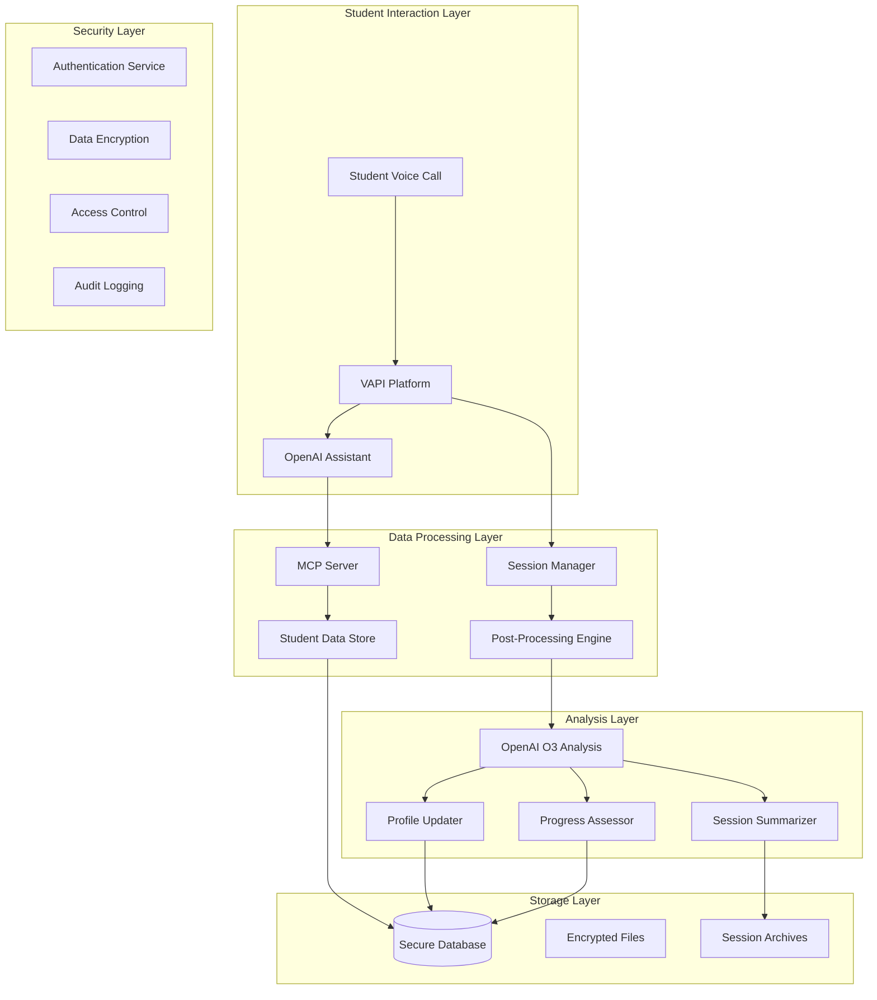
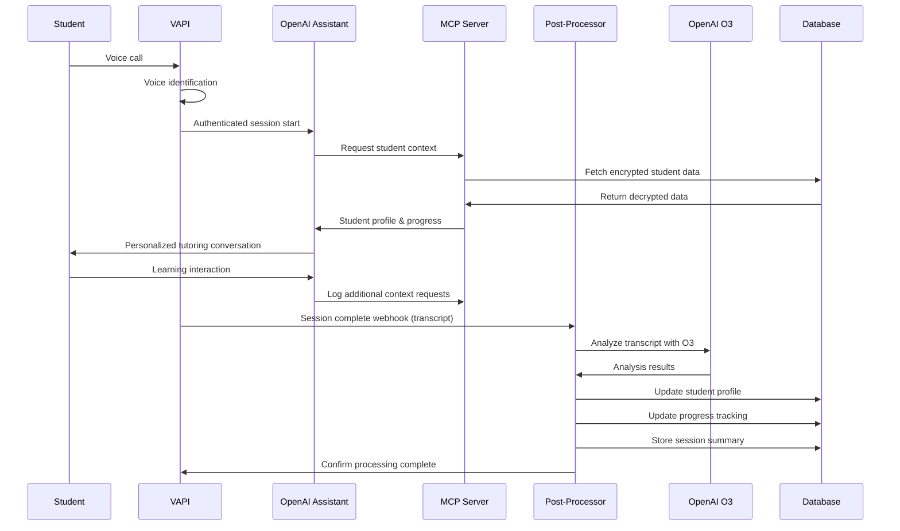

# 🏛️ AI Tutor System - Complete Architecture

## 📋 Executive Summary

This document provides the complete architectural overview of the AI Tutor system for international schools, addressing technical implementation, security considerations, post-processing workflows, and production deployment strategies.

---

## 🏗️ System Architecture Overview



---

## 🔐 Security Architecture & Concerns

### **🚨 Current Security Issues (PoC Limitations)**

#### **1. Personal Data Exposure**
```yaml
Current Issue: "MCP server exposes raw student data"
Risk Level: HIGH
Impact: "Personal profiles, progress data, conversation transcripts accessible via HTTP"
PoC Status: "Acknowledged - requires production security layer"
```

#### **2. Authentication Gap**
```yaml
Current Issue: "No student authentication in voice calls"
Risk Level: MEDIUM
Impact: "Anyone could access student data with student_id"
PoC Status: "Using simple student_id lookup for demo"
```

#### **3. API Token Exposure**
```yaml
Current Issue: "OpenAI API keys in configuration files"
Risk Level: HIGH
Impact: "API cost abuse, rate limiting, key compromise"
PoC Status: "Environment variables - needs vault solution"
```

### **🛡️ Production Security Architecture**

#### **1. Multi-Layer Authentication**
```yaml
Layer 1_Voice_Biometrics:
  - Voice pattern matching for student identification
  - Backup PIN verification for new devices
  - Session timeout (15 minutes max)

Layer 2_API_Security:
  - JWT tokens for MCP server access
  - Role-based access control (student/teacher/admin)
  - Rate limiting per user/IP

Layer 3_Data_Encryption:
  - AES-256 encryption for personal data at rest
  - TLS 1.3 for data in transit
  - Encrypted database fields for sensitive information
```

#### **2. Secure API Token Management**
```yaml
Development:
  - Environment variables (.env files)
  - .gitignore protection
  - Local key rotation

Production:
  - Azure Key Vault / AWS Secrets Manager
  - Automatic key rotation (30-day cycle)
  - Separate keys per environment
  - Service principal authentication
```

#### **3. Data Privacy Compliance**
```yaml
GDPR_Compliance:
  - Data minimization (only necessary data)
  - Right to erasure (delete student data)
  - Data portability (export functionality)
  - Consent management for minors

Access_Controls:
  - Parent/guardian consent for children <16
  - Teacher access limited to their students
  - Administrator audit trails
  - Data retention policies (2-year default)
```

---

## 🧠 Post-Processing Architecture with OpenAI O3

### **📊 Session Analysis Workflow**

```python
# Post-Processing Pipeline
class SessionPostProcessor:
    def process_session(self, session_data):
        """Complete post-session analysis pipeline"""
        
        # 1. Transcript Analysis with O3
        analysis = self.analyze_with_o3(session_data['conversation']['transcript'])
        
        # 2. Profile Updates
        profile_updates = self.assess_profile_changes(analysis, session_data['student_id'])
        
        # 3. Progress Assessment
        progress_updates = self.assess_academic_progress(analysis, session_data['student_id'])
        
        # 4. Session Summary
        summary = self.create_session_summary(analysis, session_data)
        
        # 5. Apply Updates
        self.update_student_profile(session_data['student_id'], profile_updates)
        self.update_progress_tracking(session_data['student_id'], progress_updates)
        self.save_session_summary(session_data['session_id'], summary)
        
        return {
            'analysis': analysis,
            'profile_updates': profile_updates,
            'progress_updates': progress_updates,
            'summary': summary
        }
```

### **🔍 OpenAI O3 Analysis Framework**

#### **1. Profile Assessment Prompts**
```yaml
Learning_Style_Analysis:
  prompt: |
    Analyze this tutoring conversation to identify the student's learning preferences:
    
    Transcript: {transcript}
    Current Profile: {current_profile}
    
    Evaluate:
    1. Visual vs Auditory vs Kinesthetic preferences
    2. Attention span and focus patterns
    3. Question-asking behavior and curiosity level
    4. Response to different explanation methods
    5. Emotional reactions to challenges
    
    Provide specific evidence from the conversation and suggest profile updates.

Interest_Identification:
  prompt: |
    Identify new interests or changing preferences from this conversation:
    
    Transcript: {transcript}
    Current Interests: {current_interests}
    
    Look for:
    1. Topics that generated excitement or engagement
    2. Real-world connections the student made
    3. Questions about careers or applications
    4. Subjects they want to explore further
    
    Suggest interest profile updates with confidence scores.
```

#### **2. Academic Progress Evaluation**
```yaml
Subject_Mastery_Assessment:
  prompt: |
    Assess the student's academic progress in this tutoring session:
    
    Transcript: {transcript}
    Subject: {subject}
    Grade Level: {grade}
    Current Progress: {current_progress}
    Curriculum Standards: {curriculum_standards}
    
    Evaluate:
    1. Concepts successfully demonstrated
    2. Areas of confusion or difficulty
    3. Problem-solving approach and strategies
    4. Improvement since last session
    5. Readiness for advanced topics
    
    Provide specific progress updates aligned with curriculum standards.

Skill_Development_Tracking:
  prompt: |
    Track skill development and learning outcomes:
    
    Transcript: {transcript}
    Target Skills: {target_skills}
    
    Assess:
    1. Critical thinking demonstration
    2. Communication and explanation abilities
    3. Problem-solving persistence
    4. Metacognitive awareness (understanding of own learning)
    5. Collaboration and help-seeking behavior
    
    Rate each skill (1-5) with evidence and improvement recommendations.
```

#### **3. Session Summarization**
```yaml
Educational_Summary:
  prompt: |
    Create a comprehensive session summary for educators and parents:
    
    Transcript: {transcript}
    Session Duration: {duration}
    Topics Covered: {topics}
    
    Include:
    1. Learning objectives achieved
    2. Key concepts mastered or practiced
    3. Student engagement and participation level
    4. Challenges encountered and how they were addressed
    5. Recommended follow-up activities
    6. Parent/teacher action items
    
    Keep summary concise but informative (200-300 words).
```

### **⚙️ Secure O3 Integration Architecture**

#### **1. API Security Implementation**
```python
class SecureO3Processor:
    def __init__(self):
        self.api_key = self.get_secure_api_key()
        self.client = OpenAI(api_key=self.api_key)
        self.rate_limiter = RateLimiter(requests_per_minute=60)
        
    def get_secure_api_key(self):
        """Retrieve API key from secure vault"""
        if os.getenv('ENVIRONMENT') == 'production':
            return self.get_from_key_vault('OPENAI_O3_KEY')
        else:
            return os.getenv('OPENAI_API_KEY')
    
    def analyze_transcript(self, transcript, student_id):
        """Secure transcript analysis with PII protection"""
        
        # 1. Remove or hash personal identifiers
        anonymized_transcript = self.anonymize_transcript(transcript)
        
        # 2. Rate limiting
        self.rate_limiter.wait_if_needed()
        
        # 3. API call with error handling
        try:
            response = self.client.chat.completions.create(
                model="o3-mini",  # Use O3 model
                messages=[
                    {"role": "system", "content": self.get_analysis_prompt()},
                    {"role": "user", "content": anonymized_transcript}
                ],
                max_tokens=2000,
                temperature=0.1
            )
            
            # 4. Log for audit
            self.log_api_usage(student_id, len(transcript), response.usage)
            
            return response.choices[0].message.content
            
        except Exception as e:
            self.log_error(f"O3 analysis failed: {e}")
            return None
```

---

## 🎯 Student Identification Architecture

### **🔍 Multi-Modal Identification Strategy**

#### **1. Voice Biometrics (Primary)**
```yaml
Implementation:
  - Voice pattern enrollment during setup
  - Real-time voice matching during calls
  - Confidence threshold: 85%
  - Fallback to secondary method if <85%

Technology:
  - Azure Cognitive Services Speaker Recognition
  - Or AWS Polly Speaker Recognition
  - Integration with VAPI platform

Security:
  - Voice prints stored encrypted
  - No raw audio storage after processing
  - Regular re-enrollment (6 months)
```

#### **2. PIN Verification (Secondary)**
```yaml
Implementation:
  - 4-6 digit PIN per student
  - Required for new devices or low voice confidence
  - Rate limiting (3 attempts, 15-minute lockout)

Storage:
  - Hashed PINs (bcrypt)
  - Salt per student
  - PIN history to prevent reuse
```

#### **3. Contextual Verification (Tertiary)**
```yaml
Knowledge_Based:
  - "What's your favorite subject?"
  - "Who's your math teacher?"
  - "What grade are you in?"

Behavioral:
  - Speaking patterns and vocabulary level
  - Response time to familiar questions
  - Preferred learning topics

Session_Context:
  - Previous session topics
  - Scheduled tutoring times
  - Device/location consistency
```

### **📱 Multi-Device Strategy**
```yaml
Device_Registration:
  - Parent/guardian approval for new devices
  - Device fingerprinting
  - Location-based validation (school/home)

Session_Handoff:
  - Secure session tokens
  - Cross-device continuation
  - Automatic logout after 30 minutes inactive
```

---

## 📊 Data Architecture & Storage

### **🗄️ Secure Data Model**

#### **1. Student Data Encryption**
```json
{
  "student_id": "hash_uuid",
  "encrypted_data": {
    "personal_info": "AES256_encrypted_blob",
    "learning_profile": "AES256_encrypted_blob",
    "progress_data": "AES256_encrypted_blob"
  },
  "metadata": {
    "created_at": "2025-01-17T10:30:00Z",
    "last_updated": "2025-01-17T14:30:00Z",
    "encryption_version": "v2",
    "consent_status": "active"
  }
}
```

#### **2. Session Data Protection**
```json
{
  "session_id": "hash_uuid",
  "student_id_hash": "hashed_student_reference",
  "encrypted_transcript": "AES256_encrypted_conversation",
  "analysis_summary": "encrypted_o3_results",
  "retention_policy": {
    "expires_at": "2027-01-17T10:30:00Z",
    "gdpr_deletable": true,
    "parent_accessible": true
  }
}
```

### **📈 Progress Tracking Schema**
```yaml
Academic_Progress:
  subject: "mathematics"
  grade_level: 4
  curriculum_alignment: "cambridge_primary"
  
  mastery_levels:
    addition: 
      level: "proficient"
      confidence: 0.85
      last_assessed: "2025-01-17"
    
    fractions:
      level: "developing" 
      confidence: 0.60
      needs_practice: true
      
  learning_objectives:
    completed: ["basic_addition", "number_recognition"]
    in_progress: ["fraction_concepts", "word_problems"]
    next_steps: ["decimal_introduction"]

Behavioral_Metrics:
  engagement_score: 0.78
  attention_span_minutes: 12
  help_seeking_frequency: "appropriate"
  confidence_level: "moderate"
  learning_pace: "steady"
```

---

## 🔄 Complete System Workflow

### **📞 End-to-End Session Flow**



### **⏱️ Automated Post-Processing Timeline**
```yaml
Immediate (0-30 seconds):
  - Session data validation
  - Initial transcript processing
  - Security checks and PII detection

Short-term (1-5 minutes):
  - O3 analysis of full transcript
  - Profile update recommendations
  - Progress assessment calculations

Medium-term (5-30 minutes):
  - Apply approved profile updates
  - Update progress tracking
  - Generate session summary
  - Notify parents/teachers if configured

Long-term (Daily/Weekly):
  - Aggregate progress reports
  - Curriculum alignment assessment
  - Learning trend analysis
  - Intervention recommendations
```

---

## 🚀 Production Deployment Architecture

### **☁️ Infrastructure Layout**
```yaml
Primary_Services:
  - Application: Azure Container Instances / AWS ECS
  - Database: Azure SQL / AWS RDS (encrypted)
  - File Storage: Azure Blob Storage / AWS S3 (encrypted)
  - Key Management: Azure Key Vault / AWS Secrets Manager

Security_Services:
  - Authentication: Azure AD B2C / AWS Cognito
  - API Gateway: Azure API Management / AWS API Gateway
  - WAF: Azure Front Door / AWS CloudFront
  - Monitoring: Azure Monitor / AWS CloudWatch

AI_Services:
  - OpenAI API (O3 model access)
  - Voice Recognition: Azure Speech / AWS Polly
  - VAPI Platform integration
```

### **🔧 Environment Configuration**
```yaml
Development:
  - Local development with encrypted test data
  - Separate OpenAI API keys (lower limits)
  - Mock voice identification
  - File-based storage

Staging:
  - Production-like environment
  - Anonymized real data
  - Full security stack testing
  - Performance validation

Production:
  - Full encryption and security
  - High availability (99.9% SLA)
  - Automated backups and disaster recovery
  - Compliance auditing enabled
```

---

## ✅ Implementation Phases

### **Phase 1: PoC Enhancement (Current)**
- [x] Working session tracking with VAPI integration
- [ ] O3 post-processing implementation
- [ ] Enhanced security configuration
- [ ] Comprehensive testing

### **Phase 2: Security & Privacy**
- [ ] Data encryption implementation
- [ ] Voice biometrics integration
- [ ] GDPR compliance features
- [ ] Audit logging system

### **Phase 3: Production Deployment**
- [ ] Cloud infrastructure setup
- [ ] Performance optimization
- [ ] Monitoring and alerting
- [ ] Staff training and documentation

### **Phase 4: Advanced Features**
- [ ] Multi-language support
- [ ] Advanced analytics dashboard
- [ ] Parent/teacher portal
- [ ] Integration with school management systems

---

## 🎯 Success Metrics

### **Technical Metrics**
- Session completion rate: >95%
- Voice identification accuracy: >90%
- System uptime: >99.5%
- Average response time: <2 seconds

### **Educational Metrics**
- Student engagement improvement: Track before/after
- Learning objective completion rate
- Parent/teacher satisfaction scores
- Student progress velocity

### **Security Metrics**
- Zero data breaches
- Compliance audit results
- Authentication failure rate: <1%
- Incident response time: <15 minutes

---

## 🔚 Conclusion

This architecture provides a comprehensive framework for a production-ready AI tutor system that balances educational effectiveness with security and privacy requirements. The PoC demonstrates core functionality while identifying clear paths for production deployment with enterprise-grade security.

**Key Takeaways:**
1. **Security must be architected from the start** - cannot be bolted on later
2. **Student identification requires multi-modal approach** for reliability
3. **O3 post-processing provides valuable insights** but needs secure implementation
4. **GDPR compliance is non-negotiable** for European school deployment
5. **Phased implementation allows validation** of each component before full deployment

The system is designed to scale from individual school pilots to district-wide deployments while maintaining the highest standards of student data protection and educational effectiveness.