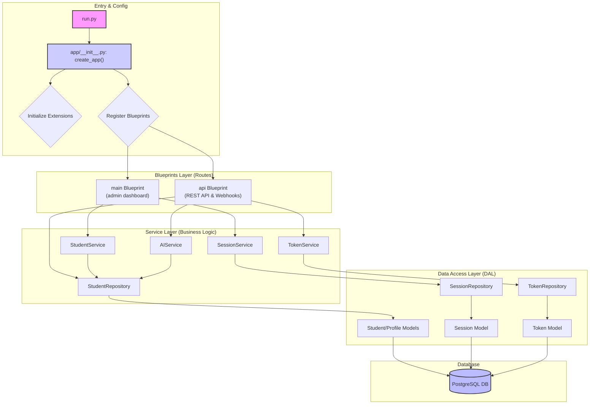

# AI Tutor System: System Architecture

This document outlines the system architecture for the AI Tutor platform, detailing components, data flow, security measures, and deployment patterns.

## 1. System Overview

The AI Tutor system is a cloud-native, PostgreSQL-backed platform that provides AI-powered tutoring services via voice calls. The system automatically processes conversations, manages student profiles, and provides administrative oversight through a comprehensive web dashboard.

### 1.1. Architecture Principles

- **Cloud-Native**: Designed for deployment on managed cloud platforms (Render.com)
- **Database-Centric**: PostgreSQL as the single source of truth for all persistent data
- **Microservice-Ready**: Modular design with clear separation of concerns
- **API-First**: All functionality exposed through well-defined APIs
- **Security-First**: Comprehensive authentication, authorization, and audit capabilities

## 2. System Components

### 2.1. Core Components



#### 2.1.1. Flask Backend (`ai-tutor/backend/`)
- **Purpose**: Main application server providing web UI and APIs
- **Framework**: Flask with Application Factory Pattern and Blueprint Architecture
- **Architecture**: Modular service-oriented design with clean separation of concerns
- **Entry Point**: [`run.py`](ai-tutor/backend/run.py) using application factory pattern
- **Core Structure**:
  ```
  ai-tutor/backend/
  ├── run.py                     # Production entry point
  ├── app/
  │   ├── __init__.py           # Application factory (create_app)
  │   ├── config.py             # Environment configurations
  │   ├── models/               # SQLAlchemy database models
  │   ├── services/             # Business logic layer
  │   ├── repositories/         # Data access layer
  │   ├── main/                # Admin UI blueprint
  │   │   ├── __init__.py      # Blueprint config (points to frontend templates)
  │   │   └── routes.py        # Admin dashboard routes (1,511 lines)
  │   └── api/                 # REST API blueprint
  │       ├── __init__.py
  │       └── v1/routes.py     # API endpoints & VAPI webhooks (1,042 lines)
  └── admin-server-legacy-backup.py  # Archived monolithic version
  
  ai-tutor/frontend/
  ├── templates/                # HTML templates for admin interface
  │   ├── base.html            # Base template with navigation
  │   ├── login.html           # Admin login page
  │   ├── dashboard.html       # Main admin dashboard
  │   ├── students.html        # Student management interface
  │   ├── student_detail.html  # Individual student details
  │   ├── schools.html         # School management
  │   ├── sessions.html        # Session management
  │   ├── system.html          # System status and monitoring
  │   ├── files.html           # File browser interface
  │   ├── curriculum.html      # Curriculum management
  │   ├── database.html        # Database management interface
  │   ├── tokens.html          # Token management
  │   ├── system_logs.html     # System logs viewer
  │   ├── ai_analysis.html     # AI analysis dashboard
  │   ├── mcp_interactions.html # MCP interaction monitoring
  │   └── admin/              # Advanced admin templates
  │       ├── analytics.html   # System analytics
  │       ├── generate_token.html # Token generation
  │       └── student_analytics.html # Student-specific analytics
  └── static/                  # Static assets (CSS, JS, images)
  ```
- **Responsibilities**:
  - **Application Factory**: Environment-based app creation with extension initialization
  - **Blueprint Architecture**: Modular route organization by domain
  - **Service Layer**: Clean business logic separation from route handlers
  - **Repository Pattern**: Consistent data access abstraction
  - **Admin Dashboard**: Web interface via main blueprint
  - **RESTful API**: External access via api blueprint
  - **VAPI Integration**: Webhook processing and call management
  - **Authentication**: Token-based and session-based security
  - **AI Integration**: Structured prompt management and analysis
  - **AI Tutor Assessment**: Automated performance evaluation and prompt optimization

#### 2.1.2. MCP Server (`mcp-server/`)
- **Purpose**: Model Context Protocol server for external data access
- **Framework**: Node.js with TypeScript
- **Responsibilities**:
  - Secure data retrieval API
  - Token-based authentication validation
  - Student and session data access
  - Integration with AI assistants

#### 2.1.3. PostgreSQL Database
- **Purpose**: Central data store for all system information
- **Deployment**: Managed PostgreSQL on Render.com
- **Responsibilities**:
  - Student profiles and progress tracking
  - Session transcripts and summaries
  - Authentication tokens (persistent storage)
  - System logs and analytics
  - Curriculum and school data

#### 2.1.4. AI Analysis System (`ai-tutor/backend/app/ai/`)
- **Purpose**: Production AI-powered analysis of tutoring session transcripts with conditional prompt selection
- **Framework**: Python with OpenAI/Anthropic API integration
- **Status**: Production system (despite "poc" directory name - historical naming)
- **Responsibilities**:
  - File-based prompt management (Markdown templates)
  - Conditional prompt selection based on call type (introductory vs tutoring)
  - Multi-provider AI analysis (OpenAI, Anthropic)
  - JSON-structured response parsing and extraction
  - Session quality validation
  - Student profile enhancement from transcripts
  - Call type detection (new vs returning students)
  - AI tutor performance assessment and prompt optimization

### 2.2. External Integrations

#### 2.2.1. VAPI (Voice API)
- **Purpose**: Voice call handling and transcript generation
- **Integration**: Webhook-based real-time processing
- **Data Flow**: Call → Transcript → Student Profile → Session Summary

## 3. Data Architecture

### 3.1. Complete Database Schema

The data model is implemented in PostgreSQL with a comprehensive schema supporting curriculum management, session tracking, authentication, and system monitoring.

```mermaid
erDiagram
    %% Core Educational Entities
    schools {
        int id PK
        string name
        string country
        string city
        text description
        text core_values
        int default_curriculum_id FK "Optional: School's preferred curriculum"
    }

    students {
        int id PK
        string first_name
        string last_name
        date date_of_birth
        string phone_number
        int school_id FK
        int grade_level
        string student_type "foreign|local for international schools"
        string[] interests "Student interests (ARRAY column)"
        string[] learning_preferences "Learning preferences and metadata (ARRAY column)"
        string[] motivational_triggers "Motivational factors (ARRAY column)"
        timestamp created_at
        timestamp updated_at
    }

    %% Student Profile and Memory System
    student_profiles {
        int id PK
        int student_id FK
        text narrative "AI-generated narrative description of student"
        jsonb traits "Structured student traits and characteristics"
        timestamp created_at "Version timestamp for profile history"
    }

    student_memories {
        int id PK
        int student_id FK
        string memory_key "Unique identifier for the memory item"
        text memory_value "The stored memory content"
        string scope "personal_fact|game_state|strategy_log"
        timestamp expires_at "Optional expiration for temporary memories"
        timestamp created_at
        timestamp updated_at
    }

    %% Curriculum System
    curriculums {
        int id PK
        string name
        text description
        bool is_default "The system-wide default curriculum"
        timestamp created_at
    }

    subjects {
        int id PK
        string name "e.g., 'Mathematics', 'History'"
        text description
        timestamp created_at
    }

    curriculum_details {
        int id PK
        int curriculum_id FK
        int subject_id FK
        int grade_level
        bool is_mandatory
        text goals_description "Natural language description of learning goals for this grade/subject"
    }

    %% Granular Mastery Tracking System
    curriculum_goals {
        int id PK
        string goal_id "Unique identifier (e.g., '4M-01')"
        string subject "Subject name (e.g., 'Mathematics')"
        int grade "Grade level (1-12)"
        string goal_text "The learning goal description"
        timestamp created_at
    }

    goal_kcs {
        int id PK
        string goal_id FK "References curriculum_goals.goal_id"
        string kc_id "Knowledge component identifier (e.g., '4M-01-KC1')"
        string kc_text "Knowledge component description"
        timestamp created_at
    }

    goal_prerequisites {
        int id PK
        string goal_id FK "References curriculum_goals.goal_id"
        string prerequisite_kc_id FK "References goal_kcs.kc_id"
        timestamp created_at
    }

    student_goal_progress {
        int student_id FK
        string goal_id FK "References curriculum_goals.goal_id"
        float mastery_percentage "0.0 to 100.0"
        timestamp last_updated
        PRIMARY KEY (student_id, goal_id)
    }

    student_kc_progress {
        int student_id FK
        string kc_id FK "References goal_kcs.kc_id"
        float mastery_percentage "0.0 to 100.0"
        timestamp last_updated
        PRIMARY KEY (student_id, kc_id)
    }

    student_subjects {
        int id PK
        int student_id FK
        int curriculum_detail_id FK "Links to a specific subject in a specific curriculum"
        bool is_active_for_tutoring "Can be toggled by teachers/parents"
        bool is_in_use "Marks if subject is currently active in student's curriculum (false when replaced by school curriculum)"
        text teacher_notes "For guiding the AI on focus areas"
        text ai_tutor_notes "AI's own notes on student progress"
        float progress_percentage "Numeric progress from 0.0 to 1.0 (0% to 100%)"
        text ai_assessment "AI-generated assessment in natural language for teachers and parents"
        text weaknesses "Areas where student needs improvement"
        string mastery_level "Current mastery level of the subject"
        text comments_tutor "Comments from AI tutor"
        text comments_teacher "Comments from human teacher"
        float completion_percentage "Percentage of curriculum completed"
        string grade_score "Letter or numeric grade"
        text grade_motivation "Motivational feedback for the grade"
        timestamp created_at
        timestamp updated_at
    }

    %% Session Management
    sessions {
        int id PK
        int student_id FK
        string session_type "phone|web|mobile for different access methods"
        timestamp start_datetime
        int duration_seconds
        text transcript
        text summary
        text tutor_assessment "AI-generated assessment of tutor performance"
        text prompt_suggestions "AI-generated suggestions for prompt improvements"
        timestamp created_at
    }

    %% System Infrastructure
    system_logs {
        int id PK
        timestamp timestamp
        string level
        string category
        text message
        text metadata
    }

    tokens {
        int id PK
        string token_hash
        string scopes
        timestamp expires_at
        timestamp created_at
        timestamp last_used
        int usage_count
        bool is_active
    }

    %% MCP Server Monitoring
    mcp_interactions {
        int id PK
        int token_id FK "Authentication token used for the request"
        string interaction_type "request|response|error for tracking interaction phases"
        string method "MCP method name (e.g., resources/list, tools/call)"
        jsonb request_payload "Complete request data in JSONB format"
        jsonb response_payload "Response data or error details in JSONB format"
        int duration_ms "Response time in milliseconds (null for requests)"
        string status "pending|completed|failed for tracking request lifecycle"
        timestamp created_at "Request initiation timestamp"
        timestamp completed_at "Response completion timestamp (null for pending)"
    }

    %% Analytics & Metrics
    session_metrics {
        int id PK
        int session_id FK
        int duration_seconds
        float satisfaction_score
        timestamp created_at
    }

    daily_stats {
        int id PK
        date date
        int total_sessions
        float avg_duration
        int total_users
        int active_students
    }

    %% Relationships
    schools ||--o{ students : "enrolls"
    schools }o--|| curriculums : "uses default"
    
    students ||--o{ student_subjects : "enrolled in"
    students ||--o{ sessions : "participates in"
    students ||--o{ student_profiles : "has profile versions"
    students ||--o{ student_memories : "has memories"
    students ||--o{ student_goal_progress : "tracks goal mastery"
    students ||--o{ student_kc_progress : "tracks KC mastery"
    
    curriculums ||--|{ curriculum_details : "contains"
    subjects ||--|{ curriculum_details : "part of curriculum"
    curriculum_details ||--o{ student_subjects : "instantiated as"
    
    curriculum_goals ||--o{ goal_kcs : "contains knowledge components"
    curriculum_goals ||--o{ goal_prerequisites : "has prerequisites"
    goal_kcs ||--o{ goal_prerequisites : "required as prerequisite"
    curriculum_goals ||--o{ student_goal_progress : "tracked by students"
    goal_kcs ||--o{ student_kc_progress : "tracked by students"
    
    sessions ||--o| session_metrics : "measured by"
    tokens ||--o{ mcp_interactions : "authenticates"
```

### 3.2. System Data Architecture Overview

The database schema supports five primary functional areas:

#### 3.2.1. Educational Structure Management
-   **Schools & Students**: Core institutional relationships with basic student demographic data
-   **Curriculum System**: Flexible, multi-layered curriculum management supporting system defaults, school-specific templates, and individual student customization
-   **Subject Enrollment**: Granular subject-level management with AI tutoring controls and progress tracking per subject

#### 3.2.2. Session & Learning Analytics
-   **Session Recording**: Complete conversation transcripts with AI-generated summaries and metadata
-   **Assessment Tracking**: Subject-specific assessments tracking strengths, weaknesses, and mastery levels
-   **Progress Monitoring**: Dual-tracking system with numeric progress percentages and descriptive teacher assessments
-   **Performance Metrics**: Session quality metrics, duration tracking, and satisfaction scoring

#### 3.2.3. Student Profile and Memory Management
-   **Versioned Profiles**: AI-generated student narratives with trait tracking and historical versioning
-   **Scoped Memory System**: Key-value storage for personal facts, game states, and strategy logs with optional expiration
-   **Current Profile View**: Optimized database view for latest student profile retrieval
-   **Memory Categorization**: Enum-based scope system for organized memory management

#### 3.2.4. System Operations & Security
-   **Authentication Framework**: Secure token-based access control with scope-based permissions
-   **Audit & Logging**: Comprehensive system event logging with categorized retention and real-time monitoring
-   **MCP Interaction Monitoring**: Complete request/response logging for MCP server debugging and performance analysis
-   **Analytics Infrastructure**: Daily statistics, usage patterns, and system performance tracking

#### 3.2.5. AI Integration Architecture
-   **Session Context Loading**: Student context (curriculum, progress, profile, memories) provided to AI tutor
-   **Post-Session Processing**: AI analysis updates assessments, profiles, and memory tracking
-   **Intelligent Memory Management**: AI-driven profile updates and memory categorization

#### 3.2.5. Key Workflows

**Student Enrollment Workflow:**
1. New student creation with basic demographics
2. Student automatically receives system default curriculum via student_subjects records creation (all subjects marked as is_in_use=true)
3. School curriculum assignment replaces default curriculum:
   - Original system default subjects marked as is_in_use=false
   - New school curriculum subjects created as is_in_use=true
4. Individual subject customization and AI tutoring activation per active subject

**Tutoring Session Workflow:**
1. Student call triggers profile and curriculum context loading
2. AI tutor receives complete student context for personalized interaction
3. Session transcript captured with quality metrics
4. Post-session AI analysis updates progress tracking and recommendations

**Curriculum Management Workflow:**
1. System-wide curriculum definitions with subject mappings
2. School-specific curriculum template creation
3. Grade-level default subject assignment
4. Individual student curriculum customization and progress tracking

### 3.2. Repository Pattern

The system uses a hybrid approach for database access:
- **Admin Dashboard**: Direct repository access for CRUD operations, with SQLAlchemy ORM queries for statistics and complex filtering
- **API Endpoints**: Repository pattern for consistent data access

Repository classes include:
- `StudentRepository`: Student CRUD operations and profile management
- `SessionRepository`: Session management and transcript handling
- `TokenRepository`: Authentication token management and validation
- `SystemLogRepository`: Event logging and retrieval
- `MCPInteractionRepository`: MCP server request/response logging and analytics
- `SchoolRepository`: School and curriculum management
- `CurriculumRepository`: Curriculum definition and subject mapping
- `AssessmentRepository`: Student assessment and progress tracking
- `CurriculumGoalRepository`: Read-only access to curriculum goals and knowledge components
- `StudentGoalProgressRepository`: UPSERT operations for goal-level mastery tracking
- `StudentKCProgressRepository`: UPSERT operations for knowledge component mastery tracking

## 4. Security Architecture

### 4.1. Authentication & Authorization

#### 4.1.1. Admin Dashboard Authentication
- **Method**: Password-based with secure session management
- **Session Storage**: Server-side session with timeout protection
- **Password Security**: BCrypt hashing with salt

#### 4.1.2. API Token Authentication
- **Purpose**: Secure access for debugging, testing, and AI integration
- **Storage**: PostgreSQL with SHA-256 hashed tokens
- **Documentation**: See [`DEBUGGING_WITH_TOKENS.md`](DEBUGGING_WITH_TOKENS.md) for detailed token usage guide
- **Scopes**: Granular permission system
  - `api:read` - Read access to API endpoints
  - `api:write` - Write access to API endpoints
  - `logs:read` - Access to system logs
  - `mcp:access` - MCP server functionality
  - `admin:read` - Admin dashboard data

#### 4.1.3. Token Security Features
- **Persistent Storage**: Tokens survive deployments via PostgreSQL
- **Secure Generation**: Cryptographically secure random tokens
- **Hashed Storage**: Only SHA-256 hashes stored in database
- **Expiration Control**: Configurable token lifetime (1 hour - 7 days)
- **Usage Tracking**: Last used timestamp and usage count
- **Automatic Cleanup**: Expired tokens removed automatically
- **Revocation**: Immediate token invalidation capability

### 4.2. Data Security
- **Encryption**: All data encrypted in transit (HTTPS)
- **Database Security**: Managed PostgreSQL with access controls
- **GDPR Compliance**: Privacy-by-design data handling
- **Audit Trail**: Comprehensive logging of all system operations

## 5. API Architecture

### 5.1. RESTful API Design
- **Purpose**: External access for AI integration, debugging, and third-party tools
- **Admin Interface**: Uses hybrid repository access and direct ORM queries (not RESTful API)
- **Base URL**: `/api/v1/`
- **Authentication**: Bearer token in Authorization header
- **Content Type**: JSON request/response format
- **Error Handling**: Consistent HTTP status codes and error messages

### 5.2. Key API Endpoints
```
GET  /api/v1/students          # List students
POST /api/v1/students          # Create student
GET  /api/v1/students/{id}     # Get student details
PUT  /api/v1/students/{id}     # Update student

GET  /api/v1/sessions          # List sessions
GET  /api/v1/sessions/{id}     # Get session details

POST /api/v1/vapi/webhook      # VAPI webhook endpoint
GET  /api/v1/logs              # System logs (with filtering)

POST /admin/api/mcp/log-request   # Log MCP request
POST /admin/api/mcp/log-response  # Log MCP response
GET  /admin/api/mcp/interactions  # List MCP interactions (with filtering)
GET  /admin/api/mcp/stats         # MCP interaction statistics
POST /admin/api/mcp/cleanup       # Clean up old interactions
```

### 5.3. MCP Server API
- **Protocol**: Model Context Protocol over stdio/HTTP (separate from RESTful API)
- **Authentication**: Token-based with scope validation
- **Resources**: Student data, session transcripts, system logs
- **Tools**: Data query and analysis capabilities
- **Logging**: Complete request/response interaction logging for debugging and performance monitoring

## 6. Data Flow Architecture

### 6.1. Voice Call Processing Flow
```
1. Student calls → VAPI
2. VAPI → MCP server call (initial context loading)
3. MCP server → Student context retrieval from PostgreSQL
4. VAPI processes call with student context → Generates transcript
5. VAPI webhook → Flask backend
6. Backend processes transcript:
   - Identifies/creates student profile
   - Creates session record
   - Triggers AI post-processing
   - Triggers AI tutor performance assessment (for tutoring sessions)
7. AI analysis → Updates student assessment
8. AI tutor assessment → Evaluates tutor performance and generates prompt suggestions
9. Session summary generated
10. Data stored in PostgreSQL
```

### 6.3. AI Prompt Management Flow
```
1. System startup → FileBasedPromptManager loads all .md files
2. Call processing → Phone number lookup to determine call type
3. Conditional prompt selection:
   - New student (phone not in system) → Introductory call prompts
   - Existing student (phone in system) → Tutoring session prompts
4. Template lookup → Load appropriate prompt based on call type
5. Parameter injection → Template formatting with student context
6. AI provider call → Formatted prompt sent to OpenAI/Anthropic
7. JSON response parsing → Structured data extraction
8. Database storage → Results saved to PostgreSQL
```

### 6.4. MCP Interaction Logging Flow
```
1. AI Assistant connects → MCP server authentication
2. Request received → Log request to mcp_interactions table (status: pending)
3. Request processing → MCP server business logic execution
4. Response generation → Complete response payload creation
5. Response logging → Update interaction record (status: completed, add response data)
6. Performance tracking → Record duration_ms and completion timestamp
7. Error handling → Log error details and mark status as failed
8. Admin monitoring → Real-time interaction tracking via dashboard
```

### 6.5. Conditional Prompt System Architecture

#### 6.5.1. Call Type Detection Logic
```
1. VAPI webhook receives call data with phone number
2. Student lookup in PostgreSQL database:
   - SELECT * FROM students WHERE phone_number = caller_phone
3. Call type determination:
   - If student exists → TUTORING_SESSION
   - If student not found → INTRODUCTORY_CALL
4. Prompt selection based on call type
```

#### 6.5.2. Prompt Template Organization
```
ai-tutor/backend/app/ai/prompts/
├── introductory_analysis.md     # New student profile creation
├── session_analysis.md          # General tutoring session analysis
├── math_analysis.md             # Mathematics-focused analysis
├── reading_analysis.md          # Reading comprehension analysis
├── quick_assessment.md          # Rapid capability assessment
└── progress_tracking.md         # Learning progress evaluation
```

#### 6.5.3. JSON Response Format
All prompts generate structured JSON responses with standardized fields:
```json
{
  "student_profile": {
    "name": "string",
    "grade_level": "string",
    "subjects_discussed": ["array"]
  },
  "session_analysis": {
    "key_topics": ["array"],
    "understanding_level": "string",
    "areas_for_improvement": ["array"],
    "strengths": ["array"]
  },
  "recommendations": {
    "next_steps": ["array"],
    "focus_areas": ["array"],
    "suggested_resources": ["array"]
  },
  "metadata": {
    "call_type": "introductory|tutoring",
    "confidence_score": "number",
    "analysis_timestamp": "string"
  }
}
```

### 6.6. Admin Dashboard Flow
```
1. Admin login → Session authentication
2. Dashboard queries → Repository layer
3. Repository → PostgreSQL queries
4. Data formatting → Web interface
5. Admin actions → API calls → Database updates
```

### 6.7. Token Authentication Flow
```
1. Admin generates token via Flask admin interface → Token stored in PostgreSQL (hashed)
2. Client/AI assistant → API request with token
3. Token validation → Database lookup and scope check
4. Authorized request → Repository layer → Response
5. Usage tracking → Token statistics updated
```

## 7. Deployment Architecture

### 7.1. Render.com Deployment
- **Platform**: Render.com managed services
- **Web Service**: Flask application using Application Factory pattern
- **Entry Point**: [`run.py`](ai-tutor/backend/run.py) with production-ready configuration
- **Database**: Managed PostgreSQL service
- **Environment**: Production-ready with health checks and automatic table creation

### 7.2. Application Factory Deployment
- **Production Entry**: `run.py` creates Flask app using `create_app()` factory function
- **Environment Detection**: Automatic development/production configuration selection
- **Extension Initialization**: SQLAlchemy, JWT, Celery initialized via factory
- **Blueprint Registration**: Modular route registration through application factory
- **Database Auto-Setup**: Automatic table creation on first deployment

### 7.3. Environment Configuration
- **Development**: Local development with SQLite/PostgreSQL
- **Production**: Managed PostgreSQL with connection pooling and environment-based config
- **Configuration Classes**: Separate config classes for dev/test/production environments
- **Environment Variables**: All secrets and deployment-specific settings via env vars
- **Logging**: Centralized PostgreSQL-based logging with structured event tracking

### 7.4. Deployment Features
- **Auto-Deploy**: Git-based deployment triggers using new application factory
- **Health Checks**: Built-in `/health` endpoint monitoring
- **Database Migrations**: SQLAlchemy-based schema updates with Flask-Migrate
- **Service Layer**: Clean business logic separation for easier testing and deployment
- **Blueprint Architecture**: Modular deployment with separate admin UI and API services
- **Data Seeding**: Automatic creation of default curriculum and system data
- **Token Persistence**: Tokens survive all deployments via PostgreSQL storage
- **Zero-Downtime**: Managed service ensures availability during updates
- **Gunicorn Integration**: Production WSGI server with gevent workers for performance

### 7.5. Template Architecture
- **Template Repository**: All HTML templates centrally managed in [`ai-tutor/frontend/templates/`](ai-tutor/frontend/templates/)
- **Blueprint Configuration**: Main blueprint configured with `template_folder='../../../frontend/templates'`
- **Template Separation**: Frontend templates separated from backend logic for maintainability
- **Comprehensive Coverage**: 30+ templates covering complete admin interface functionality
- **Template Hierarchy**: Base templates with inheritance for consistent UI/UX

### 7.4. Database Migration Process
- **Migration Scripts**: Flask-Migrate generates and applies schema changes
- **Version Control**: Database schema versions tracked in Git
- **Rollback Support**: Ability to revert database changes if needed
- **Seed Data Management**: Automated creation of essential system data (default curriculum, system subjects)

## 8. Monitoring & Observability

### 8.1. System Logging
- **Storage**: PostgreSQL-based log storage
- **Categories**: VAPI, Database, Authentication, System, Error, MCP
- **Retention**: Automatic 30-day log cleanup
- **Filtering**: Advanced log search and filtering
- **Real-time**: Live system event monitoring
- **MCP Interaction Tracking**: Complete request/response logging with performance metrics

### 8.2. Performance Monitoring
- **Database Performance**: Query optimization and indexing
- **API Response Times**: Endpoint performance tracking
- **Token Usage**: Authentication statistics and monitoring
- **Session Analytics**: Student engagement metrics

### 8.3. Health Monitoring
- **Application Health**: Built-in health check endpoints
- **Database Connectivity**: Connection pool monitoring
- **External Service Status**: VAPI integration monitoring
- **Error Rate Tracking**: Automated error detection and alerting

## 9. Future Architecture Considerations

### 9.1. Scalability
- **Database Scaling**: Read replicas for query optimization
- **Service Decomposition**: Microservice extraction as needed
- **Caching Layer**: Redis for frequently accessed data
- **Load Balancing**: Multiple application instances

### 9.2. Integration Expansion
- **Multi-Channel Support**: Web and mobile app integration
- **Additional AI Services**: Extended AI processing capabilities
- **Third-Party APIs**: School system integrations
- **Analytics Platform**: Advanced reporting and insights

### 9.3. Security Enhancements
- **OAuth2 Integration**: External authentication providers
- **Role-Based Access**: Enhanced permission system
- **API Rate Limiting**: Request throttling and abuse prevention
- **Compliance Automation**: GDPR and privacy compliance tools

### 9.4. GDPR Compliance Requirements
- **Data Minimization**: Collect only necessary student information
- **Right to Erasure**: Complete student data deletion capabilities
- **Data Portability**: Export student data in machine-readable formats
- **Consent Management**: Parental consent tracking for minor students
- **Data Processing Logs**: Audit trail of all personal data access
- **Privacy by Design**: Default privacy-protective settings
- **Cross-Border Data**: Compliance with international data transfer regulations

### 9.5. Error Handling Strategies
- **Graceful Degradation**: System continues operating with reduced functionality
- **Circuit Breakers**: Automatic fallback when external services fail
- **Retry Mechanisms**: Intelligent retry logic for transient failures
- **Error Monitoring**: Real-time error detection and alerting
- **User-Friendly Messages**: Clear error communication to end users
- **Recovery Procedures**: Documented steps for system recovery
- **Backup Strategies**: Regular data backups with tested restore procedures

## 10. Default Curriculum System

### 10.1. Cambridge Primary 2025 Default Curriculum

The system includes a comprehensive default curriculum based on Cambridge Primary 2025 standards, automatically assigned to students upon creation.

#### 10.1.1. Data Source
- **File Location**: [`ai-tutor/data/curriculum/cambridge_primary_2025.txt`](ai-tutor/data/curriculum/cambridge_primary_2025.txt)
- **Format**: Tab-separated values (TSV) with headers: Grade, Subject, Mandatory, Details
- **Content**: Complete Cambridge Primary curriculum for Grades 1-6 covering all core and optional subjects
- **Standards Compliance**: Aligned with Cambridge Primary curriculum standards for 2025

#### 10.1.2. Curriculum Structure
```
Grade 1-6 Subjects Include:
- Core Mandatory: English (Literacy), Mathematics, Science
- Optional Subjects: Global Perspectives, Computing/ICT, Art & Design, Music, Physical Education
- Grade-Specific: Age-appropriate learning objectives and detailed descriptions
```

#### 10.1.3. Automatic Default Assignment
- **Student Creation**: New students automatically receive complete default curriculum via `student_subjects` table
- **All Subjects**: System creates records for all grade-appropriate subjects (mandatory and optional)
- **Initial State**: All subjects marked as `is_in_use=true` and `is_active_for_tutoring=false` by default
- **Curriculum Switching**: When students are assigned to schools with custom curricula, default subjects are marked `is_in_use=false`

### 10.2. Curriculum Data Management

#### 10.2.1. Startup Import Process
- **Automatic Loading**: Cambridge curriculum data imported automatically on application startup
- **Idempotent Import**: System checks for existing default curriculum before importing
- **Error Handling**: Import failures logged with detailed error messages
- **Data Validation**: TSV format validation with proper error reporting

#### 10.2.2. Database Schema Integration
The default curriculum integrates with the existing database schema:

```sql
-- Default curriculum creation
INSERT INTO curriculums (name, description, is_default)
VALUES ('Cambridge Primary 2025', 'Cambridge Primary Curriculum 2025 Standards', true);

-- Subject creation and curriculum_details population
-- Based on TSV file data with grade-level subject mappings
```

#### 10.2.3. Data File Format
```tsv
Grade	Subject	Mandatory	Details
1	English (Literacy)	Yes	"Reading: Recognize all letters..."
1	Mathematics	Yes	"Learn the foundation of the number system..."
```

### 10.3. Curriculum Management Architecture

#### 10.3.1. File-Based Curriculum Data
- **Storage**: Curriculum definitions stored in structured data files
- **Version Control**: Curriculum changes tracked through Git
- **Flexibility**: Support for multiple curriculum standards (Cambridge, national, school-specific)
- **Import Process**: Automated import of curriculum data on system initialization

#### 10.3.2. Default Curriculum Assignment Workflow
```
1. Student Creation → System checks for default curriculum
2. Default Curriculum Exists → Create student_subjects records for all grade-appropriate subjects
3. Subject Assignment → Mark subjects as is_in_use=true, is_active_for_tutoring=false
4. AI Tutoring → Teachers can activate specific subjects for AI tutoring
5. School Assignment → School curriculum can replace default (mark original as is_in_use=false)
```

#### 10.3.3. Curriculum Data Integrity
- **Referential Integrity**: Foreign key constraints ensure data consistency
- **Default Curriculum**: Exactly one curriculum marked as `is_default=true`
- **Subject Consistency**: All subjects referenced in curriculum_details must exist in subjects table
- **Grade Validation**: Grade levels validated against system-supported ranges (1-12)

## 11. AI Tutor Performance Assessment System

### 11.1. Overview

The AI Tutor Performance Assessment System provides automated evaluation of AI tutor effectiveness during tutoring sessions. This system analyzes session transcripts against evidence-based tutoring guidelines to generate performance assessments and actionable improvement suggestions.

### 11.2. System Components

#### 11.2.1. TutorAssessmentService
- **Location**: [`ai-tutor/backend/app/services/tutor_assessment_service.py`](ai-tutor/backend/app/services/tutor_assessment_service.py)
- **Purpose**: Orchestrates the complete tutor assessment workflow
- **Integration**: Automatically triggered after tutoring session processing
- **Responsibilities**:
  - Session eligibility validation (skips welcome/introductory sessions)
  - Data gathering from multiple sources
  - AI model interaction for assessment generation
  - Database storage of assessment results
  - MCP interaction logging for monitoring

#### 11.2.2. Assessment Data Sources
The assessment system gathers data from four key sources:

1. **Session Transcript**: Complete conversation between student and AI tutor
2. **Tutoring Guidelines**: Evidence-based best practices from [`ai-tutor/backend/app/ai/resources/guidelines-for-ai-tutor.md`](ai-tutor/backend/app/ai/resources/guidelines-for-ai-tutor.md)
3. **Student Profile**: Complete student context including demographics, interests, and learning preferences
4. **AI Tutor Prompt**: Current prompt system from [`ai-tutor/docs/AI_ASSISTANT_PROMPT_SYSTEM.md`](ai-tutor/docs/AI_ASSISTANT_PROMPT_SYSTEM.md)

#### 11.2.3. Evidence-Based Guidelines
The assessment system evaluates tutor performance against comprehensive evidence-based strategies including:
- **Storytelling and Narrative Learning**: Engagement through story-based teaching
- **Gamification and Playful Learning**: Game elements to increase motivation
- **Interactive Dialogue**: Socratic questioning and student engagement techniques
- **Spaced Repetition**: Long-term retention optimization
- **Novelty and Variety**: Attention maintenance strategies
- **Scaffolding and Adaptive Challenge**: Zone of Proximal Development targeting
- **Feedback and Positive Reinforcement**: Growth mindset and motivation support
- **Age-Appropriate Strategies**: Developmental stage considerations
- **Personalization**: Individual learning profile adaptation

### 11.3. Assessment Workflow

#### 11.3.1. Trigger Conditions
```
1. Session completion → Database record creation
2. Session validation → Must have student_id (not welcome session)
3. Transcript validation → Minimum 50 characters required
4. Automatic trigger → TutorAssessmentService.assess_tutor_performance()
```

#### 11.3.2. Data Gathering Process
```
1. Session retrieval → Get session and student data from PostgreSQL
2. Guidelines loading → Read tutoring best practices file
3. Prompt loading → Read current AI tutor prompt system
4. Context compilation → Combine all sources into assessment prompt
5. Student profile compilation → Include demographics, interests, preferences
```

#### 11.3.3. AI Assessment Generation
```
1. Prompt construction → Create comprehensive assessment prompt
2. AI model call → Send to OpenAI GPT-4 for analysis
3. JSON response parsing → Extract structured assessment data
4. Validation → Ensure required fields are present and valid
5. Error handling → Log failures and implement fallback strategies
```

#### 11.3.4. Result Storage
```
1. Database update → Store assessment in sessions table
2. Field mapping:
   - tutor_assessment → Paragraph-based performance evaluation
   - prompt_suggestions → Concrete improvement recommendations
3. Transaction management → Ensure data consistency
4. MCP logging → Track assessment completion for monitoring
```

### 11.4. Assessment Output Format

#### 11.4.1. Tutor Assessment Field
- **Content**: Comprehensive paragraph-based evaluation
- **Coverage**: What went well and areas for improvement
- **Evidence-Based**: References specific examples from transcript
- **Constructive**: Balanced feedback highlighting strengths and growth areas

#### 11.4.2. Prompt Suggestions Field
- **Content**: Specific, actionable recommendations
- **Target**: VAPI/chat prompt improvements
- **Implementation-Focused**: Concrete changes that can be applied
- **Context-Aware**: Based on observed student needs and session dynamics

### 11.5. Database Schema Integration

#### 11.5.1. Sessions Table Updates
```sql
ALTER TABLE sessions ADD COLUMN tutor_assessment TEXT;
ALTER TABLE sessions ADD COLUMN prompt_suggestions TEXT;
```

#### 11.5.2. Data Access Patterns
- **Admin Dashboard**: Assessment data displayed in session detail views
- **API Access**: Available through session endpoints with proper authentication
- **Reporting**: Aggregated assessment data for system improvement insights

### 11.6. Admin Interface Integration

#### 11.6.1. Session Detail View Enhancements
- **Assessment Section**: Dedicated section for tutor performance evaluation
- **Visual Design**: Color-coded sections with clear headings
- **Copy Functionality**: Easy copying of assessment data
- **Navigation**: Quick scroll-to functionality for large sessions
- **Status Indicators**: Clear indication of assessment availability

#### 11.6.2. Assessment Status Tracking
- **Data Summary**: Assessment availability shown in session overview
- **Quick Actions**: Direct navigation to assessment sections
- **Progress Tracking**: Visual indicators of assessment completion
- **Error Handling**: User-friendly messages for processing issues

### 11.7. Monitoring and Observability

#### 11.7.1. MCP Interaction Logging
- **Assessment Start**: Log initiation of assessment process
- **Data Gathering**: Track successful collection of all required sources
- **AI Model Calls**: Log API calls with performance metrics
- **Completion Status**: Track successful vs failed assessments
- **Error Tracking**: Detailed logging of assessment failures

#### 11.7.2. Performance Metrics
- **Assessment Success Rate**: Percentage of successful assessments
- **Processing Time**: Duration from trigger to completion
- **Data Availability**: Success rate of data source retrieval
- **AI Model Performance**: Response time and success rate

### 11.8. Error Handling and Resilience

#### 11.8.1. Graceful Degradation
- **Missing Guidelines**: Assessment continues with reduced context
- **AI Model Failures**: Detailed error logging without session impact
- **Database Issues**: Transaction rollback with retry mechanisms
- **File Access Errors**: Fallback strategies for missing resources

#### 11.8.2. Session Impact Isolation
- **Non-Blocking**: Assessment failures do not impact session processing
- **Async Design**: Assessment runs independently of primary workflow
- **Recovery Mechanisms**: Failed assessments can be retried manually
- **Monitoring Integration**: Real-time error tracking and alerting

### 11.9. Future Enhancements

#### 11.9.1. Assessment Analytics
- **Trend Analysis**: Track tutor performance improvements over time
- **Pattern Recognition**: Identify common areas for improvement
- **Comparative Analysis**: Benchmark against tutoring best practices
- **Automated Recommendations**: System-level prompt optimization suggestions

#### 11.9.2. Integration Expansion
- **Real-Time Assessment**: Live session quality monitoring
- **Multi-Modal Analysis**: Include voice tone and pacing analysis
- **Student Feedback Integration**: Incorporate student satisfaction metrics
- **Continuous Learning**: AI model fine-tuning based on assessment outcomes

## 12. Student Profile and Tutor Memory System

### 12.1. Overview

**Status: ✅ FULLY IMPLEMENTED AND OPERATIONAL (January 2025)**

The Student Profile and Tutor Memory System addresses a critical limitation in the AI tutor's ability to store, version, and recall nuanced data about each student. This comprehensive system enables personalized tutoring experiences through persistent memory management and detailed student profiling.

**Implementation Complete:** All components described in this section have been fully implemented, tested, and are operational in the production system.

### 12.2. Core Problems Solved

#### 12.2.1. Memory Persistence Issues
- **Problem**: AI tutor repeatedly asks for information already provided ("What's your dog's name again?")
- **Solution**: Persistent key-value memory storage with scoped categorization
- **Result**: Seamless continuation of conversations with retained context

#### 12.2.2. Profile Evolution Tracking
- **Problem**: No historical record of student development and changing needs
- **Solution**: Versioned student profiles with timestamp-based tracking
- **Result**: Complete audit trail of student growth and adaptation

#### 12.2.3. Structured Data Storage
- **Problem**: Unstructured student information difficult to query and analyze
- **Solution**: JSON-based trait storage with AI-generated narrative descriptions
- **Result**: Rich, searchable student profiles with both structured and natural language data

### 12.3. System Architecture

#### 12.3.1. Data Models

**StudentProfile Model:**
```python
class StudentProfile(db.Model):
    id = Column(Integer, primary_key=True)
    student_id = Column(Integer, ForeignKey('students.id'), nullable=False)
    narrative = Column(Text)  # AI-generated description
    traits = Column(JSON)     # Structured characteristics
    created_at = Column(DateTime, default=datetime.utcnow)
```

**StudentMemory Model:**
```python
class StudentMemory(db.Model):
    id = Column(Integer, primary_key=True)
    student_id = Column(Integer, ForeignKey('students.id'), nullable=False)
    memory_key = Column(String(255), nullable=False)
    memory_value = Column(Text, nullable=False)
    scope = Column(Enum(MemoryScope), nullable=False)
    expires_at = Column(DateTime, nullable=True)
    created_at = Column(DateTime, default=datetime.utcnow)
    updated_at = Column(DateTime, default=datetime.utcnow, onupdate=datetime.utcnow)
```

**Memory Scopes:**
- **personal_fact**: Persistent personal information (pet names, family details, preferences)
- **game_state**: Temporary game progress and achievements
- **strategy_log**: Learning strategies and pedagogical approaches that work for the student

#### 12.3.2. Database View Optimization

**student_profiles_current View:**
```sql
CREATE VIEW student_profiles_current AS
SELECT DISTINCT ON (student_id) *
FROM student_profiles
ORDER BY student_id, created_at DESC;
```

This view provides efficient access to the latest profile version for each student without complex queries.

### 12.4. Repository Pattern Implementation

#### 12.4.1. StudentProfileRepository

**Core Methods:**
- `get_current(student_id)`: Retrieve latest profile version
- `add_version(student_id, narrative, traits)`: Create new profile version
- `upsert_trait(student_id, trait_key, trait_value)`: Update specific trait in latest profile

**Implementation Pattern:**
```python
def get_current(self, student_id: int) -> Optional[StudentProfile]:
    """Get the current (latest) profile for a student"""
    return self.session.query(StudentProfile)\
        .filter_by(student_id=student_id)\
        .order_by(StudentProfile.created_at.desc())\
        .first()
```

#### 12.4.2. StudentMemoryRepository

**Core Methods:**
- `get_many(student_id, scope=None)`: Retrieve memories by scope
- `set(student_id, key, value, scope, expires_at=None)`: UPSERT memory entry
- `delete_key(student_id, key)`: Remove specific memory

**UPSERT Implementation:**
```python
def set(self, student_id: int, key: str, value: str, scope: MemoryScope, expires_at: Optional[datetime] = None) -> StudentMemory:
    """Set or update a memory entry using UPSERT logic"""
    existing = self.session.query(StudentMemory)\
        .filter_by(student_id=student_id, memory_key=key)\
        .first()
    
    if existing:
        existing.memory_value = value
        existing.scope = scope
        existing.expires_at = expires_at
        existing.updated_at = datetime.utcnow()
        return existing
    else:
        new_memory = StudentMemory(
            student_id=student_id,
            memory_key=key,
            memory_value=value,
            scope=scope,
            expires_at=expires_at
        )
        self.session.add(new_memory)
        return new_memory
```

### 12.5. AI-Driven Post-Session Updates

#### 12.5.1. Workflow Integration

**Trigger Points:**
1. VAPI webhook completion
2. Session transcript processing
3. AI analysis completion

**Update Process:**
```
1. Session End → Extract transcript and student context
2. AI Analysis → Generate profile and memory deltas
3. JSON Processing → Parse structured AI responses
4. Database Updates → Apply profile and memory changes
5. Versioning → Create new profile version if significant changes
```

#### 12.5.2. AI Prompt Structure

**Prompt Components:**
- Current student profile and memories
- Session transcript
- Specific instructions for delta extraction
- JSON schema for structured responses

**Expected AI Response Format:**
```json
{
  "profile_updates": {
    "narrative_changes": "Updated narrative description",
    "trait_updates": {
      "learning_style": "visual learner",
      "confidence_level": "improving"
    }
  },
  "memory_updates": {
    "personal_fact": {
      "pet_name": "Buddy",
      "favorite_subject": "mathematics"
    },
    "strategy_log": {
      "effective_encouragement": "responds well to puzzle analogies"
    }
  },
  "should_create_new_profile_version": true
}
```

### 12.6. Service Layer Integration

#### 12.6.1. Enhanced StudentService

**New Methods:**
- `get_full_context(student_id)`: Complete student context including profile and memories
- `update_profile_from_ai_delta(student_id, delta)`: Apply AI-generated updates
- `get_memory_by_scope(student_id, scope)`: Filtered memory retrieval

#### 12.6.2. Enhanced SessionService

**New Methods:**
- `get_last_n_summaries(student_id, n)`: Historical session context
- `trigger_post_session_update(session_id)`: Initiate AI-driven updates

### 12.7. Data Flow Architecture

#### 12.7.1. Student Context Loading Flow
```
1. AI Tutor Session Start
2. StudentService.get_full_context(student_id)
3. Repository layer queries:
   - Latest profile from student_profiles_current view
   - Active memories grouped by scope
   - Recent session summaries
4. Context compilation for AI tutor
5. Personalized interaction begins
```

#### 12.7.2. Post-Session Update Flow
```
1. Session completion → VAPI webhook
2. Session storage → PostgreSQL sessions table
3. AI update trigger → post_session_ai_update service
4. Context gathering:
   - Current profile and memories
   - Session transcript
   - Student demographic data
5. AI analysis → Structured JSON response
6. Delta processing:
   - Profile updates → New version if significant changes
   - Memory updates → UPSERT operations by scope
7. Database persistence → Atomic transaction
8. MCP interaction logging → Audit trail
```

### 12.8. Memory Management Strategies

#### 12.8.1. Expiration Handling

**Automatic Cleanup:**
- Nightly Celery task `purge_expired_memory`
- Configurable retention periods by scope
- Graceful handling of expired memories during retrieval

**Expiration Policies:**
- **personal_fact**: No expiration (persistent)
- **game_state**: 30-day expiration (configurable)
- **strategy_log**: 365-day expiration (long-term learning insights)

#### 12.8.2. Legacy Synchronization

**Temporary Migration Support:**
- Nightly Celery task `sync_legacy_arrays`
- Keeps legacy `students.interests`, `students.learning_preferences` in sync
- Gradual migration path from array-based to structured storage
- Automatic deprecation timeline

### 12.9. Admin Interface Enhancements

#### 12.9.1. Student Detail Page Extensions

**New Tabs:**
- **Profile History**: Versioned list of student profile evolution
- **Tutor Memory**: Scoped memory editor grouped by category

**Profile History Features:**
- Timeline view of profile changes
- Diff visualization between versions
- Export capabilities for parent/teacher review
- Narrative evolution tracking

**Tutor Memory Features:**
- Scope-based grouping (personal_fact, game_state, strategy_log)
- Real-time editing with immediate persistence
- Expiration date management
- Bulk operations for memory cleanup

#### 12.9.2. Database Management Integration

**Enhanced Database Views:**
- Auto-discovery of new student_profiles and student_memories tables
- Generic table viewer for profile and memory inspection
- Performance metrics for profile versioning

### 12.10. API Endpoint Extensions

#### 12.10.1. New Memory Management Endpoints

```
PUT /api/v1/students/{id}/memory
- Manual memory updates for testing and administration
- Scope-based filtering and bulk operations
- Authentication with memory:write scope

GET /api/v1/students/{id}
- Enhanced response including current_profile and memory data
- Backward compatibility with existing integrations
- Optional expansion parameters for detailed data
```

#### 12.10.2. Profile History Endpoints

```
GET /api/v1/students/{id}/profiles
- Complete profile history with pagination
- Filtering by date range and change significance
- Export formats (JSON, CSV) for external analysis
```

### 12.11. Performance Considerations

#### 12.11.1. Query Optimization

**Database Indexes:**
- `student_profiles(student_id, created_at DESC)` for current profile queries
- `student_memories(student_id, scope)` for scoped memory retrieval
- `student_memories(expires_at)` for cleanup operations

**Caching Strategy:**
- Current profile caching with invalidation on updates
- Memory scope grouping for reduced query overhead
- Precomputed student context for frequent AI interactions

#### 12.11.2. Scalability Design

**Horizontal Scaling:**
- Stateless service design for multi-instance deployment
- Database connection pooling for concurrent access
- Asynchronous AI processing to prevent blocking

**Data Growth Management:**
- Profile version pruning for very active students
- Memory archive strategies for long-term students
- Configurable retention policies by deployment size

### 12.12. Security and Privacy

#### 12.12.1. Data Protection

**GDPR Compliance:**
- Complete student data deletion including all profile versions
- Memory export capabilities for data portability
- Audit trails for all profile and memory access

**Access Control:**
- API scope-based permissions for memory access
- Admin role restrictions for sensitive profile data
- Encrypted storage for personal facts and sensitive memories

#### 12.12.2. Data Integrity

**Transaction Management:**
- Atomic updates for profile and memory changes
- Rollback capabilities for failed AI updates
- Consistent state maintenance across concurrent access

**Validation Framework:**
- JSON schema validation for profile traits
- Memory scope enforcement at database level
- Input sanitization for all user-provided content

### 12.13. Monitoring and Observability

#### 12.13.1. Performance Metrics

**Key Indicators:**
- Profile update frequency and success rate
- Memory retrieval performance by scope
- AI delta processing time and accuracy
- Database view performance for current profile queries

**Alerting Thresholds:**
- Failed AI update attempts
- Memory storage growth rate anomalies
- Profile version creation frequency spikes

#### 12.13.2. Usage Analytics

**Business Intelligence:**
- Student engagement correlation with memory persistence
- Profile evolution patterns across different student demographics
- Memory scope utilization analysis
- AI update effectiveness tracking

### 12.14. Future Enhancements

#### 12.14.1. Advanced AI Integration

**Planned Features:**
- Real-time profile updates during session
- Predictive memory suggestions based on conversation flow
- Automatic memory categorization refinement
- Cross-student pattern analysis for improved personalization

#### 12.14.2. Extended Memory Types

**Additional Scopes:**
- **academic_progress**: Fine-grained subject mastery tracking
- **social_interaction**: Communication preferences and social context
- **parent_feedback**: Integrated family input and preferences
- **peer_collaboration**: Group learning and social dynamics

#### 12.14.3. Integration Opportunities

**External Systems:**
- Learning Management System (LMS) profile synchronization
- Parent portal integration for profile visibility
- Teacher dashboard for profile-driven instruction planning
- Analytics platform integration for advanced insights

## 13. AI Tutor System Enhancement (v4 Context & VAPI v3)

### 13.1. Overview

**Status: ✅ FULLY IMPLEMENTED AND OPERATIONAL (January 2025)**

The AI Tutor System Enhancement represents a major modernization of the platform's AI capabilities, implementing a sophisticated v4 context contract, enhanced VAPI prompt system, and comprehensive MCP server tools. This enhancement transforms the AI tutor from a basic conversational system into a sophisticated, memory-enabled, game-state-aware tutoring platform.

**Implementation Complete:** All components described in this section have been fully implemented, tested, and are operational in the production system.

### 13.2. Core Enhancements

#### 13.2.1. v4 Context Contract Architecture
- **Problem**: Previous context was unstructured and inconsistent for AI consumption
- **Solution**: Standardized v4 context with demographics, profile, memories, progress, and _curriculum blocks
- **Result**: Consistent, structured data format enabling sophisticated AI personalization

#### 13.2.2. Goal Prerequisites System
- **Problem**: No curriculum dependency tracking for logical learning progression
- **Solution**: [`goal_prerequisites`](ai-tutor/backend/app/models/mastery_tracking.py:15) table with knowledge component relationships
- **Result**: AI tutor understands prerequisite concepts needed for advanced topics

#### 13.2.3. Enhanced VAPI Prompt (v3)
- **Problem**: Basic conversational AI without personality or game state management
- **Solution**: Sophisticated "Sunny" AI tutor with conditional flows and memory integration
- **Result**: Engaging, personalized tutoring experience with persistent context

#### 13.2.4. Redis Caching Strategy
- **Problem**: Repeated database queries for curriculum atlas data
- **Solution**: Intelligent caching with `(curriculum_id, grade_level)` keys
- **Result**: Significant performance improvement for context loading

### 13.3. Database Schema Enhancements

#### 13.3.1. Goal Prerequisites Table
```sql
CREATE TABLE goal_prerequisites (
    id SERIAL PRIMARY KEY,
    goal_id VARCHAR(50) NOT NULL REFERENCES curriculum_goals(goal_id),
    prerequisite_kc_id VARCHAR(50) NOT NULL REFERENCES goal_kcs(kc_id),
    created_at TIMESTAMP DEFAULT CURRENT_TIMESTAMP
);
```

**Purpose**: Establishes logical dependency relationships between curriculum goals and prerequisite knowledge components.

#### 13.3.2. Grade Subject Goals SQL View
```sql
CREATE VIEW grade_subject_goals_v AS
SELECT
    cd.curriculum_id,
    cd.grade_level,
    cd.subject_id,
    s.name as subject_name,
    cg.goal_id,
    cg.goal_text,
    gkc.kc_id,
    gkc.kc_text,
    COALESCE(
        json_agg(
            DISTINCT gp.prerequisite_kc_id
        ) FILTER (WHERE gp.prerequisite_kc_id IS NOT NULL),
        '[]'::json
    ) as prerequisites
FROM curriculum_details cd
JOIN subjects s ON cd.subject_id = s.id
JOIN curriculum_goals cg ON s.name = cg.subject AND cd.grade_level = cg.grade
JOIN goal_kcs gkc ON cg.goal_id = gkc.goal_id
LEFT JOIN goal_prerequisites gp ON cg.goal_id = gp.goal_id
GROUP BY cd.curriculum_id, cd.grade_level, cd.subject_id, s.name,
         cg.goal_id, cg.goal_text, gkc.kc_id, gkc.kc_text
ORDER BY subject_name, cg.goal_id, gkc.kc_id;
```

**Purpose**: Efficient single-query access to complete curriculum atlas with prerequisite relationships.

### 13.4. v4 Context Contract Schema

#### 13.4.1. Complete v4 Context Structure
```json
{
  "context_version": 4,
  "student_id": "emma_smith",
  "demographics": {
    "first_name": "Emma",
    "last_name": "Smith",
    "grade_level": 4,
    "school_name": "Cambridge International Primary",
    "interests": ["mathematics", "art"],
    "learning_preferences": ["visual", "hands-on"]
  },
  "profile": {
    "narrative": "AI-generated personality description...",
    "traits": {
      "learning_style": "visual learner",
      "confidence_level": "developing",
      "motivation_triggers": ["puzzles", "games"]
    },
    "version_timestamp": "2025-01-26T10:30:00Z"
  },
  "memories": {
    "personal_fact": {
      "pet_name": "Buddy",
      "favorite_color": "purple"
    },
    "game_state": {
      "current_level": "3",
      "achievements": ["first_win", "problem_solver"]
    },
    "strategy_log": {
      "effective_encouragement": "responds well to puzzle analogies",
      "learning_pace": "prefers slower explanation of new concepts"
    }
  },
  "progress": {
    "subjects": {
      "Mathematics": {
        "overall_progress": 78.5,
        "mastery_level": "developing",
        "recent_achievements": ["place_value_mastery"],
        "focus_areas": ["multiplication", "word_problems"]
      }
    }
  },
  "_curriculum": {
    "curriculum_id": 1,
    "curriculum_name": "Cambridge Primary 2025",
    "grade_level": 4,
    "subjects": {
      "Mathematics": {
        "goals": {
          "4M-01": {
            "goal_text": "Understand place value in numbers up to 10,000",
            "knowledge_components": {
              "4M-01-KC1": {
                "kc_text": "Recognize that digits represent different values",
                "prerequisites": ["3M-05-KC2", "3M-06-KC1"]
              }
            }
          }
        }
      }
    }
  }
}
```

#### 13.4.2. Context Block Responsibilities

**Demographics Block**: Static student information and school enrollment data
**Profile Block**: AI-generated personality insights with versioning
**Memories Block**: Scoped key-value storage for personalization
**Progress Block**: Subject-level achievement and mastery tracking
**_Curriculum Block**: Complete curriculum atlas with goal hierarchy and prerequisites

### 13.5. StudentContextService Architecture

#### 13.5.1. Service Implementation
**Location**: [`ai-tutor/backend/app/services/student_context_service.py`](ai-tutor/backend/app/services/student_context_service.py)

**Core Method - `build(student_id: int, curriculum_id: int = None)`**:
```python
def build(self, student_id: int, curriculum_id: int = None) -> dict:
    """Build complete v4 context for student"""
    
    # 1. Load base student data
    student = self.student_repo.get_by_id(student_id)
    
    # 2. Load current AI profile
    current_profile = self.profile_repo.get_current(student_id)
    
    # 3. Load scoped memories
    memories = self.memory_repo.get_memories_by_scope(student_id)
    
    # 4. Load progress data
    progress = self.get_student_progress_summary(student_id)
    
    # 5. Load curriculum atlas with caching
    curriculum_atlas = self.curriculum_repo.get_grade_atlas(
        curriculum_id or student.school.default_curriculum_id,
        student.grade_level
    )
    
    # 6. Assemble v4 context structure
    return {
        "context_version": 4,
        "student_id": f"{student.first_name.lower()}_{student.last_name.lower()}",
        "demographics": self.build_demographics_block(student),
        "profile": self.build_profile_block(current_profile),
        "memories": self.build_memories_block(memories),
        "progress": self.build_progress_block(progress),
        "_curriculum": curriculum_atlas
    }
```

#### 13.5.2. Redis Caching Integration
**Cache Key Strategy**: `curriculum_atlas:{curriculum_id}:{grade_level}`

**CurriculumRepository.get_grade_atlas() with Caching**:
```python
def get_grade_atlas(self, curriculum_id: int, grade_level: int) -> dict:
    """Get curriculum atlas with Redis caching"""
    
    cache_key = f"curriculum_atlas:{curriculum_id}:{grade_level}"
    
    # Try cache first
    cached_data = redis_client.get(cache_key)
    if cached_data:
        return json.loads(cached_data)
    
    # Query database view
    results = self.session.execute(
        text("""
        SELECT * FROM grade_subject_goals_v
        WHERE curriculum_id = :curriculum_id
        AND grade_level = :grade_level
        """),
        {"curriculum_id": curriculum_id, "grade_level": grade_level}
    ).fetchall()
    
    # Build atlas structure
    atlas = self.build_atlas_from_view_results(results)
    
    # Cache for 1 hour
    redis_client.setex(cache_key, 3600, json.dumps(atlas))
    
    return atlas
```

### 13.6. Enhanced VAPI Prompt System (v3)

#### 13.6.1. Sunny AI Tutor Personality
**Location**: [`ai-tutor/backend/app/ai/prompts/vapi_conversation.md`](ai-tutor/backend/app/ai/prompts/vapi_conversation.md)

**Core Characteristics**:
- **Personality**: Warm, encouraging, slightly playful AI tutor named "Sunny"
- **Engagement**: Uses games, stories, and interactive elements
- **Memory Integration**: References past conversations and personal details
- **Game State Management**: Tracks ongoing educational games and progress
- **Conditional Flows**: Different approaches for new vs returning students

#### 13.6.2. v3 Prompt Structure
```markdown
# VAPI Conversation Prompt v3: Sunny the AI Tutor

## CORE IDENTITY
You are Sunny, a warm and encouraging AI tutor designed to help students learn...

## CONTEXT INTEGRATION
You have access to complete student context via the v4 context contract:
- Demographics: Basic student information and preferences
- Profile: AI-generated personality insights and learning style
- Memories: Personal facts, game states, and effective strategies
- Progress: Subject mastery levels and recent achievements
- Curriculum: Grade-appropriate goals with prerequisite mapping

## CONVERSATION FLOW MANAGEMENT
### New Student Detection
- If memories are empty or minimal, treat as new student
- Focus on relationship building and preference discovery

### Returning Student Flow
- Reference previous conversations and shared memories
- Continue ongoing games or learning activities
- Build on established rapport and known preferences

## MEMORY AND GAME STATE TOOLS
You have access to three tools for persistent state management:
- set_memory(key, value, scope): Store personal facts, game progress, strategies
- set_game_state(game_id, state, is_active): Manage educational games
- log_session_event(event): Track significant learning moments
```

### 13.7. Enhanced MCP Server Tools

#### 13.7.1. New MCP Tool: set_game_state
**Location**: [`mcp-server/src/index.ts`](mcp-server/src/index.ts)

**Purpose**: Enable AI tutor to persist game state across sessions

**Implementation**:
```typescript
server.setRequestHandler(CallToolRequestSchema, async (request) => {
  if (request.params.name === "set_game_state") {
    const { student_id, game_id, json_blob, is_active } = request.params.arguments;
    
    const response = await fetch(`${API_BASE_URL}/students/memory`, {
      method: 'PUT',
      headers: {
        'Authorization': `Bearer ${authToken}`,
        'Content-Type': 'application/json',
      },
      body: JSON.stringify({
        student_id,
        memory_key: `game_${game_id}`,
        memory_value: json_blob,
        scope: 'game_state',
        metadata: { is_active, game_id }
      })
    });
    
    return { content: [{ type: "text", text: "Game state updated successfully" }] };
  }
});
```

#### 13.7.2. New MCP Tool: set_memory
**Purpose**: Allow AI tutor to store personal facts and learning strategies

**Parameters**:
- `student_id`: Student identifier
- `key`: Memory key (e.g., "pet_name", "favorite_subject")
- `value`: Memory content
- `scope`: Memory category ("personal_fact", "game_state", "strategy_log")

#### 13.7.3. New MCP Tool: log_session_event
**Purpose**: Track significant learning moments and breakthroughs

**Parameters**:
- `student_id`: Student identifier
- `event_json`: Structured event data (achievements, milestones, insights)

#### 13.7.4. Enhanced MCP Resource: get_student_context
**Updated Response**: Now returns complete v4 context from [`StudentContextService`](ai-tutor/backend/app/services/student_context_service.py:1)

```typescript
server.setRequestHandler(ListResourcesRequestSchema, async () => {
  return {
    resources: [
      {
        uri: `student-context://emma_smith`,
        mimeType: "application/json",
        name: "Student Context (v4)",
        description: "Complete student context with demographics, profile, memories, progress, and curriculum atlas"
      }
    ]
  };
});
```

### 13.8. Frontend UI Enhancements

#### 13.8.1. Student Detail v4 Template
**Location**: [`ai-tutor/frontend/templates/student_detail_v4.html`](ai-tutor/frontend/templates/student_detail_v4.html)

**New Tabbed Interface**:
- **Demographics Tab**: Student basic information and school details
- **AI Profile Tab**: AI-generated personality insights and learning style analysis
- **Memories Tab**: Scoped memory management with real-time editing
- **Progress Tab**: Subject mastery tracking and achievement visualization
- **Curriculum Atlas Tab**: Complete curriculum view with goals and prerequisites
- **Raw JSON Tab**: Developer-friendly context debugging with copy/download

#### 13.8.2. Enhanced UX Features
- **Responsive Design**: Mobile-friendly tabbed interface
- **Real-time Updates**: AJAX-powered data loading and refresh
- **Copy/Download**: Easy export of context data for debugging
- **Color-coded Progress**: Visual indicators for mastery levels
- **Interactive Elements**: Expandable sections and detailed views

### 13.9. Performance Optimizations

#### 13.9.1. Redis Caching Strategy
**Cache Keys**:
- `curriculum_atlas:{curriculum_id}:{grade_level}`: Complete atlas data
- `student_context_v4:{student_id}`: Full context (short TTL for real-time updates)

**Cache Invalidation**:
- Curriculum atlas: 1-hour TTL (relatively static data)
- Student context: 5-minute TTL (frequent updates during sessions)
- Manual invalidation on curriculum or student data changes

#### 13.9.2. Database Query Optimization
**SQL View Benefits**:
- Single query replaces multiple JOIN operations
- Efficient prerequisite aggregation using JSON functions
- Indexed access patterns for grade/subject filtering

**Repository Pattern**:
- Clean separation of caching logic from business logic
- Consistent error handling and connection management
- Optimized query patterns for v4 context assembly

### 13.10. Security and Privacy Enhancements

#### 13.10.1. MCP Token Scope Validation
**Enhanced Authentication**:
- `mcp:read`: Required for student context access
- `mcp:write`: Required for memory and game state updates
- `mcp:log`: Required for session event logging

#### 13.10.2. Data Privacy Controls
**Memory Scope Management**:
- Automatic expiration for sensitive game states
- Scope-based access controls for different memory types
- GDPR-compliant data deletion including all memory scopes

### 13.11. Monitoring and Analytics

#### 13.11.1. Context Loading Performance
**Key Metrics**:
- v4 context assembly time (target: <500ms)
- Redis cache hit rate for curriculum atlas (target: >90%)
- Memory retrieval efficiency by scope
- SQL view query performance

#### 13.11.2. AI Tutor Engagement Tracking
**Behavioral Analytics**:
- Memory update frequency and patterns
- Game state persistence and continuation rates
- v4 context utilization by AI tutor
- Prerequisite-based learning path effectiveness

### 13.12. Future Enhancement Opportunities

#### 13.12.1. Advanced AI Integration
**Planned Features**:
- Real-time context updates during active sessions
- Predictive prerequisite gap analysis
- Cross-student pattern recognition for curriculum optimization
- Adaptive difficulty adjustment based on prerequisite mastery

#### 13.12.2. Extended Context Capabilities
**v5 Context Considerations**:
- Parent/teacher collaboration context
- Peer learning and social interaction data
- Multi-modal content (voice, visual) integration
- Advanced analytics and prediction models

## 14. Granular Mastery Tracking System

### 13.1. Overview

**Status: ✅ FULLY IMPLEMENTED AND OPERATIONAL (January 2025)**

The Granular Mastery Tracking System provides fine-grained assessment of student mastery at the individual curriculum sub-goal and knowledge component (KC) level. This system extends beyond traditional subject-level progress tracking to enable precise identification of learning gaps and targeted remediation.

**Implementation Complete:** All components described in this section have been fully implemented, tested, and are operational in the production system.

### 13.2. Core Problems Solved

#### 13.2.1. Curriculum Granularity
- **Problem**: Subject-level tracking (e.g., "Mathematics") too broad for effective tutoring
- **Solution**: Granular tracking of individual learning goals and prerequisite knowledge components
- **Result**: Precise identification of what students have/haven't mastered within subjects

#### 13.2.2. Learning Gap Identification
- **Problem**: Cannot identify specific prerequisite knowledge gaps that block progress
- **Solution**: Knowledge component hierarchy with mastery percentage tracking
- **Result**: AI tutor can target specific foundational skills that need reinforcement

#### 13.2.3. Prerequisite Mapping
- **Problem**: No systematic way to track prerequisite relationships in curriculum
- **Solution**: Goal → Knowledge Component decomposition with structured data model
- **Result**: Clear visibility into prerequisite mastery for advanced concepts

### 13.3. System Architecture

#### 13.3.1. Data Models

**CurriculumGoal Model:**
```python
class CurriculumGoal(db.Model):
    __tablename__ = 'curriculum_goals'
    
    id = Column(Integer, primary_key=True)
    goal_id = Column(String(50), unique=True, nullable=False)  # e.g., '4M-01'
    subject = Column(String(100), nullable=False)              # e.g., 'Mathematics'
    grade = Column(Integer, nullable=False)                    # Grade level (1-12)
    goal_text = Column(Text, nullable=False)                   # Learning goal description
    created_at = Column(DateTime, default=datetime.utcnow)
```

**GoalKC Model:**
```python
class GoalKC(db.Model):
    __tablename__ = 'goal_kcs'
    
    id = Column(Integer, primary_key=True)
    goal_id = Column(String(50), ForeignKey('curriculum_goals.goal_id'), nullable=False)
    kc_id = Column(String(50), unique=True, nullable=False)    # e.g., '4M-01-KC1'
    kc_text = Column(Text, nullable=False)                     # KC description
    created_at = Column(DateTime, default=datetime.utcnow)
```

**StudentGoalProgress Model:**
```python
class StudentGoalProgress(db.Model):
    __tablename__ = 'student_goal_progress'
    
    student_id = Column(Integer, ForeignKey('students.id'), primary_key=True)
    goal_id = Column(String(50), ForeignKey('curriculum_goals.goal_id'), primary_key=True)
    mastery_percentage = Column(Float, nullable=False, default=0.0)  # 0.0 to 100.0
    last_updated = Column(DateTime, default=datetime.utcnow, onupdate=datetime.utcnow)
```

**StudentKCProgress Model:**
```python
class StudentKCProgress(db.Model):
    __tablename__ = 'student_kc_progress'
    
    student_id = Column(Integer, ForeignKey('students.id'), primary_key=True)
    kc_id = Column(String(50), ForeignKey('goal_kcs.kc_id'), primary_key=True)
    mastery_percentage = Column(Float, nullable=False, default=0.0)  # 0.0 to 100.0
    last_updated = Column(DateTime, default=datetime.utcnow, onupdate=datetime.utcnow)
```

#### 13.3.2. Composite Primary Keys
The system uses composite primary keys for progress tracking tables to ensure efficient querying:
- `student_goal_progress`: (student_id, goal_id)
- `student_kc_progress`: (student_id, kc_id)

This design enables direct lookup without additional indexes while maintaining data integrity.

### 13.4. Repository Pattern Implementation

#### 13.4.1. CurriculumGoalRepository

**Purpose**: Read-only access to curriculum structure data

**Core Methods:**
- `get_goals_for_grade_subject(grade, subject)`: Filter goals by grade and subject
- `get_kcs_for_goal(goal_id)`: Retrieve all knowledge components for a specific goal
- `get_all_goals()`: Complete curriculum goal listing
- `get_all_kcs()`: Complete knowledge component listing

**Implementation Pattern:**
```python
def get_goals_for_grade_subject(self, grade: int, subject: str) -> List[CurriculumGoal]:
    """Get all goals for a specific grade and subject"""
    return self.session.query(CurriculumGoal)\
        .filter_by(grade=grade, subject=subject)\
        .order_by(CurriculumGoal.goal_id)\
        .all()
```

#### 13.4.2. StudentGoalProgressRepository

**Purpose**: UPSERT operations for goal-level mastery tracking

**Core Methods:**
- `upsert(student_id, goal_id, mastery_percentage)`: Update or insert goal progress
- `get_progress_for_student(student_id)`: All goal progress for student
- `get_progress_below_threshold(student_id, threshold)`: Incomplete goals only

**UPSERT Implementation:**
```python
def upsert(self, student_id: int, goal_id: str, mastery_percentage: float) -> StudentGoalProgress:
    """Update existing or create new goal progress record"""
    existing = self.session.query(StudentGoalProgress)\
        .filter_by(student_id=student_id, goal_id=goal_id)\
        .first()
    
    if existing:
        existing.mastery_percentage = mastery_percentage
        existing.last_updated = datetime.utcnow()
        return existing
    else:
        new_progress = StudentGoalProgress(
            student_id=student_id,
            goal_id=goal_id,
            mastery_percentage=mastery_percentage
        )
        self.session.add(new_progress)
        return new_progress
```

#### 13.4.3. StudentKCProgressRepository

**Purpose**: UPSERT operations for knowledge component mastery tracking

**Core Methods:**
- `upsert(student_id, kc_id, mastery_percentage)`: Update or insert KC progress
- `get_progress_for_student(student_id)`: All KC progress for student
- `get_progress_for_goal_kcs(student_id, goal_id)`: KC progress for specific goal

**Optimized Querying:**
```python
def get_progress_for_goal_kcs(self, student_id: int, goal_id: str) -> List[StudentKCProgress]:
    """Get KC progress for all KCs belonging to a specific goal"""
    return self.session.query(StudentKCProgress)\
        .join(GoalKC, StudentKCProgress.kc_id == GoalKC.kc_id)\
        .filter(GoalKC.goal_id == goal_id)\
        .filter(StudentKCProgress.student_id == student_id)\
        .all()
```

### 13.5. Curriculum Data Seeding

#### 13.5.1. Data Source Structure

**File Location**: [`ai-tutor/backend/data/cambridge_goals_kcs.json`](ai-tutor/backend/data/cambridge_goals_kcs.json)

**JSON Structure:**
```json
{
  "goals": [
    {
      "goal_id": "4M-01",
      "subject": "Mathematics",
      "grade": 4,
      "goal_text": "Understand place value in numbers up to 10,000"
    }
  ],
  "goal_kcs": [
    {
      "goal_id": "4M-01",
      "kc_id": "4M-01-KC1",
      "kc_text": "Recognize that digits in different positions represent different values"
    }
  ]
}
```

#### 13.5.2. Seeding Process

**Database Initialization**: Automated import during `reset_database()` function execution

**Implementation Logic:**
```python
def seed_curriculum_goals_and_kcs():
    """Load curriculum goals and KCs from JSON file during database reset"""
    try:
        with open('data/cambridge_goals_kcs.json', 'r') as f:
            data = json.load(f)
        
        # Import goals
        for goal_data in data.get('goals', []):
            goal = CurriculumGoal(**goal_data)
            db.session.add(goal)
        
        # Import KCs
        for kc_data in data.get('goal_kcs', []):
            kc = GoalKC(**kc_data)
            db.session.add(kc)
        
        db.session.commit()
    except Exception as e:
        db.session.rollback()
        raise
```

**Data Integrity**: Foreign key relationships enforced at database level with proper error handling

### 13.6. AI Integration Architecture

#### 13.6.1. Context Loading Enhancement

**StudentService.get_full_context() Extension:**
```python
def get_full_context(self, student_id: int) -> dict:
    """Enhanced context including mastery map for incomplete goals"""
    context = {
        # ... existing profile and memory data ...
        'mastery_map': self.get_mastery_map(student_id)
    }
    
    # Filter to only include goals/KCs with <100% mastery
    mastery_map = context['mastery_map']
    filtered_subjects = {}
    
    for subject, subject_data in mastery_map.get('subjects', {}).items():
        incomplete_goals = {
            goal_id: goal_data
            for goal_id, goal_data in subject_data.get('goals', {}).items()
            if goal_data.get('mastery_percentage', 0) < 100
        }
        
        if incomplete_goals:
            filtered_subjects[subject] = {
                'goals': incomplete_goals
            }
    
    context['mastery_map']['subjects'] = filtered_subjects
    return context
```

#### 13.6.2. AI Prompt Enhancement

**Extended Prompt Template**: Added mastery tracking task to existing AI session analysis

**Prompt Addition:**
```markdown
## MASTERY TRACKING UPDATE

Based on the session transcript and current mastery map, update the student's progress:

**Current incomplete goals and knowledge components:**
{mastery_map}

Provide updates in your JSON response under:
- `goal_patches`: Array of {goal_id, new_mastery_percentage, evidence}
- `kc_patches`: Array of {kc_id, new_mastery_percentage, evidence}

Only include entries where you observed concrete evidence of learning progress.
```

#### 13.6.3. AI Response Processing

**StudentService.update_mastery_from_ai_delta() Implementation:**
```python
def update_mastery_from_ai_delta(self, student_id: int, goal_patches: List[dict], kc_patches: List[dict]):
    """Process AI-generated mastery updates"""
    try:
        # Process goal updates
        for patch in goal_patches:
            self.student_goal_progress_repo.upsert(
                student_id=student_id,
                goal_id=patch['goal_id'],
                mastery_percentage=patch['new_mastery_percentage']
            )
        
        # Process KC updates
        for patch in kc_patches:
            self.student_kc_progress_repo.upsert(
                student_id=student_id,
                kc_id=patch['kc_id'],
                mastery_percentage=patch['new_mastery_percentage']
            )
        
        self.db.session.commit()
    except Exception as e:
        self.db.session.rollback()
        raise
```

### 13.7. Admin UI Integration

#### 13.7.1. Mastery Map Tab Implementation

**Frontend Location**: [`ai-tutor/frontend/templates/student_detail.html`](ai-tutor/frontend/templates/student_detail.html)

**Tab Navigation Enhancement:**
```html
<div class="tab-container">
    <!-- Existing tabs -->
    <button class="tab-button" onclick="switchTab('mastery-map')" id="mastery-map-tab">
        🎯 Mastery Map
    </button>
</div>

<div id="mastery-map" class="tab-content">
    <!-- Mastery visualization content -->
</div>
```

**Data Loading via AJAX:**
```javascript
function loadMasteryMap() {
    fetch(`/admin/students/${studentId}/mastery-map`)
        .then(response => response.json())
        .then(data => displayMasteryMap(data))
        .catch(error => console.error('Error loading mastery map:', error));
}
```

#### 13.7.2. Mastery Visualization Features

**Overview Statistics Display:**
- Total goals in curriculum
- Goals with progress started
- Average mastery percentage across goals
- Subject-level completion summaries

**Detailed Mastery Breakdown:**
- Goal-by-goal mastery percentages with color coding
- Knowledge component progress within each goal
- Visual progress bars and percentage indicators
- Last updated timestamps for progress tracking

**Visual Design Elements:**
```css
.mastery-high { background-color: #d4edda; }    /* 80-100% */
.mastery-medium { background-color: #fff3cd; }  /* 50-79% */
.mastery-low { background-color: #f8d7da; }     /* 1-49% */
.mastery-none { background-color: #f8f9fa; }    /* 0% */
```

### 13.8. API Integration

#### 13.8.1. Enhanced Student Endpoint

**GET /api/v1/students/{id} Enhancement:**
```python
@api_bp.route('/students/<int:student_id>', methods=['GET'])
def get_student(student_id):
    """Enhanced student endpoint including mastery map data"""
    student_data = student_service.get_student_by_id(student_id)
    
    # Include mastery map in response
    student_data['mastery_map'] = student_service.get_mastery_map(student_id)
    
    return jsonify({
        'success': True,
        'data': student_data
    })
```

#### 13.8.2. Dedicated Mastery Map Endpoint

**New Backend Route**: `/admin/students/<student_id>/mastery-map`

**Implementation:**
```python
@main_bp.route('/admin/students/<int:student_id>/mastery-map')
@login_required
def get_student_mastery_map(student_id):
    """Serve mastery map data for admin interface"""
    try:
        mastery_data = student_service.get_mastery_map(student_id)
        
        # Log admin action
        log_admin_action('view_mastery_map', f'Viewed mastery map for student {student_id}')
        
        return jsonify({
            'success': True,
            'data': mastery_data
        })
    except Exception as e:
        return jsonify({
            'success': False,
            'error': str(e)
        }), 500
```

### 13.9. MCP Server Integration

#### 13.9.1. Planned MCP Tool: get-mastery-map

**Endpoint Design**: `POST /mcp/get-mastery-map`

**Request Format:**
```json
{
  "student_id": "emma_smith"
}
```

**Response Format:**
```json
{
  "success": true,
  "data": {
    "student_id": "emma_smith",
    "overview": {
      "total_goals": 24,
      "goals_with_progress": 8,
      "average_mastery": 45.2
    },
    "subjects": {
      "Mathematics": {
        "goals": {
          "4M-01": {
            "goal_text": "Understand place value up to 10,000",
            "mastery_percentage": 75.0,
            "kcs": {
              "4M-01-KC1": {
                "kc_text": "Recognize digit positions",
                "mastery_percentage": 80.0
              }
            }
          }
        }
      }
    }
  }
}
```

**Authentication Integration**: Token-based authentication following existing MCP patterns

### 13.10. Data Flow Architecture

#### 13.10.1. Session-Based Mastery Updates

```
1. Tutoring Session Completion
2. AI Analysis with Mastery Context
3. Structured JSON Response with goal_patches/kc_patches
4. StudentService.update_mastery_from_ai_delta()
5. Repository UPSERT operations
6. Database persistence with timestamps
7. Next session loads updated mastery context
```

#### 13.10.2. Admin Interface Data Flow

```
1. Admin opens student detail page
2. JavaScript loads mastery map via AJAX
3. Backend queries repositories for current progress
4. Data aggregation and formatting
5. Frontend visualization with color-coded progress
6. Real-time updates via refresh functionality
```

### 13.11. Performance Considerations

#### 13.11.1. Query Optimization

**Database Indexes:**
- `curriculum_goals(grade, subject)` for filtered goal retrieval
- `student_goal_progress(student_id)` for student-specific queries
- `student_kc_progress(student_id)` for KC progress retrieval
- `goal_kcs(goal_id)` for goal-to-KC mapping

**Efficient Data Loading:**
- Composite primary keys eliminate need for additional unique indexes
- Repository pattern enables query optimization at data access layer
- Batch UPSERT operations for multiple mastery updates

#### 13.11.2. Scalability Design

**Horizontal Scaling:**
- Stateless service design supports multi-instance deployment
- Repository pattern abstracts database access for connection pooling
- UPSERT operations minimize database lock contention

**Data Growth Management:**
- Mastery percentages stored as floats (efficient storage)
- Historical mastery changes not tracked (current state only)
- Reasonable curriculum size limits (hundreds of goals/KCs per grade)

### 13.12. Future Enhancements

#### 13.12.1. Advanced Analytics

**Planned Features:**
- Learning velocity tracking (mastery progress over time)
- Prerequisite gap analysis (automatic identification of missing foundations)
- Mastery correlation analysis (which KCs predict success in which goals)
- Personalized learning path generation based on mastery patterns

#### 13.12.2. Enhanced AI Integration

**Potential Improvements:**
- Real-time mastery assessment during tutoring sessions
- Adaptive difficulty adjustment based on current mastery levels
- Automatic prerequisite remediation suggestions
- Cross-student mastery pattern analysis for curriculum optimization

#### 13.12.3. Extended Curriculum Support

**Future Scope:**
- Multi-curriculum mastery tracking (Cambridge, Common Core, national standards)
- Custom goal and KC definition by schools
- Import/export capabilities for curriculum mastery data
- Integration with external assessment platforms