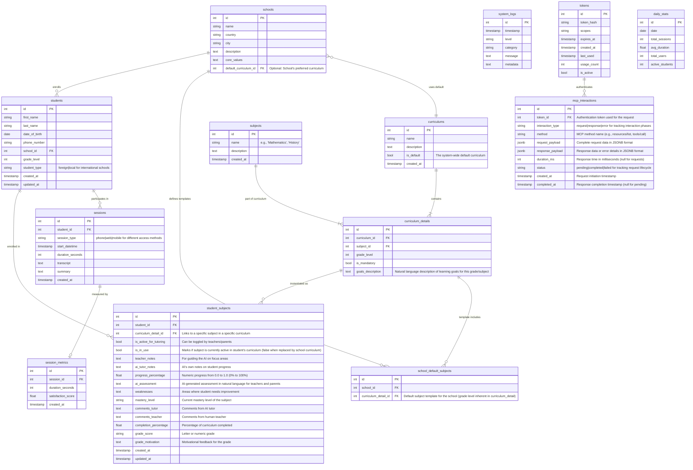

# AI Tutor System: System Architecture

This document outlines the system architecture for the AI Tutor platform, detailing components, data flow, security measures, and deployment patterns.

## 1. System Overview

The AI Tutor system is a cloud-native, PostgreSQL-backed platform that provides AI-powered tutoring services via voice calls. The system automatically processes conversations, manages student profiles, and provides administrative oversight through a comprehensive web dashboard.

### 1.1. Architecture Principles

- **Cloud-Native**: Designed for deployment on managed cloud platforms (Render.com)
- **Database-Centric**: PostgreSQL as the single source of truth for all persistent data
- **Microservice-Ready**: Modular design with clear separation of concerns
- **API-First**: All functionality exposed through well-defined APIs
- **Security-First**: Comprehensive authentication, authorization, and audit capabilities

## 2. System Components

### 2.1. Core Components


#### 2.1.1. Flask Backend (`ai-tutor/backend/`)
- **Purpose**: Main application server providing web UI and APIs
- **Framework**: Flask with Application Factory Pattern and Blueprint Architecture
- **Architecture**: Modular service-oriented design with clean separation of concerns
- **Entry Point**: [`run.py`](ai-tutor/backend/run.py) using application factory pattern
- **Core Structure**:
  ```
  ai-tutor/backend/
  ├── run.py                     # Production entry point
  ├── app/
  │   ├── __init__.py           # Application factory (create_app)
  │   ├── config.py             # Environment configurations
  │   ├── models/               # SQLAlchemy database models
  │   ├── services/             # Business logic layer
  │   ├── repositories/         # Data access layer
  │   ├── main/                # Admin UI blueprint
  │   │   ├── __init__.py
  │   │   └── routes.py        # Admin dashboard routes (1,511 lines)
  │   └── api/                 # REST API blueprint
  │       ├── __init__.py
  │       └── v1/routes.py     # API endpoints & VAPI webhooks (1,042 lines)
  └── admin-server-legacy-backup.py  # Archived monolithic version
  ```
- **Responsibilities**:
  - **Application Factory**: Environment-based app creation with extension initialization
  - **Blueprint Architecture**: Modular route organization by domain
  - **Service Layer**: Clean business logic separation from route handlers
  - **Repository Pattern**: Consistent data access abstraction
  - **Admin Dashboard**: Web interface via main blueprint
  - **RESTful API**: External access via api blueprint
  - **VAPI Integration**: Webhook processing and call management
  - **Authentication**: Token-based and session-based security
  - **AI Integration**: Structured prompt management and analysis

#### 2.1.2. MCP Server (`mcp-server/`)
- **Purpose**: Model Context Protocol server for external data access
- **Framework**: Node.js with TypeScript
- **Responsibilities**:
  - Secure data retrieval API
  - Token-based authentication validation
  - Student and session data access
  - Integration with AI assistants

#### 2.1.3. PostgreSQL Database
- **Purpose**: Central data store for all system information
- **Deployment**: Managed PostgreSQL on Render.com
- **Responsibilities**:
  - Student profiles and progress tracking
  - Session transcripts and summaries
  - Authentication tokens (persistent storage)
  - System logs and analytics
  - Curriculum and school data

#### 2.1.4. AI Analysis System (`ai-tutor/backend/ai_poc/`)
- **Purpose**: Production AI-powered analysis of tutoring session transcripts with conditional prompt selection
- **Framework**: Python with OpenAI/Anthropic API integration
- **Status**: Production system (despite "poc" directory name - historical naming)
- **Responsibilities**:
  - File-based prompt management (Markdown templates)
  - Conditional prompt selection based on call type (introductory vs tutoring)
  - Multi-provider AI analysis (OpenAI, Anthropic)
  - JSON-structured response parsing and extraction
  - Session quality validation
  - Student profile enhancement from transcripts
  - Call type detection (new vs returning students)

### 2.2. External Integrations

#### 2.2.1. VAPI (Voice API)
- **Purpose**: Voice call handling and transcript generation
- **Integration**: Webhook-based real-time processing
- **Data Flow**: Call → Transcript → Student Profile → Session Summary

## 3. Data Architecture

### 3.1. Complete Database Schema

The data model is implemented in PostgreSQL with a comprehensive schema supporting curriculum management, session tracking, authentication, and system monitoring.



### 3.2. System Data Architecture Overview

The database schema supports four primary functional areas:

#### 3.2.1. Educational Structure Management
-   **Schools & Students**: Core institutional relationships with basic student demographic data
-   **Curriculum System**: Flexible, multi-layered curriculum management supporting system defaults, school-specific templates, and individual student customization
-   **Subject Enrollment**: Granular subject-level management with AI tutoring controls and progress tracking per subject

#### 3.2.2. Session & Learning Analytics
-   **Session Recording**: Complete conversation transcripts with AI-generated summaries and metadata
-   **Assessment Tracking**: Subject-specific assessments tracking strengths, weaknesses, and mastery levels
-   **Progress Monitoring**: Dual-tracking system with numeric progress percentages and descriptive teacher assessments
-   **Performance Metrics**: Session quality metrics, duration tracking, and satisfaction scoring

#### 3.2.3. System Operations & Security
-   **Authentication Framework**: Secure token-based access control with scope-based permissions
-   **Audit & Logging**: Comprehensive system event logging with categorized retention and real-time monitoring
-   **MCP Interaction Monitoring**: Complete request/response logging for MCP server debugging and performance analysis
-   **Analytics Infrastructure**: Daily statistics, usage patterns, and system performance tracking

#### 3.2.4. AI Integration Architecture
-   **Session Context Loading**: Student context (curriculum, progress) provided to AI tutor
-   **Post-Session Processing**: AI analysis updates assessments and progress tracking

#### 3.2.5. Key Workflows

**Student Enrollment Workflow:**
1. New student creation with basic demographics
2. Student automatically receives system default curriculum via student_subjects records creation (all subjects marked as is_in_use=true)
3. School curriculum assignment replaces default curriculum:
   - Original system default subjects marked as is_in_use=false
   - New school curriculum subjects created as is_in_use=true
4. Individual subject customization and AI tutoring activation per active subject

**Tutoring Session Workflow:**
1. Student call triggers profile and curriculum context loading
2. AI tutor receives complete student context for personalized interaction
3. Session transcript captured with quality metrics
4. Post-session AI analysis updates progress tracking and recommendations

**Curriculum Management Workflow:**
1. System-wide curriculum definitions with subject mappings
2. School-specific curriculum template creation
3. Grade-level default subject assignment
4. Individual student curriculum customization and progress tracking

### 3.2. Repository Pattern

The system uses a hybrid approach for database access:
- **Admin Dashboard**: Direct repository access for CRUD operations, with SQLAlchemy ORM queries for statistics and complex filtering
- **API Endpoints**: Repository pattern for consistent data access

Repository classes include:
- `StudentRepository`: Student CRUD operations and profile management
- `SessionRepository`: Session management and transcript handling
- `TokenRepository`: Authentication token management and validation
- `SystemLogRepository`: Event logging and retrieval
- `MCPInteractionRepository`: MCP server request/response logging and analytics
- `SchoolRepository`: School and curriculum management
- `CurriculumRepository`: Curriculum definition and subject mapping
- `AssessmentRepository`: Student assessment and progress tracking

## 4. Security Architecture

### 4.1. Authentication & Authorization

#### 4.1.1. Admin Dashboard Authentication
- **Method**: Password-based with secure session management
- **Session Storage**: Server-side session with timeout protection
- **Password Security**: BCrypt hashing with salt

#### 4.1.2. API Token Authentication
- **Purpose**: Secure access for debugging, testing, and AI integration
- **Storage**: PostgreSQL with SHA-256 hashed tokens
- **Documentation**: See [`DEBUGGING_WITH_TOKENS.md`](DEBUGGING_WITH_TOKENS.md) for detailed token usage guide
- **Scopes**: Granular permission system
  - `api:read` - Read access to API endpoints
  - `api:write` - Write access to API endpoints
  - `logs:read` - Access to system logs
  - `mcp:access` - MCP server functionality
  - `admin:read` - Admin dashboard data

#### 4.1.3. Token Security Features
- **Persistent Storage**: Tokens survive deployments via PostgreSQL
- **Secure Generation**: Cryptographically secure random tokens
- **Hashed Storage**: Only SHA-256 hashes stored in database
- **Expiration Control**: Configurable token lifetime (1 hour - 7 days)
- **Usage Tracking**: Last used timestamp and usage count
- **Automatic Cleanup**: Expired tokens removed automatically
- **Revocation**: Immediate token invalidation capability

### 4.2. Data Security
- **Encryption**: All data encrypted in transit (HTTPS)
- **Database Security**: Managed PostgreSQL with access controls
- **GDPR Compliance**: Privacy-by-design data handling
- **Audit Trail**: Comprehensive logging of all system operations

## 5. API Architecture

### 5.1. RESTful API Design
- **Purpose**: External access for AI integration, debugging, and third-party tools
- **Admin Interface**: Uses hybrid repository access and direct ORM queries (not RESTful API)
- **Base URL**: `/api/v1/`
- **Authentication**: Bearer token in Authorization header
- **Content Type**: JSON request/response format
- **Error Handling**: Consistent HTTP status codes and error messages

### 5.2. Key API Endpoints
```
GET  /api/v1/students          # List students
POST /api/v1/students          # Create student
GET  /api/v1/students/{id}     # Get student details
PUT  /api/v1/students/{id}     # Update student

GET  /api/v1/sessions          # List sessions
GET  /api/v1/sessions/{id}     # Get session details

POST /api/v1/vapi/webhook      # VAPI webhook endpoint
GET  /api/v1/logs              # System logs (with filtering)

POST /admin/api/mcp/log-request   # Log MCP request
POST /admin/api/mcp/log-response  # Log MCP response
GET  /admin/api/mcp/interactions  # List MCP interactions (with filtering)
GET  /admin/api/mcp/stats         # MCP interaction statistics
POST /admin/api/mcp/cleanup       # Clean up old interactions
```

### 5.3. MCP Server API
- **Protocol**: Model Context Protocol over stdio/HTTP (separate from RESTful API)
- **Authentication**: Token-based with scope validation
- **Resources**: Student data, session transcripts, system logs
- **Tools**: Data query and analysis capabilities
- **Logging**: Complete request/response interaction logging for debugging and performance monitoring

## 6. Data Flow Architecture

### 6.1. Voice Call Processing Flow
```
1. Student calls → VAPI
2. VAPI → MCP server call (initial context loading)
3. MCP server → Student context retrieval from PostgreSQL
4. VAPI processes call with student context → Generates transcript
5. VAPI webhook → Flask backend
6. Backend processes transcript:
   - Identifies/creates student profile
   - Creates session record
   - Triggers AI post-processing
7. AI analysis → Updates student assessment
8. Session summary generated
9. Data stored in PostgreSQL
```

### 6.3. AI Prompt Management Flow
```
1. System startup → FileBasedPromptManager loads all .md files
2. Call processing → Phone number lookup to determine call type
3. Conditional prompt selection:
   - New student (phone not in system) → Introductory call prompts
   - Existing student (phone in system) → Tutoring session prompts
4. Template lookup → Load appropriate prompt based on call type
5. Parameter injection → Template formatting with student context
6. AI provider call → Formatted prompt sent to OpenAI/Anthropic
7. JSON response parsing → Structured data extraction
8. Database storage → Results saved to PostgreSQL
```

### 6.4. MCP Interaction Logging Flow
```
1. AI Assistant connects → MCP server authentication
2. Request received → Log request to mcp_interactions table (status: pending)
3. Request processing → MCP server business logic execution
4. Response generation → Complete response payload creation
5. Response logging → Update interaction record (status: completed, add response data)
6. Performance tracking → Record duration_ms and completion timestamp
7. Error handling → Log error details and mark status as failed
8. Admin monitoring → Real-time interaction tracking via dashboard
```

### 6.5. Conditional Prompt System Architecture

#### 6.5.1. Call Type Detection Logic
```
1. VAPI webhook receives call data with phone number
2. Student lookup in PostgreSQL database:
   - SELECT * FROM students WHERE phone_number = caller_phone
3. Call type determination:
   - If student exists → TUTORING_SESSION
   - If student not found → INTRODUCTORY_CALL
4. Prompt selection based on call type
```

#### 6.5.2. Prompt Template Organization
```
ai-tutor/backend/ai_poc/prompts/
├── introductory_analysis.md     # New student profile creation
├── session_analysis.md          # General tutoring session analysis
├── math_analysis.md             # Mathematics-focused analysis
├── reading_analysis.md          # Reading comprehension analysis
├── quick_assessment.md          # Rapid capability assessment
└── progress_tracking.md         # Learning progress evaluation
```

#### 6.5.3. JSON Response Format
All prompts generate structured JSON responses with standardized fields:
```json
{
  "student_profile": {
    "name": "string",
    "grade_level": "string",
    "subjects_discussed": ["array"]
  },
  "session_analysis": {
    "key_topics": ["array"],
    "understanding_level": "string",
    "areas_for_improvement": ["array"],
    "strengths": ["array"]
  },
  "recommendations": {
    "next_steps": ["array"],
    "focus_areas": ["array"],
    "suggested_resources": ["array"]
  },
  "metadata": {
    "call_type": "introductory|tutoring",
    "confidence_score": "number",
    "analysis_timestamp": "string"
  }
}
```

### 6.6. Admin Dashboard Flow
```
1. Admin login → Session authentication
2. Dashboard queries → Repository layer
3. Repository → PostgreSQL queries
4. Data formatting → Web interface
5. Admin actions → API calls → Database updates
```

### 6.7. Token Authentication Flow
```
1. Admin generates token via Flask admin interface → Token stored in PostgreSQL (hashed)
2. Client/AI assistant → API request with token
3. Token validation → Database lookup and scope check
4. Authorized request → Repository layer → Response
5. Usage tracking → Token statistics updated
```

## 7. Deployment Architecture

### 7.1. Render.com Deployment
- **Platform**: Render.com managed services
- **Web Service**: Flask application using Application Factory pattern
- **Entry Point**: [`run.py`](ai-tutor/backend/run.py) with production-ready configuration
- **Database**: Managed PostgreSQL service
- **Environment**: Production-ready with health checks and automatic table creation

### 7.2. Application Factory Deployment
- **Production Entry**: `run.py` creates Flask app using `create_app()` factory function
- **Environment Detection**: Automatic development/production configuration selection
- **Extension Initialization**: SQLAlchemy, JWT, Celery initialized via factory
- **Blueprint Registration**: Modular route registration through application factory
- **Database Auto-Setup**: Automatic table creation on first deployment

### 7.3. Environment Configuration
- **Development**: Local development with SQLite/PostgreSQL
- **Production**: Managed PostgreSQL with connection pooling and environment-based config
- **Configuration Classes**: Separate config classes for dev/test/production environments
- **Environment Variables**: All secrets and deployment-specific settings via env vars
- **Logging**: Centralized PostgreSQL-based logging with structured event tracking

### 7.4. Deployment Features
- **Auto-Deploy**: Git-based deployment triggers using new application factory
- **Health Checks**: Built-in `/health` endpoint monitoring
- **Database Migrations**: SQLAlchemy-based schema updates with Flask-Migrate
- **Service Layer**: Clean business logic separation for easier testing and deployment
- **Blueprint Architecture**: Modular deployment with separate admin UI and API services
- **Data Seeding**: Automatic creation of default curriculum and system data
- **Token Persistence**: Tokens survive all deployments via PostgreSQL storage
- **Zero-Downtime**: Managed service ensures availability during updates
- **Gunicorn Integration**: Production WSGI server with gevent workers for performance

### 7.4. Database Migration Process
- **Migration Scripts**: Flask-Migrate generates and applies schema changes
- **Version Control**: Database schema versions tracked in Git
- **Rollback Support**: Ability to revert database changes if needed
- **Seed Data Management**: Automated creation of essential system data (default curriculum, system subjects)

## 8. Monitoring & Observability

### 8.1. System Logging
- **Storage**: PostgreSQL-based log storage
- **Categories**: VAPI, Database, Authentication, System, Error, MCP
- **Retention**: Automatic 30-day log cleanup
- **Filtering**: Advanced log search and filtering
- **Real-time**: Live system event monitoring
- **MCP Interaction Tracking**: Complete request/response logging with performance metrics

### 8.2. Performance Monitoring
- **Database Performance**: Query optimization and indexing
- **API Response Times**: Endpoint performance tracking
- **Token Usage**: Authentication statistics and monitoring
- **Session Analytics**: Student engagement metrics

### 8.3. Health Monitoring
- **Application Health**: Built-in health check endpoints
- **Database Connectivity**: Connection pool monitoring
- **External Service Status**: VAPI integration monitoring
- **Error Rate Tracking**: Automated error detection and alerting

## 9. Future Architecture Considerations

### 9.1. Scalability
- **Database Scaling**: Read replicas for query optimization
- **Service Decomposition**: Microservice extraction as needed
- **Caching Layer**: Redis for frequently accessed data
- **Load Balancing**: Multiple application instances

### 9.2. Integration Expansion
- **Multi-Channel Support**: Web and mobile app integration
- **Additional AI Services**: Extended AI processing capabilities
- **Third-Party APIs**: School system integrations
- **Analytics Platform**: Advanced reporting and insights

### 9.3. Security Enhancements
- **OAuth2 Integration**: External authentication providers
- **Role-Based Access**: Enhanced permission system
- **API Rate Limiting**: Request throttling and abuse prevention
- **Compliance Automation**: GDPR and privacy compliance tools

### 9.4. GDPR Compliance Requirements
- **Data Minimization**: Collect only necessary student information
- **Right to Erasure**: Complete student data deletion capabilities
- **Data Portability**: Export student data in machine-readable formats
- **Consent Management**: Parental consent tracking for minor students
- **Data Processing Logs**: Audit trail of all personal data access
- **Privacy by Design**: Default privacy-protective settings
- **Cross-Border Data**: Compliance with international data transfer regulations

### 9.5. Error Handling Strategies
- **Graceful Degradation**: System continues operating with reduced functionality
- **Circuit Breakers**: Automatic fallback when external services fail
- **Retry Mechanisms**: Intelligent retry logic for transient failures
- **Error Monitoring**: Real-time error detection and alerting
- **User-Friendly Messages**: Clear error communication to end users
- **Recovery Procedures**: Documented steps for system recovery
- **Backup Strategies**: Regular data backups with tested restore procedures

## 10. Default Curriculum System

### 10.1. Cambridge Primary 2025 Default Curriculum

The system includes a comprehensive default curriculum based on Cambridge Primary 2025 standards, automatically assigned to students upon creation.

#### 10.1.1. Data Source
- **File Location**: [`ai-tutor/data/curriculum/cambridge_primary_2025.txt`](ai-tutor/data/curriculum/cambridge_primary_2025.txt)
- **Format**: Tab-separated values (TSV) with headers: Grade, Subject, Mandatory, Details
- **Content**: Complete Cambridge Primary curriculum for Grades 1-6 covering all core and optional subjects
- **Standards Compliance**: Aligned with Cambridge Primary curriculum standards for 2025

#### 10.1.2. Curriculum Structure
```
Grade 1-6 Subjects Include:
- Core Mandatory: English (Literacy), Mathematics, Science
- Optional Subjects: Global Perspectives, Computing/ICT, Art & Design, Music, Physical Education
- Grade-Specific: Age-appropriate learning objectives and detailed descriptions
```

#### 10.1.3. Automatic Default Assignment
- **Student Creation**: New students automatically receive complete default curriculum via `student_subjects` table
- **All Subjects**: System creates records for all grade-appropriate subjects (mandatory and optional)
- **Initial State**: All subjects marked as `is_in_use=true` and `is_active_for_tutoring=false` by default
- **Curriculum Switching**: When students are assigned to schools with custom curricula, default subjects are marked `is_in_use=false`

### 10.2. Curriculum Data Management

#### 10.2.1. Startup Import Process
- **Automatic Loading**: Cambridge curriculum data imported automatically on application startup
- **Idempotent Import**: System checks for existing default curriculum before importing
- **Error Handling**: Import failures logged with detailed error messages
- **Data Validation**: TSV format validation with proper error reporting

#### 10.2.2. Database Schema Integration
The default curriculum integrates with the existing database schema:

```sql
-- Default curriculum creation
INSERT INTO curriculums (name, description, is_default)
VALUES ('Cambridge Primary 2025', 'Cambridge Primary Curriculum 2025 Standards', true);

-- Subject creation and curriculum_details population
-- Based on TSV file data with grade-level subject mappings
```

#### 10.2.3. Data File Format
```tsv
Grade	Subject	Mandatory	Details
1	English (Literacy)	Yes	"Reading: Recognize all letters..."
1	Mathematics	Yes	"Learn the foundation of the number system..."
```

### 10.3. Curriculum Management Architecture

#### 10.3.1. File-Based Curriculum Data
- **Storage**: Curriculum definitions stored in structured data files
- **Version Control**: Curriculum changes tracked through Git
- **Flexibility**: Support for multiple curriculum standards (Cambridge, national, school-specific)
- **Import Process**: Automated import of curriculum data on system initialization

#### 10.3.2. Default Curriculum Assignment Workflow
```
1. Student Creation → System checks for default curriculum
2. Default Curriculum Exists → Create student_subjects records for all grade-appropriate subjects
3. Subject Assignment → Mark subjects as is_in_use=true, is_active_for_tutoring=false
4. AI Tutoring → Teachers can activate specific subjects for AI tutoring
5. School Assignment → School curriculum can replace default (mark original as is_in_use=false)
```

#### 10.3.3. Curriculum Data Integrity
- **Referential Integrity**: Foreign key constraints ensure data consistency
- **Default Curriculum**: Exactly one curriculum marked as `is_default=true`
- **Subject Consistency**: All subjects referenced in curriculum_details must exist in subjects table
- **Grade Validation**: Grade levels validated against system-supported ranges (1-12)