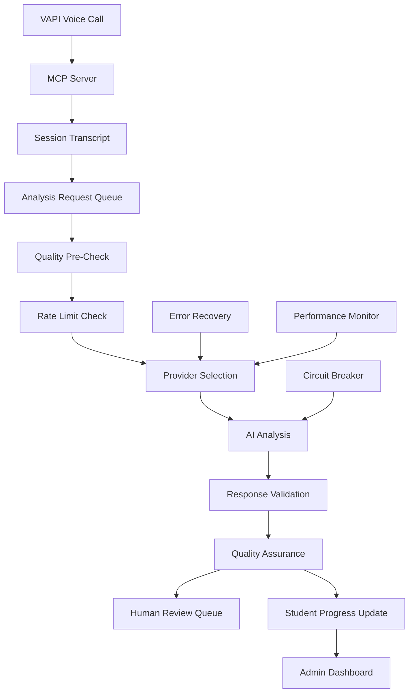

# Final Implementation Roadmap: Enhanced AI Post-Processing System

## 🎯 **Complete System Overview**

This roadmap integrates the provider-agnostic AI architecture with advanced quality assurance, rate limiting, and reliability enhancements into a production-ready educational AI system for the international school in Greece.

## 📋 **Architecture Integration Summary**

### **Core Components Integration**
```
┌─────────────────────────────────────────────────────────────────┐
│                    AI POST-PROCESSING SYSTEM                    │
├─────────────────────────────────────────────────────────────────┤
│  Admin Dashboard  │  VAPI Integration  │  MCP Server Interface  │
├─────────────────────────────────────────────────────────────────┤
│              Session Analysis Orchestrator                      │
├─────────────────────────────────────────────────────────────────┤
│  Quality Assurance  │  Rate Limiter  │  Concurrency Manager    │
├─────────────────────────────────────────────────────────────────┤
│  Provider Manager (OpenAI O3, Anthropic, Google, Azure, Local) │
├─────────────────────────────────────────────────────────────────┤
│  Performance Monitor │  Circuit Breakers │  Error Recovery     │
├─────────────────────────────────────────────────────────────────┤
│              Student Data & Progress Tracking                   │
└─────────────────────────────────────────────────────────────────┘
```

### **Data Flow Architecture**


## 🚀 **Phase-by-Phase Implementation Plan**

### **Phase 1: Foundation Infrastructure (Week 1-2)**

#### **Week 1: Core Provider System**
```python
# File structure to create:
ai_post_processing/
├── __init__.py
├── core/
│   ├── __init__.py
│   ├── provider_interface.py       # Abstract base classes
│   ├── provider_manager.py         # Central provider coordination
│   ├── data_models.py             # Standardized data structures
│   └── exceptions.py              # Custom exceptions
├── providers/
│   ├── __init__.py
│   ├── openai_provider.py         # O3/GPT-4 implementation
│   ├── anthropic_provider.py      # Claude implementation  
│   ├── google_provider.py         # Gemini implementation
│   └── provider_factory.py        # Provider instantiation
├── config/
│   ├── __init__.py
│   ├── settings.py               # Configuration management
│   └── validation.py             # Config validation
└── tests/
    ├── __init__.py
    ├── test_providers.py
    └── test_config.py
```

**Priority Tasks:**
- [ ] **Day 1-2**: Create core data models and provider interface
- [ ] **Day 3-4**: Implement OpenAI O3 provider with configuration system
- [ ] **Day 5-6**: Add basic error handling and logging
- [ ] **Day 7**: Create comprehensive unit tests

#### **Week 2: Quality Assurance Foundation**
```python
# Additional file structure:
ai_post_processing/
├── quality/
│   ├── __init__.py
│   ├── validator.py              # Educational content validation
│   ├── evidence_checker.py       # Transcript evidence grounding
│   ├── standards_checker.py      # Educational standards compliance
│   └── review_queue.py           # Human review management
├── monitoring/
│   ├── __init__.py
│   ├── metrics_collector.py      # Performance metrics
│   ├── alert_manager.py          # Alert system
│   └── dashboard_data.py         # Admin dashboard integration
```

**Priority Tasks:**
- [ ] **Day 8-9**: Implement basic educational content validation
- [ ] **Day 10-11**: Create evidence grounding checker
- [ ] **Day 12-13**: Build human review queue system
- [ ] **Day 14**: Integration testing with admin dashboard

### **Phase 2: Reliability & Performance (Week 3-4)**

#### **Week 3: Rate Limiting & Concurrency**
```python
# Additional components:
ai_post_processing/
├── reliability/
│   ├── __init__.py
│   ├── rate_limiter.py           # Token bucket implementation
│   ├── circuit_breaker.py        # Provider fault tolerance
│   ├── concurrency_manager.py    # Request coordination
│   └── adaptive_throttle.py      # Performance-based throttling
├── processing/
│   ├── __init__.py
│   ├── session_processor.py      # Main processing orchestrator
│   ├── priority_queue.py         # Priority-based processing
│   └── batch_processor.py        # Bulk processing capabilities
```

**Priority Tasks:**
- [ ] **Day 15-16**: Implement token bucket rate limiting
- [ ] **Day 17-18**: Create circuit breaker pattern for providers
- [ ] **Day 19-20**: Build priority-based concurrency management
- [ ] **Day 21**: Performance testing and optimization

#### **Week 4: Multi-Provider Support**
```python
# Expand provider support:
ai_post_processing/
├── providers/
│   ├── anthropic_provider.py     # Complete Claude integration
│   ├── google_provider.py        # Complete Gemini integration
│   ├── azure_provider.py         # Azure OpenAI support
│   └── local_provider.py         # Ollama/local model support
├── fallback/
│   ├── __init__.py
│   ├── fallback_manager.py       # Provider failover logic
│   └── health_checker.py         # Provider health monitoring
```

**Priority Tasks:**
- [ ] **Day 22-23**: Complete Anthropic and Google provider implementations
- [ ] **Day 24-25**: Build provider failover and health checking
- [ ] **Day 26-27**: Add Azure and local model support
- [ ] **Day 28**: End-to-end multi-provider testing

### **Phase 3: Advanced Features (Week 5-6)**

#### **Week 5: Advanced Quality Assurance**
```python
# Enhanced QA features:
ai_post_processing/
├── quality/
│   ├── cross_validator.py        # Cross-provider verification
│   ├── bias_detector.py          # Educational bias detection
│   ├── age_appropriateness.py    # Age-specific validation
│   └── cultural_sensitivity.py   # International context validation
├── analytics/
│   ├── __init__.py
│   ├── trend_analyzer.py         # Performance trend analysis
│   ├── cost_optimizer.py         # Cost optimization recommendations
│   └── usage_predictor.py        # Usage pattern prediction
```

**Priority Tasks:**
- [ ] **Day 29-30**: Implement cross-provider validation
- [ ] **Day 31-32**: Add bias detection and cultural sensitivity checks
- [ ] **Day 33-34**: Build performance analytics and cost optimization
- [ ] **Day 35**: Advanced QA integration testing

#### **Week 6: Admin Dashboard Integration**
```python
# Dashboard enhancements:
admin_dashboard/
├── ai_management/
│   ├── provider_dashboard.html   # Provider status and switching
│   ├── quality_review.html       # Human review interface
│   ├── performance_analytics.html # System performance metrics
│   └── cost_monitoring.html      # Cost tracking and alerts
├── api_routes/
│   ├── ai_providers.py           # Provider management API
│   ├── quality_review.py         # Review queue API
│   └── analytics.py              # Analytics data API
```

**Priority Tasks:**
- [ ] **Day 36-37**: Create provider management dashboard
- [ ] **Day 38-39**: Build human review interface
- [ ] **Day 40-41**: Add performance and cost monitoring dashboards
- [ ] **Day 42**: Complete dashboard integration testing

### **Phase 4: Production Optimization (Week 7-8)**

#### **Week 7: Performance & Security**
```python
# Production features:
ai_post_processing/
├── security/
│   ├── __init__.py
│   ├── key_manager.py            # API key rotation and management
│   ├── data_encryption.py        # Sensitive data protection
│   └── audit_logger.py           # Security audit logging
├── caching/
│   ├── __init__.py
│   ├── analysis_cache.py         # Redis-based response caching
│   └── cache_manager.py          # Cache invalidation strategies
```

**Priority Tasks:**
- [ ] **Day 43-44**: Implement API key management and rotation
- [ ] **Day 45-46**: Add data encryption and security auditing
- [ ] **Day 47-48**: Build Redis-based caching system
- [ ] **Day 49**: Security and performance validation

#### **Week 8: Deployment & Monitoring**
```python
# Deployment components:
deployment/
├── docker/
│   ├── Dockerfile                # Container configuration
│   ├── docker-compose.yml        # Multi-service setup
│   └── requirements.txt          # Python dependencies
├── render/
│   ├── render.yaml               # Render.com deployment config
│   └── startup.sh                # Service startup script
├── monitoring/
│   ├── health_check.py           # Service health endpoints
│   └── metrics_export.py         # Prometheus metrics export
```

**Priority Tasks:**
- [ ] **Day 50-51**: Create Docker containers and deployment configs
- [ ] **Day 52-53**: Deploy to Render.com with monitoring
- [ ] **Day 54-55**: Load testing and performance optimization
- [ ] **Day 56**: Production readiness verification

## 🔧 **Implementation Specifications**

### **1. Core Provider Interface Implementation**

```python
# ai_post_processing/core/provider_interface.py
from abc import ABC, abstractmethod
from typing import Dict, Any, Optional
from dataclasses import dataclass
from datetime import datetime

@dataclass
class AnalysisRequest:
    transcript: str
    student_context: Dict[str, Any]
    session_metadata: Dict[str, Any]
    analysis_depth: str = 'standard'
    priority: str = 'normal'
    max_cost_usd: Optional[float] = None
    preferred_provider: Optional[str] = None
    require_human_review: bool = False

@dataclass
class StandardizedAnalysis:
    # Educational analysis components
    conceptual_understanding: Dict[str, Any]
    engagement_patterns: Dict[str, Any]
    personalization_effectiveness: Dict[str, Any]
    progress_trajectory: Dict[str, Any]
    recommendations: Dict[str, Any]
    
    # Quality metrics
    confidence_scores: Dict[str, float]
    validation_results: 'ValidationResult'
    evidence_support: Dict[str, float]
    
    # System metadata
    provider_metadata: Dict[str, Any]
    processing_metadata: Dict[str, Any]
    cost_breakdown: 'CostEstimate'
    timestamp: datetime

class EducationalAIProvider(ABC):
    """Enhanced abstract base for all educational AI providers"""
    
    @abstractmethod
    async def analyze_educational_session(
        self, 
        request: AnalysisRequest
    ) -> StandardizedAnalysis:
        """Perform educational analysis with enhanced request handling"""
        pass
    
    @abstractmethod
    async def health_check(self) -> Dict[str, Any]:
        """Comprehensive provider health check"""
        pass
    
    @abstractmethod
    def get_capabilities(self) -> 'ProviderCapabilities':
        """Get detailed provider capabilities"""
        pass
    
    @abstractmethod
    def estimate_cost(self, request: AnalysisRequest) -> 'CostEstimate':
        """Enhanced cost estimation"""
        pass
```

### **2. Enhanced Provider Manager**

```python
# ai_post_processing/core/provider_manager.py
class EnhancedAIProviderManager:
    """
    Production-grade AI provider manager with full reliability features
    """
    
    def __init__(self):
        self.providers = {}
        self.rate_limiter = AdvancedRateLimiter()
        self.circuit_breakers = ProviderCircuitBreakerManager()
        self.quality_assurance = EducationalQualityAssurance()
        self.concurrency_manager = ConcurrencyManager()
        self.performance_monitor = PerformanceMonitor()
        self.fallback_manager = FallbackManager()
        
        self._initialize_providers()
        self._start_background_tasks()
    
    async def process_analysis_request(
        self, 
        request: AnalysisRequest
    ) -> StandardizedAnalysis:
        """
        Main entry point for analysis requests
        Handles full pipeline: QA, rate limiting, provider selection, fallback
        """
        
        # Pre-request validation
        validation_result = await self.quality_assurance.pre_validate_request(request)
        if not validation_result.is_valid:
            raise InvalidRequestError(validation_result.issues_found)
        
        # Acquire rate limiting and concurrency permits
        async with self.concurrency_manager.acquire_processing_slot(request.priority):
            
            # Select optimal provider
            provider_name = await self._select_optimal_provider(request)
            
            # Attempt analysis with fallback chain
            for attempt_provider in [provider_name] + self.fallback_manager.get_fallback_chain(provider_name):
                
                try:
                    # Check provider health
                    if not await self._is_provider_healthy(attempt_provider):
                        continue
                    
                    # Acquire rate limit
                    await self.rate_limiter.wait_for_rate_limit(
                        attempt_provider, 
                        self._estimate_tokens(request)
                    )
                    
                    # Perform analysis with circuit breaker protection
                    provider = self.providers[attempt_provider]
                    analysis = await self.circuit_breakers.call_with_circuit_breaker(
                        attempt_provider,
                        provider.analyze_educational_session,
                        request
                    )
                    
                    # Post-analysis quality assurance
                    validated_analysis = await self.quality_assurance.validate_analysis(
                        analysis, request.transcript, request.student_context
                    )
                    
                    # Track performance metrics
                    await self.performance_monitor.track_successful_analysis(
                        attempt_provider, analysis, request
                    )
                    
                    return validated_analysis
                    
                except Exception as e:
                    # Track failure and continue to next provider
                    await self.performance_monitor.track_failed_analysis(
                        attempt_provider, e, request
                    )
                    continue
            
            # All providers failed
            raise AllProvidersFailedError("No providers available for analysis")
```

### **3. Integration with Admin Dashboard**

```python
# admin_dashboard/ai_management.py
@app.route('/admin/ai-system')
def ai_system_dashboard():
    """Comprehensive AI system management dashboard"""
    
    provider_manager = get_provider_manager()
    
    dashboard_data = {
        'provider_status': provider_manager.get_provider_status(),
        'processing_queue': provider_manager.get_queue_status(),
        'quality_metrics': provider_manager.get_quality_metrics(),
        'performance_stats': provider_manager.get_performance_stats(),
        'cost_tracking': provider_manager.get_cost_tracking(),
        'recent_alerts': provider_manager.get_recent_alerts(),
        'system_health': provider_manager.get_system_health()
    }
    
    return render_template('ai_system_dashboard.html', **dashboard_data)

@app.route('/admin/ai-providers/switch', methods=['POST'])
def switch_primary_provider():
    """Enhanced provider switching with validation"""
    
    new_provider = request.form.get('provider')
    force_switch = request.form.get('force', False)
    
    provider_manager = get_provider_manager()
    
    # Validate provider switch
    validation_result = provider_manager.validate_provider_switch(new_provider)
    
    if not validation_result.is_valid and not force_switch:
        return jsonify({
            'success': False,
            'errors': validation_result.issues,
            'warnings': validation_result.warnings
        })
    
    # Perform switch
    switch_result = await provider_manager.switch_primary_provider(new_provider)
    
    # Audit log
    audit_log.record_provider_switch(
        admin_user=session.get('admin_username'),
        old_provider=switch_result.old_provider,
        new_provider=new_provider,
        validation_result=validation_result
    )
    
    return jsonify({
        'success': True,
        'message': f'Successfully switched to {new_provider}',
        'warnings': validation_result.warnings if validation_result.warnings else []
    })
```

## 📊 **Quality Metrics & KPIs**

### **System Reliability Targets**
- **Uptime**: 99.9% (< 8.77 hours downtime/year)
- **Response Time**: < 10 seconds average, < 30 seconds 95th percentile
- **Error Rate**: < 1% of requests
- **Provider Failover**: < 5 seconds recovery time

### **Quality Assurance Targets**
- **Analysis Accuracy**: > 90% educator approval rating
- **Evidence Grounding**: > 85% claims supported by transcript
- **Age Appropriateness**: > 95% appropriate content rating
- **Cultural Sensitivity**: > 98% appropriate for international context

### **Cost Management Targets**
- **Daily Cost Control**: Alerts at 80% of limit, hard stop at 100%
- **Cost per Analysis**: < $0.50 average across all providers
- **Cost Optimization**: 20% reduction through intelligent provider selection

## 🔒 **Security & Compliance Framework**

### **Data Protection**
- **Encryption**: AES-256 for data at rest, TLS 1.3 for data in transit
- **API Keys**: Rotation every 90 days, stored in secure vault
- **Student Data**: GDPR compliance, right to deletion
- **Audit Logging**: Complete audit trail for compliance

### **Access Control**
- **Admin Authentication**: Multi-factor authentication required
- **Role-Based Access**: Separate permissions for different admin functions
- **Session Management**: Secure session handling with timeout
- **API Security**: Rate limiting and request validation

## 🚀 **Deployment Strategy**

### **Environment Configuration**
```bash
# Production environment setup
ENVIRONMENT=production
DEBUG=false
LOG_LEVEL=WARNING

# AI Provider Configuration
AI_PROVIDER=openai
OPENAI_MODEL=o3-mini
FALLBACK_PROVIDERS=anthropic,google

# Performance Tuning
MAX_CONCURRENT_ANALYSES=10
CACHE_TTL_HOURS=24
RATE_LIMIT_BUFFER=0.8

# Security
FORCE_HTTPS=true
SESSION_TIMEOUT_MINUTES=30
API_KEY_ROTATION_DAYS=90

# Monitoring
ENABLE_METRICS_EXPORT=true
ALERT_EMAIL=admin@school.edu
PERFORMANCE_ALERT_THRESHOLD=15.0
```

### **Render.com Deployment**
```yaml
# render.yaml
services:
  - type: web
    name: ai-tutor-system
    env: python
    buildCommand: pip install -r requirements.txt
    startCommand: python main.py
    envVars:
      - key: ENVIRONMENT
        value: production
      - key: AI_PROVIDER
        sync: false
    scaling:
      minInstances: 2
      maxInstances: 10
      targetCPU: 70
      targetMemory: 80
```

## 📈 **Success Metrics & Monitoring**

### **Implementation Milestones**
- [ ] **Week 2**: Basic AI analysis working with OpenAI O3
- [ ] **Week 4**: Multi-provider support with failover
- [ ] **Week 6**: Quality assurance and human review system
- [ ] **Week 8**: Production deployment with full monitoring

### **Business Impact Targets**
- **Tutor Efficiency**: 40% reduction in post-session analysis time
- **Educational Insights**: 3x more detailed progress tracking
- **Cost Efficiency**: 60% cost reduction vs. human analysis
- **Quality Consistency**: 95% consistent analysis quality

---

**🎯 Final Outcome:**
A production-ready, enterprise-grade AI post-processing system that:
- Seamlessly switches between multiple AI providers (O3, Claude, Gemini)
- Ensures educational quality through comprehensive validation
- Provides reliable service with automatic failover and recovery
- Integrates perfectly with existing admin dashboard and VAPI system
- Scales efficiently while maintaining cost control

This system positions the international school with cutting-edge AI capabilities while maintaining the flexibility to adapt to future AI developments.