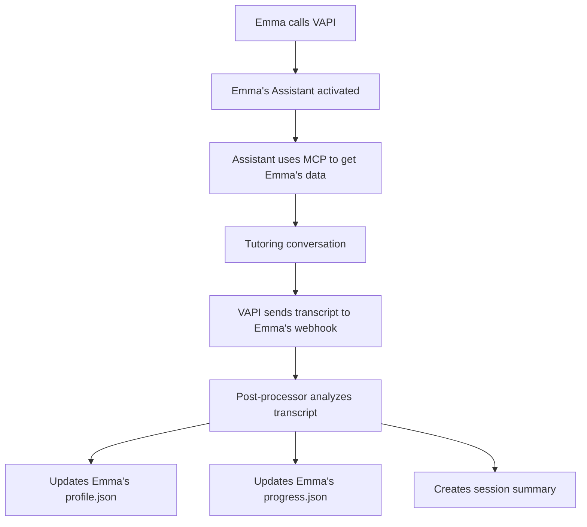

# 🎯 AI Tutor PoC - Simple Architecture

## 📋 Overview

This document outlines a **simple, implementable PoC** focused on the core functionality: **post-processing session transcripts to update student profiles and generate insights**. Complex production features are listed as future enhancements.

---

## 🎯 PoC Core Focus: Transcript Post-Processing

### **What We're Building (PoC Scope)**
```yaml
Primary_Goal: 
  "Automatically analyze session transcripts and update student learning profiles"

Core_Components:
  1. Session transcript capture (✅ Working)
  2. OpenAI analysis of transcripts  
  3. Student profile updates
  4. Simple progress tracking
  5. Session summaries for teachers/parents

Simplification_Strategy:
  - One OpenAI Assistant per student (eliminates identification complexity)
  - File-based storage (no complex databases)
  - Basic analysis prompts (no complex AI frameworks)
  - Manual trigger for post-processing (no complex automation)
```

---

## 🏗️ Simple Architecture Design

### **1. One Assistant Per Student Approach**

#### **Benefits of Separate Assistants**
```yaml
Advantages:
  ✅ No student identification needed
  ✅ Personalized assistant instructions per student
  ✅ Isolated student data (natural privacy boundary)
  ✅ Simple VAPI integration (each student gets unique webhook)
  ✅ Easy to manage and debug per student

Implementation:
  - Create Assistant for each student: "Emma Smith Tutor", "Jane Doe Tutor"
  - Each Assistant has student-specific instructions
  - Each Assistant connects to same MCP server with student_id
  - VAPI configured with separate phone numbers or access codes
```

#### **Assistant Configuration Per Student**
```yaml
Assistant_Name: "Emma Smith AI Tutor"
Instructions: |
  You are Emma's personal AI tutor. Emma is a 9-year-old Grade 4 student who:
  - Learns best with visual examples and diagrams
  - Enjoys space and animal topics  
  - Sometimes struggles with attention but responds well to encouragement
  - Is currently working on fractions and reading comprehension
  
  Use the get-student-context function to access Emma's current progress.
  Adapt your teaching style to her visual learning preference.
  Keep sessions engaging with her interests in space and animals.

Tools:
  - get-student-context (points to MCP server with emma_smith student_id)

VAPI_Webhook: https://ai-tutor-ptnl.onrender.com/webhook/vapi/emma-smith
```

### **2. Simplified Post-Processing Workflow**



---

## 📝 PoC Implementation Plan

### **Phase 1: Basic Transcript Analysis (Week 1)**

#### **Simple Post-Processing Script**
```python
# simple_post_processor.py
class SimplePostProcessor:
    def __init__(self):
        self.openai_client = OpenAI(api_key=os.getenv('OPENAI_API_KEY'))
    
    def process_session(self, student_id, transcript):
        """Simple transcript analysis and profile updates"""
        
        # 1. Load current student data
        profile = self.load_student_profile(student_id)
        progress = self.load_student_progress(student_id)
        
        # 2. Analyze transcript with simple prompt
        analysis = self.analyze_transcript(transcript, profile, progress)
        
        # 3. Update files based on analysis
        self.update_profile_if_needed(student_id, analysis)
        self.update_progress_if_needed(student_id, analysis)
        self.create_session_summary(student_id, transcript, analysis)
        
        return analysis
    
    def analyze_transcript(self, transcript, profile, progress):
        """Single OpenAI call to analyze transcript"""
        prompt = f"""
        Analyze this tutoring session transcript and suggest updates:
        
        TRANSCRIPT: {transcript}
        
        CURRENT PROFILE: {json.dumps(profile, indent=2)}
        
        CURRENT PROGRESS: {json.dumps(progress, indent=2)}
        
        Please provide:
        1. Any learning style observations
        2. Concepts the student mastered or struggled with
        3. Engagement level (high/medium/low)
        4. Suggested profile updates
        5. Progress updates needed
        6. Brief session summary for parents/teachers
        
        Format as JSON with sections: learning_observations, mastery_assessment, engagement_level, profile_updates, progress_updates, session_summary
        """
        
        response = self.openai_client.chat.completions.create(
            model="gpt-4",
            messages=[{"role": "user", "content": prompt}],
            max_tokens=1500,
            temperature=0.3
        )
        
        return json.loads(response.choices[0].message.content)
```

#### **Manual Processing Trigger**
```python
# Manual script to process sessions
# Usage: python process_session.py emma_smith 2025-01-17_1430

import sys
from simple_post_processor import SimplePostProcessor

def main():
    if len(sys.argv) != 3:
        print("Usage: python process_session.py <student_id> <session_id>")
        return
    
    student_id = sys.argv[1]
    session_id = sys.argv[2]
    
    # Load session transcript
    session_file = f"data/students/{student_id}/sessions/{session_id}_session.json"
    with open(session_file, 'r') as f:
        session_data = json.load(f)
    
    transcript = session_data['conversation']['transcript']
    
    # Process
    processor = SimplePostProcessor()
    analysis = processor.process_session(student_id, transcript)
    
    print(f"✅ Processed session {session_id} for {student_id}")
    print(f"📊 Analysis: {analysis['session_summary']}")

if __name__ == "__main__":
    main()
```

### **Phase 2: Automated Webhook Processing (Week 2)**

#### **Enhanced Webhook Handler**
```python
# Add to session-enhanced-server.py
def handle_vapi_webhook_with_processing(self, request_data):
    """Enhanced webhook that triggers post-processing"""
    
    # Extract student ID from webhook URL
    # e.g., /webhook/vapi/emma-smith -> student_id = "emma_smith"
    student_id = self.extract_student_from_webhook_path(request.path)
    
    # Process webhook normally
    session_id = self.process_vapi_webhook(request_data, student_id)
    
    # Trigger post-processing asynchronously
    if session_id and self.should_auto_process(student_id):
        asyncio.create_task(self.trigger_post_processing(session_id))
    
    return {'success': True, 'session_id': session_id}

def trigger_post_processing(self, session_id):
    """Automatically trigger post-processing for completed sessions"""
    try:
        session_data = self.session_history[session_id]
        transcript = session_data['conversation']['transcript']
        student_id = session_data['student_id']
        
        # Run simple post-processor
        processor = SimplePostProcessor()
        analysis = processor.process_session(student_id, transcript)
        
        # Mark session as analyzed
        session_data['analysis'] = analysis
        session_data['analysis_completed'] = True
        self.save_session(session_data)
        
        logger.info(f"✅ Auto-processed session {session_id}")
        
    except Exception as e:
        logger.error(f"❌ Auto-processing failed for {session_id}: {e}")
```

---

## 📊 Simple Data Updates

### **Profile Updates (Simple)**
```python
def update_profile_if_needed(self, student_id, analysis):
    """Simple profile updates based on analysis"""
    
    profile_updates = analysis.get('profile_updates', {})
    if not profile_updates:
        return
    
    # Load current profile
    profile_path = f"data/students/{student_id}/profile.json"
    with open(profile_path, 'r') as f:
        profile = json.load(f)
    
    # Simple updates
    if 'learning_style' in profile_updates:
        profile['learning_style'].update(profile_updates['learning_style'])
    
    if 'behavioral_notes' in profile_updates:
        if 'notes' not in profile:
            profile['notes'] = []
        profile['notes'].append({
            'date': datetime.now().isoformat(),
            'observation': profile_updates['behavioral_notes']
        })
    
    # Save updated profile
    with open(profile_path, 'w') as f:
        json.dump(profile, f, indent=2)
    
    logger.info(f"📝 Updated profile for {student_id}")
```

### **Progress Updates (Simple)**
```python
def update_progress_if_needed(self, student_id, analysis):
    """Simple progress updates"""
    
    progress_updates = analysis.get('progress_updates', {})
    if not progress_updates:
        return
    
    # Load current progress
    progress_path = f"data/students/{student_id}/progress.json"
    with open(progress_path, 'r') as f:
        progress = json.load(f)
    
    # Update mastery levels
    for subject, updates in progress_updates.items():
        if subject in progress:
            if 'mastered_concepts' in updates:
                progress[subject]['strengths'].extend(updates['mastered_concepts'])
            
            if 'struggled_concepts' in updates:
                progress[subject]['areas_for_improvement'].extend(updates['struggled_concepts'])
            
            progress[subject]['last_session'] = datetime.now().isoformat()
    
    # Save updated progress
    with open(progress_path, 'w') as f:
        json.dump(progress, f, indent=2)
    
    logger.info(f"📈 Updated progress for {student_id}")
```

---

## 🎯 PoC Testing Plan

### **Simple Test Workflow**
```bash
# 1. Start enhanced server
python session-enhanced-server.py

# 2. Simulate VAPI webhook for Emma
curl -X POST http://localhost:3000/webhook/vapi/emma-smith \
  -H "Content-Type: application/json" \
  -d '{
    "call_id": "test_123",
    "transcript": "Hi Emma! Lets work on fractions today. A fraction is like a pizza cut into pieces...",
    "started_at": "2025-01-17T14:30:00Z",
    "ended_at": "2025-01-17T14:45:00Z"
  }'

# 3. Check that session was created and processed
ls data/students/emma_smith/sessions/

# 4. Manually run post-processing (if not automated)
python process_session.py emma_smith emma_smith_20250117_1430

# 5. Verify updates
cat data/students/emma_smith/profile.json
cat data/students/emma_smith/progress.json
```

---

## 🔮 Future Enhancements (Out of PoC Scope)

### **Security & Production Features**
```yaml
Phase_N_Future:
  - Voice biometrics authentication
  - Data encryption and GDPR compliance  
  - Production database instead of JSON files
  - Advanced user access management
  - Monitoring and alerting systems
  - Multi-tenant architecture

Advanced_Analysis:
  - OpenAI O3 model integration
  - Complex learning trajectory analysis
  - Predictive progress modeling
  - Multi-session pattern recognition
  - Advanced curriculum alignment

Integration_Features:
  - Parent/teacher dashboard
  - School management system integration
  - Advanced reporting and analytics
  - Multi-language support
  - Mobile app for parents
```

---

## 🛠️ Implementation Checklist

### **Week 1: Core Post-Processing**
- [ ] Create `simple_post_processor.py`
- [ ] Add manual processing script
- [ ] Test with existing session data  
- [ ] Verify profile and progress updates
- [ ] Create session summary format

### **Week 2: Automation**
- [ ] Enhance webhook handler for auto-processing
- [ ] Add student-specific webhook endpoints
- [ ] Test automated pipeline end-to-end
- [ ] Create separate Assistant for Emma (test student)
- [ ] Configure VAPI with student-specific webhooks

### **Week 3: Multiple Students**
- [ ] Create second test student (Jane Doe)
- [ ] Set up separate Assistant for Jane
- [ ] Test with multiple students simultaneously
- [ ] Verify data isolation between students
- [ ] Document setup process for new students

---

## 🎯 Success Criteria (PoC)

### **Core Functionality Working**
- ✅ Session transcripts automatically captured
- ✅ Transcripts analyzed with OpenAI
- ✅ Student profiles updated based on analysis
- ✅ Progress tracking reflects session content
- ✅ Session summaries generated for teachers/parents

### **Simple but Effective**
- ✅ One Assistant per student working
- ✅ Manual processing script functional
- ✅ Automated processing via webhooks
- ✅ File-based storage stable and reliable
- ✅ Easy to add new students

### **Ready for School Pilot**
- ✅ 2-3 test students fully configured
- ✅ Teachers can review session summaries
- ✅ Profile updates reflect actual learning patterns
- ✅ System handles daily tutoring sessions
- ✅ Simple enough for school IT to maintain

This simplified architecture focuses on **proving the core concept works** before adding production complexity. The "one Assistant per student" approach elegantly solves many authentication and data isolation challenges while keeping the implementation straightforward.