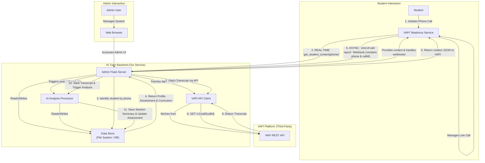

# AI Tutor Service: System Architecture

This document provides a comprehensive architectural overview of the AI Tutor service, including its components, data flows, security measures, and a roadmap for future development. Its purpose is to serve as a single source of truth for understanding how the system works end-to-end.

## 1. High-Level Overview

The AI Tutor service provides personalized, voice-based tutoring for students. It uses a combination of a third-party telephony provider (VAPI), a custom backend for call management and data processing, a post-call AI analysis pipeline, and a web-based admin dashboard for system administration. The architecture is designed around a two-phase lifecycle for each call: a real-time context fetch at the start of a call, and a robust, asynchronous processing pipeline after the call ends.

## 2. Full System Workflow & Data Flow

This section provides a complete end-to-end view of the system, including both the **real-time, pre-call context fetching** and the **asynchronous, post-call data processing**.

### 2.1. Complete Architectural Diagram

### 2.2. Two-Phase Call Lifecycle

The system operates in two distinct phases for every call:

**Phase 1: Real-Time Context Fetching (At the start of the call)**

This is a synchronous, low-latency process designed to provide the VAPI AI Assistant with immediate context about the caller.

1.  **VAPI Initiates Request**: As soon as a call is received, VAPI's infrastructure makes a server-to-server HTTP request to our backend (e.g., `/mcp/get_student_context`), including the caller's phone number.
2.  **Student Lookup**: The backend finds a matching student in the data store.
3.  **Context Assembly**:
    *   **If Student Found**: The system fetches the student's `name`, `Dynamic Profile`, the relevant `Curriculum` for their grade, and their most recent `Cumulative Assessment`.
    *   **If Student Not Found**: The system prepares a default context for a first-time caller.
4.  **Context Response**: The backend returns a JSON object to VAPI containing the student's name and the assembled context.

**Phase 2: Asynchronous Post-Call Processing (After the call ends)**

This is a reliable, asynchronous process for data storage and AI analysis.

1.  **Webhook Ingestion**: VAPI sends an `end-of-call-report` webhook containing the `callId` and the caller's phone number.
2.  **Authoritative Data Fetching**: The backend fetches the full `Session Transcript` from the VAPI REST API.
3.  **Student Identification & Creation**: If the student was identified as "new", the system now creates the `Student Core Info`, `Dynamic Profile`, and `School` records.
4.  **AI-Powered Analysis**: The `Session Transcript` along with the student's `Dynamic Profile`, `Curriculum`, and `Cumulative Assessment` are sent to the AI model to generate a `Session Summary`.
5.  **Data Persistence & Updates**:
    *   The `Session Transcript` and `Session Summary` are saved.
    *   The `Dynamic Profile` is updated with new insights.
    *   The `Cumulative Assessment` is updated with the latest results.

## 3. Data Models

The system's data architecture is designed around a set of interconnected data types that track a student's entire learning journey.

| Data Model | Storage / Source | Key Attributes | Description |
|---|---|---|---|
| **Student Core Info** | `students/{id}/profile.json` | `student_id`, `name`, `age`, `grade`, `phone_number`, `school_id` | Foundational, static information about the student. Initially identified by phone number. |
| **School** | `schools/school_data.json` | `school_id`, `name`, `location`, `background` | Static information about the schools attended by students. Managed via the Admin Interface. |
| **Curriculum** | `curriculum/*.json`| `grade`, `subject`, `goals`, `is_local` | Static educational framework defining learning objectives, tailored by student type (local vs. international). |
| **Dynamic Profile** | `students/{id}/profile.json` | `interests`, `learning_style`, `teachers`, `motivational_triggers` | A rich, evolving profile of the student's traits, updated by the AI and admins. Used as core context for every session. The `teachers` field is a simple key-value store of subject to teacher name. |
| **Session Transcript** | `sessions/*_transcript.txt` | `full_text_transcript` | The raw, immutable record of a single tutoring session. The primary source of truth for all subsequent AI analysis. |
| **Session Summary** | `sessions/*_summary.json` | `call_id`, `summary`, `learnings`, `outcomes` | A structured summary produced by AI after each session, used to update the Assessment and Dynamic Profile. |
| **Cumulative Assessment** | `students/{id}/assessment.json` | `strengths`, `weaknesses`, `knowledge_gaps`, `mastery_level` | A longitudinal, per-subject record of the student's academic progress. Updated after each session. |
| **System Logs** | `logs/*.jsonl` | `timestamp`, `level`, `category`, `message` | Structured logs from all system components for monitoring and debugging. |

## 4. Admin Interface Capabilities

The Admin Interface is a web-based dashboard that serves as the central control panel for the entire AI Tutor service. It provides the following capabilities:

*   **Student Management (CRUD):**
    *   View a list of all students.
    *   Create, Read, Update, and Delete student profiles (`Student Core Info` and `Dynamic Profile`).
    *   Manually assign a `School` to a student.
    *   Update student-teacher mappings.
*   **Session Review:**
    *   View a list of all historical sessions for all students.
    *   Drill down into a specific session to view the `Session Transcript` and `Session Summary`.
*   **Assessment Monitoring:**
    *   View the `Cumulative Assessment` for each student to track their progress over time.
*   **Curriculum Management:**
    *   View and edit the learning goals in the `Curriculum` files.
*   **System Health & Monitoring:**
    *   View `System Logs` with filtering capabilities.
    *   Monitor AI processing statistics and provider status.

## 5. Security and Data Integrity

Ensuring the security of student data and the integrity of the system is paramount.

*   **Authentication:** The Admin Interface is protected by a secure login system with hashed passwords. All API endpoints and webhook handlers enforce proper authentication and authorization.
*   **Webhook Security:** All incoming webhooks from VAPI are verified using a shared secret and HMAC-SHA256 signature checking to prevent spoofing.
*   **Secret Management:** All sensitive credentials (API keys, secrets) are managed exclusively through environment variables and are never hard-coded or committed to version control. The `render-production.env` file is explicitly listed in `.gitignore`.
*   **Data Integrity:** The proposed migration to a SQL database (Gap 1) will introduce transactional integrity (ACID compliance) to prevent data corruption and ensure that updates to different data models (e.g., Profile and Assessment) happen atomically.
*   **Input Validation:** All data received from external sources (webhooks, API calls) and user input from the Admin Interface is rigorously validated to prevent injection attacks and ensure data consistency.

## 6. Architectural Gaps & Future Improvements

This section identifies current weaknesses in the architecture and proposes improvements to create a more robust, scalable, and maintainable system.

### Gap 1: File-Based Data Storage
- **Description**: The current reliance on a directory of JSON and text files is simple but not scalable or robust. It lacks transactional integrity, indexing, and efficient querying capabilities.
- **Risks**: Data corruption, race conditions (if concurrency increases), performance degradation with scale, difficulty in performing complex queries (e.g., "show all sessions where engagement was low").
- **Proposed Solution**: **Migrate to a SQL Database (e.g., SQLite or PostgreSQL).**
    - **SQLite**: Simple, serverless, and stores the entire database in a single file. Perfect for the current scale and simplifies deployment.
    - **PostgreSQL**: A more powerful, production-grade option if significant future scale is anticipated.
    - **Benefits**: ACID compliance, indexes for fast queries, robust data relationships, and standardized access via an ORM (like SQLAlchemy).

### Gap 2: Monolithic `admin-server.py`
- **Description**: The `admin-server.py` file is becoming a monolith, containing business logic for webhooks, UI routes, data processing, and student management.
- **Risks**: Poor separation of concerns, difficult to maintain and test, and tight coupling between components.
- **Proposed Solution**: **Refactor the Backend into a Service-Oriented or Layered Architecture.**
    - **Use Flask Blueprints**: Separate UI routes, API routes, and webhook handlers into distinct modules.
    - **Create a Service Layer**: Encapsulate business logic (e.g., `StudentService`, `SessionService`) away from the Flask route handlers. This makes the logic reusable and easier to test independently.

### Gap 3: Synchronous AI Processing Trigger
- **Description**: While the AI analysis runs in a background thread (`threading.Thread`), this is not a durable or scalable solution for background tasks. If the server restarts while a task is running, the task is lost.
- **Risks**: Lost AI analysis jobs, no retry mechanism for failed analysis, and resource contention on the web server.
- **Proposed Solution**: **Implement a Dedicated Task Queue.**
    - **Use a Task Queue Framework**: Integrate **Celery** with a message broker like **Redis** or **RabbitMQ**.
    - **Workflow**: The Flask app would enqueue an analysis job (e.g., `process_session_transcript.delay(session_id)`). A separate Celery worker process would pick up the job, execute it, and handle retries on failure.
    - **Benefits**: Decouples the web server from heavy background work, ensures task durability, provides visibility into job status, and can be scaled independently.

### Gap 4: Lack of a Formal Data Access Layer
- **Description**: Data access is performed via scattered `os.path.exists`, `open()`, and `json.load()` calls throughout the codebase. This is error-prone and hard to manage.
- **Risks**: Inconsistent data handling, code duplication, and difficulty in migrating the data store later.
- **Proposed Solution**: **Introduce a Data Access Layer (DAL) or Repository Pattern.**
    - **Create Repository Classes**: Implement classes like `StudentRepository` and `SessionRepository` that are solely responsible for data persistence logic.
    - **Benefits**: Centralizes all data access code, abstracts the underlying storage mechanism (file system vs. database), and makes the rest of the application agnostic to how data is stored.

## 7. Updated Implementation Roadmap

Based on the gap analysis, here is a revised, high-level roadmap:

1.  **Phase 3: Foundational Refactor (Immediate Priority)**
    - Migrate from file-based storage to a **SQLite database**.
    - Introduce an ORM (e.g., SQLAlchemy) and implement the **Repository Pattern** for data access.
    - Refactor `admin-server.py` into **Flask Blueprints** and a **Service Layer**.

2.  **Phase 4: Production-Grade Enhancements**
    - Integrate **Celery and Redis** for a robust background task queue.
    - Add **real OpenAI API keys** and test the end-to-end AI analysis pipeline in production.
    - Implement comprehensive **session analytics** and visualizations in the admin dashboard, powered by database queries.

3.  **Phase 5: Advanced Features**
    - Develop advanced file management features within the dashboard.
    - Implement more sophisticated student progress tracking and reporting.