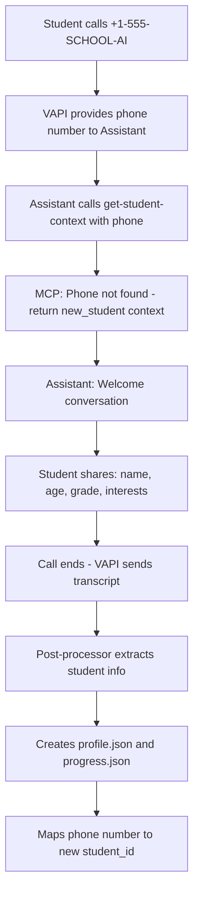
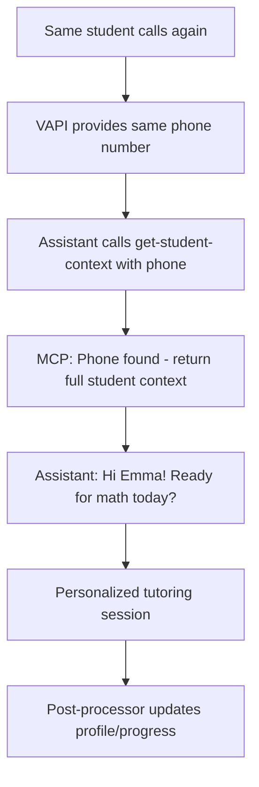

# 🎯 AI Tutor PoC - Phone-Based Architecture

## 📋 Overview

This architecture uses **phone number identification** with **automatic student onboarding**. Unknown numbers trigger welcome calls that gather student information, while known numbers proceed directly to tutoring.

---

## 🏗️ Smart Phone-Based Identification

### **Core Design Principle**
```yaml
Concept: "Your phone number is your student ID"

Workflow:
  Known_Number: Phone → Student lookup → Personalized tutoring
  Unknown_Number: Phone → Welcome call → Profile creation → Future tutoring

Benefits:
  ✅ Natural authentication (everyone has a phone number)
  ✅ Automatic onboarding for new students
  ✅ Single VAPI assistant handles everything
  ✅ No complex setup required
  ✅ Seamless user experience
```

---

## 🔧 Architecture Components

### **1. Single VAPI Assistant (Handles All Students)**

#### **VAPI Configuration**
```yaml
VAPI_Assistant_Name: "International School AI Tutor"
Phone_Number: "+1-555-SCHOOL-AI"  # Single number for all students
OpenAI_Assistant_ID: "asst_tutor_123"

# Key: VAPI provides caller number as environment variable
Environment_Variables:
  CALLER_PHONE_NUMBER: "{{caller.phoneNumber}}"  # VAPI built-in variable
  
Webhook_URL: "https://ai-tutor-ptnl.onrender.com/webhook/vapi/session-complete"
```

### **2. Smart OpenAI Assistant Instructions**

#### **Assistant Configuration**
```yaml
Assistant_Name: "International School AI Tutor"
Instructions: |
  You are an AI tutor for an international school (Grades 1-6, Cambridge Primary curriculum).
  
  IMPORTANT: Start every conversation by calling get-student-context with the caller's phone number.
  
  The response will tell you:
  1. If this is a KNOWN STUDENT: You'll get their profile, progress, and learning preferences
  2. If this is a NEW STUDENT: You'll get a "new_student" indicator
  
  For KNOWN STUDENTS:
  - Greet them by name and reference their recent progress
  - Ask what they'd like to work on today
  - Adapt to their learning style and grade level
  - Keep sessions engaging and curriculum-aligned
  
  For NEW STUDENTS:
  - Welcome them warmly to the tutoring system
  - Explain that you're their AI tutor and you'd like to learn about them
  - Ask for: Name, Age, Grade, Favorite subjects, Interests, Learning preferences
  - Keep the conversation friendly and engaging
  - End by saying you'll remember everything for next time
  
  Always be encouraging, age-appropriate, and educational.

Tools:
  - get-student-context: Get student data by phone number OR create new student profile

Model: gpt-4-turbo
Temperature: 0.7
```

### **3. Enhanced MCP Server (Phone-Based Lookup)**

#### **Phone-Based Student Context Function**
```python
class PhoneBasedStudentContext:
    def __init__(self):
        self.phone_to_student_mapping = self.load_phone_mapping()
    
    def get_student_context(self, request_data):
        """Get student context by phone number, with new student handling"""
        
        phone_number = request_data.get('phone_number')
        if not phone_number:
            return {"error": "Phone number required"}
        
        # Normalize phone number
        normalized_phone = self.normalize_phone_number(phone_number)
        
        # Check if this is a known student
        student_id = self.phone_to_student_mapping.get(normalized_phone)
        
        if student_id:
            # Known student - return full context
            return self.get_existing_student_context(student_id, normalized_phone)
        else:
            # New student - return new student prompt
            return self.get_new_student_context(normalized_phone)
    
    def get_existing_student_context(self, student_id, phone_number):
        """Load full context for existing student"""
        try:
            profile = self.load_student_profile(student_id)
            progress = self.load_student_progress(student_id)
            recent_sessions = self.load_recent_sessions(student_id)
            curriculum = self.load_curriculum_for_grade(profile.get('grade', 4))
            
            return {
                'student_type': 'existing',
                'student_id': student_id,
                'phone_number': phone_number,
                'profile': profile,
                'progress': progress,
                'recent_sessions': recent_sessions,
                'curriculum_context': curriculum,
                'greeting_suggestion': f"Hi {profile.get('name', 'there')}! Ready for some learning today?"
            }
        except Exception as e:
            logger.error(f"Error loading student {student_id}: {e}")
            return {"error": f"Could not load student data for {student_id}"}
    
    def get_new_student_context(self, phone_number):
        """Return new student onboarding context"""
        return {
            'student_type': 'new',
            'phone_number': phone_number,
            'onboarding_needed': True,
            'greeting_suggestion': "Hello! I'm your AI tutor. I'd love to learn about you so I can help you with your studies!",
            'questions_to_ask': [
                "What's your name?",
                "How old are you?", 
                "What grade are you in?",
                "What are your favorite subjects?",
                "What do you like to do for fun?",
                "How do you like to learn? (Do you like pictures, stories, hands-on activities?)"
            ],
            'curriculum_overview': self.get_curriculum_overview()
        }
    
    def normalize_phone_number(self, phone_number):
        """Normalize phone number format"""
        # Remove all non-digits
        digits_only = ''.join(filter(str.isdigit, phone_number))
        
        # Handle different formats
        if len(digits_only) == 10:
            return f"+1{digits_only}"  # US number
        elif len(digits_only) == 11 and digits_only.startswith('1'):
            return f"+{digits_only}"   # US number with country code
        else:
            return f"+{digits_only}"   # International format
```

### **4. Post-Processing with Student Creation**

#### **Enhanced Post-Processing for New Students**
```python
class NewStudentProcessor:
    def process_welcome_session(self, session_data):
        """Process welcome session and create new student profile"""
        
        phone_number = session_data.get('phone_number')
        transcript = session_data['conversation']['transcript']
        
        # Extract student information from conversation
        student_info = self.extract_student_info_from_transcript(transcript)
        
        if self.is_complete_profile(student_info):
            # Create new student
            student_id = self.create_new_student(phone_number, student_info)
            return {
                'status': 'student_created',
                'student_id': student_id,
                'message': f"Created profile for {student_info.get('name', 'new student')}"
            }
        else:
            # Incomplete profile - may need follow-up
            return {
                'status': 'profile_incomplete', 
                'collected_info': student_info,
                'message': "More information needed to complete profile"
            }
    
    def extract_student_info_from_transcript(self, transcript):
        """Use OpenAI to extract student information from welcome conversation"""
        
        extraction_prompt = f"""
        Analyze this welcome conversation with a new student and extract their information:
        
        TRANSCRIPT: {transcript}
        
        Extract the following information if mentioned:
        - name: Student's first name
        - age: Age in years
        - grade: School grade (1-6)
        - favorite_subjects: List of subjects they mentioned liking
        - interests: Hobbies, favorite activities, what they like
        - learning_preferences: How they like to learn (visual, hands-on, etc.)
        
        Return as JSON with only the information that was clearly mentioned.
        If something wasn't mentioned, don't include it in the JSON.
        """
        
        response = self.openai_client.chat.completions.create(
            model="gpt-4",
            messages=[{"role": "user", "content": extraction_prompt}],
            max_tokens=500,
            temperature=0.1
        )
        
        try:
            return json.loads(response.choices[0].message.content)
        except:
            return {}
    
    def create_new_student(self, phone_number, student_info):
        """Create new student profile and files"""
        
        # Generate student_id from name and phone
        name = student_info.get('name', 'student')
        student_id = self.generate_student_id(name, phone_number)
        
        # Create profile
        profile = {
            'student_id': student_id,
            'name': student_info.get('name', ''),
            'age': student_info.get('age'),
            'grade': student_info.get('grade', 4),
            'phone_number': phone_number,
            'interests': student_info.get('interests', []),
            'favorite_subjects': student_info.get('favorite_subjects', []),
            'learning_style': {
                'visual': 0.5,  # Default values
                'auditory': 0.5,
                'kinesthetic': 0.5
            },
            'created_at': datetime.utcnow().isoformat(),
            'last_updated': datetime.utcnow().isoformat()
        }
        
        # Create initial progress
        progress = {
            'student_id': student_id,
            'grade_level': student_info.get('grade', 4),
            'subjects': {},
            'created_at': datetime.utcnow().isoformat()
        }
        
        # Save files
        self.save_student_profile(student_id, profile)
        self.save_student_progress(student_id, progress)
        
        # Update phone mapping
        self.add_phone_mapping(phone_number, student_id)
        
        logger.info(f"✅ Created new student: {student_id} for phone {phone_number}")
        return student_id
    
    def generate_student_id(self, name, phone_number):
        """Generate unique student ID"""
        # Use name + last 4 digits of phone
        name_part = name.lower().replace(' ', '_')
        phone_part = phone_number[-4:]
        return f"{name_part}_{phone_part}"
```

---

## 🔄 Complete User Journey

### **First Call (New Student)**


### **Second Call (Existing Student)**


---

## 📊 Implementation Examples

### **Phone Mapping File**
```json
{
  "phone_to_student": {
    "+15551234567": "emma_4567",
    "+15559876543": "jane_6543",
    "+15555555555": "alex_5555"
  },
  "last_updated": "2025-01-17T14:30:00Z"
}
```

### **New Student Profile Creation**
```python
# Example welcome conversation extraction
transcript = """
AI: Hello! I'm your AI tutor. What's your name?
Student: I'm Emma!
AI: Nice to meet you Emma! How old are you?
Student: I'm 9 years old.
AI: What grade are you in?
Student: I'm in 4th grade.
AI: What subjects do you like?
Student: I love math and science! And I really like animals.
"""

# Extracted information
extracted_info = {
    "name": "Emma",
    "age": 9,
    "grade": 4,
    "favorite_subjects": ["math", "science"],
    "interests": ["animals"]
}

# Generated student_id: "emma_4567" (name + last 4 of phone)
```

### **Enhanced Assistant Instructions Example**
```yaml
# When Emma calls again:
Assistant_Response_Context:
  student_type: "existing"
  student_id: "emma_4567" 
  name: "Emma"
  grade: 4
  last_session: "worked on fractions"
  interests: ["animals", "space"]
  
Assistant_Greeting: "Hi Emma! Last time we worked on fractions with pizza slices. How did that go? Ready for more math today, or would you like to explore something else?"
```

---

## 🎯 Testing Workflow

### **Test Case 1: New Student**
```bash
# Simulate new phone number calling
curl -X POST http://localhost:3000/mcp/get-student-context \
  -H "Content-Type: application/json" \
  -d '{"phone_number": "+15551234567"}'

# Expected response: new_student context with onboarding questions
```

### **Test Case 2: Existing Student** 
```bash
# Same phone number after profile creation
curl -X POST http://localhost:3000/mcp/get-student-context \
  -H "Content-Type: application/json" \
  -d '{"phone_number": "+15551234567"}'

# Expected response: full student context with profile/progress
```

### **Test Case 3: Welcome Session Processing**
```bash
# Process welcome conversation transcript
python process_welcome_session.py "+15551234567" "welcome_transcript.txt"

# Expected: New student profile created, phone mapped
```

---

## ✅ Implementation Phases

### **Week 1: Phone-Based Context System**
- [ ] Implement phone-based get-student-context function
- [ ] Create phone-to-student mapping system
- [ ] Test new vs existing student responses
- [ ] Update Assistant instructions for both scenarios

### **Week 2: VAPI Integration**
- [ ] Configure single VAPI assistant with phone number variable
- [ ] Test welcome call workflow with new phone number
- [ ] Test existing student call with known phone number
- [ ] Verify phone number environment variable passing

### **Week 3: Post-Processing Pipeline**
- [ ] Implement welcome session transcript analysis
- [ ] Create automatic student profile generation
- [ ] Test phone number mapping and student creation
- [ ] End-to-end testing: New student → Profile creation → Tutoring

---

## 🔮 Future Evolution

### **Current PoC: Phone Number Authentication**
```yaml
Authentication: "Phone number = student identity"
Onboarding: "Automatic via welcome conversation"
Security: "Basic (phone number verification)"
```

### **Future Production Options**
```yaml
Enhanced_Authentication:
  - Voice biometrics overlaid on phone numbers
  - PIN verification for shared phones
  - Parent approval for new registrations
  - Multi-factor for sensitive operations

Advanced_Onboarding:
  - Parent consent workflows
  - School enrollment integration
  - Academic assessment during onboarding
  - Learning style diagnostic tests
```

---

## 🎯 Success Criteria

### **PoC Validation**
- ✅ New phone numbers trigger welcome conversations
- ✅ Welcome conversations create complete student profiles
- ✅ Known phone numbers load existing student context
- ✅ Assistant adapts behavior based on student type
- ✅ Post-processing automatically creates students

### **User Experience**
- ✅ Natural, no-setup experience for students
- ✅ Seamless transition from onboarding to tutoring
- ✅ Personalized experience from second call onwards
- ✅ Easy for schools to add new students (just give them the number)

This phone-based approach provides the perfect balance of **simplicity for the PoC** while maintaining **natural user experience** and **easy scalability**. Students just call a number - that's it!