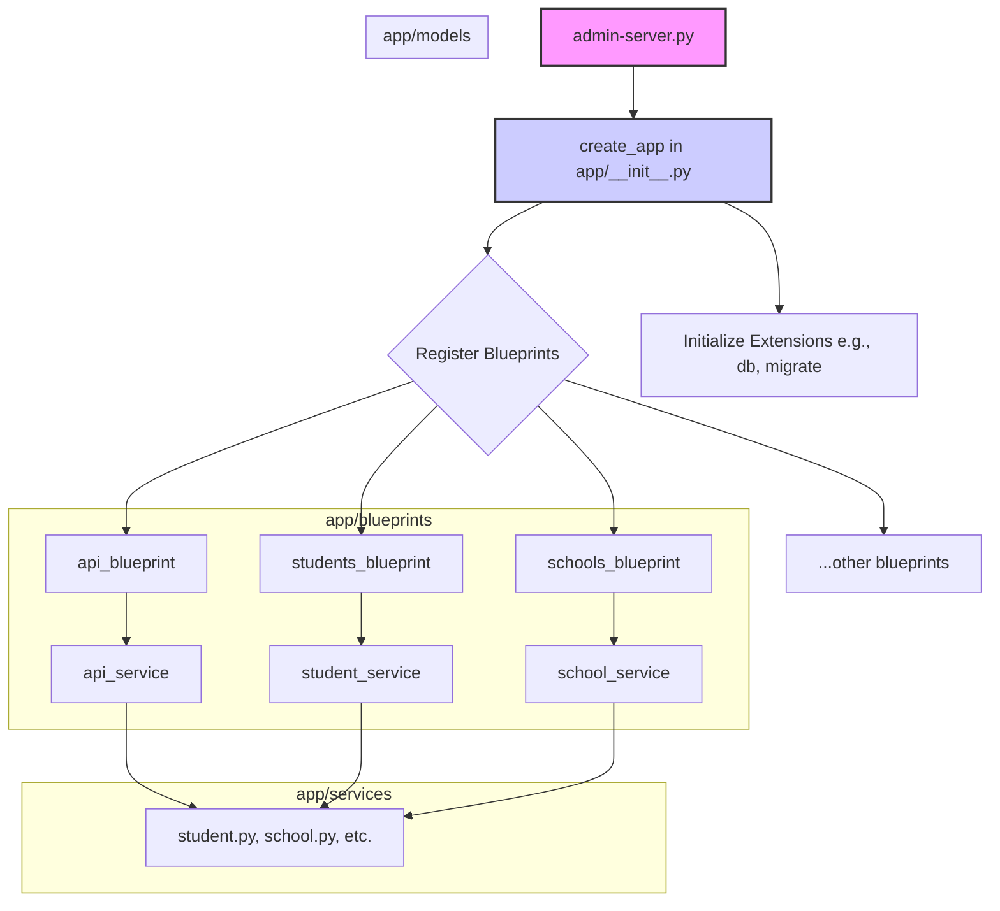

# Admin Server Refactoring & Bug Fix Plan

## I. Executive Summary

This document outlines the plan to refactor the monolithic `ai-tutor/backend/admin-server.py` file and address critical bugs affecting the AI Tutor admin dashboard. The current single-file architecture (6000+ lines) is the root cause of performance issues, UI slowness, API errors, and significant development friction.

The proposed solution is to migrate the application to a modern, scalable, and maintainable modular architecture using standard Flask patterns like the **Application Factory**, **Blueprints**, and a dedicated **Service Layer**. This refactoring will not only fix the immediate bugs but also establish a clean foundation for future development, especially for AI-related features.

## II. Known Issues & Bugs

### Bug 1: Admin Dashboard "Total Students = 0"

*   **Symptom:** The admin dashboard incorrectly displays "Total students = 0".
*   **Facts & Pointers:**
    *   Data investigation confirmed that student records **are being saved correctly** to the remote PostgreSQL database on Render.com.
    *   The issue is not with data persistence but with the data retrieval and display logic for the dashboard.
    *   **Location:** The faulty logic is located within one of the 56+ routes in `admin-server.py`. The function responsible for rendering the dashboard (`/` or `/dashboard`) and its associated data-fetching function need to be inspected.
*   **Resolution Path:** This will be resolved during the refactoring. The logic for fetching statistics will be moved to a dedicated `stats_service.py` or `student_service.py`, and the corresponding dashboard route will be in a `main` or `dashboard` blueprint, making it isolated and easy to debug.

### Architectural Bug 2: General UI Slowness & API Errors

*   **Symptom:** The user interface is slow, and various API endpoints are prone to errors or timeouts.
*   **Facts & Pointers:**
    *   These issues are characteristic of a monolithic application under load. All requests are handled by a single, massive process, leading to contention and performance degradation.
    *   The monolithic nature of `admin-server.py` makes it impossible to scale or optimize specific parts of the application.
*   **Resolution Path:** The complete refactoring is the solution. By breaking the application into Blueprints (e.g., `api`, `students`, `schools`), we can better manage resources. The Service Layer will abstract database queries, allowing for optimization and caching in the future.

## III. Refactoring Plan: Modularizing admin-server.py

The goal is to transform the single `admin-server.py` file into a structured Flask application.

### Target Architecture

### Detailed Steps

1.  **Establish Application Factory**: Create a `create_app` function in `app/__init__.py`. This function will be responsible for initializing the Flask app, loading configurations (from `config.py`), initializing extensions like SQLAlchemy, and registering the blueprints.

2.  **Create Directory Structure**: Create the necessary directories to house the new modular code:
    *   `ai-tutor/backend/app/blueprints/`
    *   `ai-tutor/backend/app/services/`

3.  **Create Service Modules**: Move all business logic and direct database interactions out of the route handlers in `admin-server.py` and into a new service layer. Create files like:
    *   `app/services/student_service.py`: For all logic related to students (CRUD, fetching, stats).
    *   `app/services/school_service.py`: For school-related logic.
    *   `app/services/curriculum_service.py`: For curriculum logic.
    *   `app/services/ai_service.py`: For existing AI and VAPI-related logic.
    *   `app/services/stats_service.py`: For dashboard statistics.

4.  **Implement Blueprints**: Systematically move routes from `admin-server.py` into separate blueprint files in `app/blueprints`. Each blueprint will handle a specific domain of the application.
    *   `app/blueprints/main.py`: For static pages and the main dashboard.
    *   `app/blueprints/students.py`: For all routes starting with `/students`.
    *   `app/blueprints/schools.py`: For all routes starting with `/schools`.
    *   `app/blueprints/api.py`: For all API endpoints, including the `/vapi-webhook`. This creates a clean workspace for the AI developer.
    *   *... and so on for other functionalities.*

5.  **Register Blueprints**: Within the `create_app` function in `app/__init__.py`, import and register each blueprint created in the previous step.

6.  **Refactor Server Entry Point**: Modify `admin-server.py` to be a lean entry point. Its only job will be to import `create_app` from the `app` package, create an application instance, and run it.

7.  **Test Refactored Application**: Since this is a major architectural change, testing is critical. The application must be deployed to the Render.com staging environment and tested end-to-end to ensure all features work as expected and no regressions have been introduced.

8.  **Final Code Cleanup**: Once testing is successful, completely gut `admin-server.py`, removing all the migrated routes, helper functions, and imports, leaving only the application entry point code.

9.  **Update Documentation**: Update `ai-tutor/docs/AI_TUTOR_SYSTEM_ARCHITECTURE.md` and any other relevant documents to reflect the new modular architecture, including replacing old diagrams with the new Mermaid diagram.

## IV. Actionable To-Do List

This is the checklist to follow for the implementation.

- [ ] **Establish Application Factory**: Refactor `app/__init__.py` to create a `create_app` function.
- [ ] **Create Directory Structure**: Create `app/blueprints` and `app/services` directories.
- [ ] **Create Service Modules**: Move business logic into service files (e.g., `student_service.py`, `stats_service.py`).
- [ ] **Implement Blueprints**: Create blueprints and move routes (e.g., `main.py`, `students.py`).
- [ ] **Register Blueprints**: Import and register all blueprints in `create_app`.
- [ ] **Refactor Server Entry Point**: Slim down `admin-server.py`.
- [ ] **Test Refactored Application**: Deploy and test on staging.
- [ ] **Final Code Cleanup**: Remove migrated code from `admin-server.py`.
- [ ] **Update Documentation**: Update `AI_TUTOR_SYSTEM_ARCHITECTURE.md`.