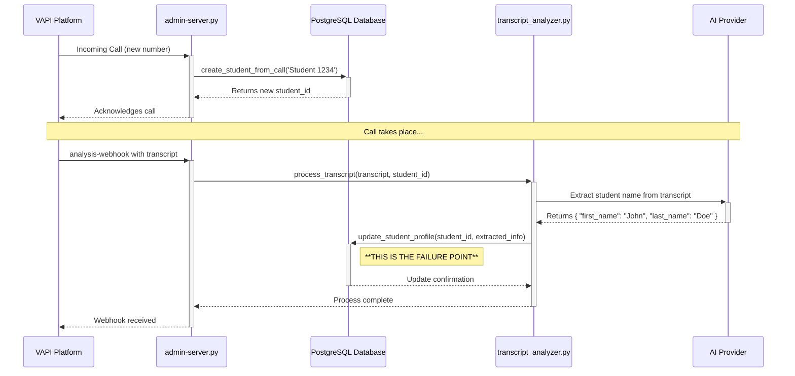

# Plan to Fix Student Profile Update Logic

## 1. Background: The Student Creation and Update Flow

This document outlines the plan to resolve a critical bug where student names, captured from phone call transcripts, are not correctly updated in the database.

The current process is designed as follows:
1.  **Initial Contact**: A new, unrecognized phone number calls the system.
2.  **Placeholder Creation**: The VAPI webhook handler in `admin-server.py` receives the call. The `create_student_from_call` function immediately creates a new `Student` record in the database. To avoid delays, this record is populated with a placeholder name, typically combining the word "Student" with the last four digits of their phone number (e.g., "Student 6010").
3.  **Transcript Analysis**: After the call ends, the full transcript is sent to the AI for analysis via the `TranscriptAnalyzer` class. The AI's task is to extract key information, including the student's actual first and last name.
4.  **Profile Update**: The `update_student_profile` method in `transcript_analyzer.py` is then invoked. Its purpose is to take the extracted information from the AI and update the placeholder record in the database with the correct details.

## 2. The Problem: Placeholder Names Are Not Replaced

The final, critical step of the process fails. Although the AI successfully extracts the correct name (e.g., "John Doe") from the transcript, the `update_student_profile` method does not overwrite the placeholder name ("Student 6010") in the database.

This results in student profiles remaining in a permanent placeholder state, causing confusion in the admin dashboard and preventing proper student tracking and personalization.

## 3. Root Cause Analysis

A detailed review of `ai-tutor/backend/transcript_analyzer.py` reveals two primary flaws in the `update_student_profile` method:

1.  **Overly Complex Data Extraction**: The AI's JSON response can have slightly different structures depending on the prompt used. The code tries to account for multiple possibilities (e.g., `extracted_info['student_profile']['first_name']` vs. `extracted_info['first_name']`). This logic is brittle and can fail to find the name even when it's present.
2.  **A Flawed "Placeholder" Check**: The function attempts to determine if the current name is a placeholder before overwriting it. This check is too cautious and complex. It often incorrectly concludes that the existing name is *not* a placeholder, and therefore aborts the update to avoid overwriting what it perceives as legitimate data. The logic fails to reliably identify names like "Student 6010" as temporary.

The combination of these issues means the update logic is both fragile and overly hesitant, causing the update to fail silently.

## 4. The Solution: Refactor `update_student_profile`

The fix will involve a targeted refactoring of the `update_student_profile` method to make it more robust and decisive.

### Part 1: Standardize Data Access

First, we will simplify the logic for retrieving the new name from the AI's response. Instead of multiple nested `if` statements, we will implement a clean, prioritized search. A small, dedicated helper function can be used to check for the name in a defined order of possible keys.

### Part 2: Implement a Decisive Update Rule

Second, we will replace the flawed placeholder check with a simple, unambiguous rule:

**If the AI provides a valid first name, and the student's current first name starts with "Student", the name will be updated.**

This rule is based on the operational guarantee that any student name beginning with "Student" is a system-generated placeholder that is *always* safe to overwrite. This eliminates ambiguity and ensures legitimate names extracted by the AI are always persisted.

## 5. Action Plan

The implementation will proceed in the following steps:

-   **[ ] Step 1**: Refactor `update_student_profile` in `ai-tutor/backend/transcript_analyzer.py` to standardize and simplify the extraction of `new_first_name` and `new_last_name` from the `extracted_info` dictionary.
-   **[ ] Step 2**: Replace the complex `is_placeholder_name` conditional with the new, decisive update rule.
-   **[ ] Step 3**: Create a new unit test file, `test_name_extraction_fix.py`, to simulate the exact failure scenario and validate the fix. The test will:
    -   Programmatically create a student with a placeholder name.
    -   Call `update_student_profile` with a sample AI response.
    -   Assert that the student's name in the database was correctly updated.
-   **[ ] Step 4**: Deploy the changes to production and monitor logs to confirm that new student names are being updated as expected.