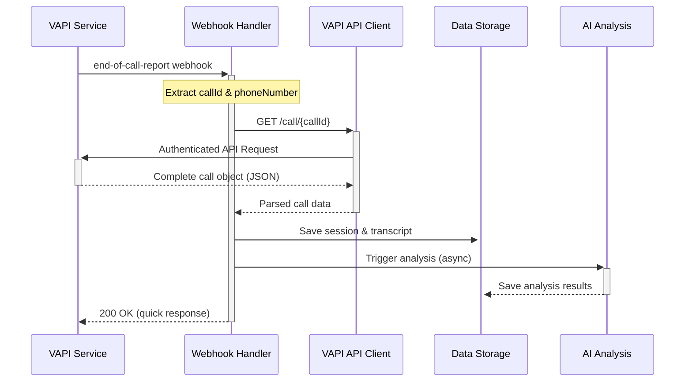

# VAPI Integration Architectural Refactor Plan

## Executive Summary

The current VAPI webhook integration has fundamental architectural flaws that cause unreliable data processing and system crashes. This plan outlines a complete refactor to implement a robust, API-driven architecture that uses webhooks as notifications and fetches authoritative data directly from the VAPI API.

## Current Problems Identified

### 1. **Core Bug: Data Type Mismatch**
```python
# Current error in handle_end_of_call()
AttributeError: 'str' object has no attribute 'get'
```
- The `end-of-call-report` payload structure is being misinterpreted
- Data parsing logic assumes dict structure but receives string in some cases

### 2. **Unreliable Data Ingestion**
- `conversation-update` webhooks provide incomplete, fragmented transcript data
- Webhook payloads are inconsistent and don't contain the complete conversation
- Message-by-message processing is error-prone and resource-intensive

### 3. **Architectural Deficiencies**
- Over-reliance on webhook payload content rather than using webhooks as triggers
- No fallback mechanism for data retrieval failures
- Excessive verbose logging making production monitoring difficult

### 4. **Project Hygiene Issues**
- Obsolete files cluttering the root directory: `requirements.txt`, `simple-server-fixed.py`, `start.py`
- Production logs are too verbose for effective monitoring

## Proposed Architecture: API-First Approach

### **Core Principle**
> Webhooks serve as notifications, not data sources. The VAPI REST API is the single source of truth for call data.

### **New Workflow**



## Implementation Plan

### **Phase 1: Project Cleanup**

#### 1.1 Remove Obsolete Files
```bash
# Files to delete from project root
rm requirements.txt
rm simple-server-fixed.py  
rm start.py
```

#### 1.2 Reduce Logging Verbosity
- Remove all `webhook-structure-debug` and `message-structure-debug` logging
- Keep only essential webhook events: `end-of-call-report`, `student-identified`, `student-not-found`
- Remove excessive data preview logging

### **Phase 2: VAPI API Client Implementation**

#### 2.1 Create VAPI API Client Class
**File:** [`ai-tutor/backend/vapi_client.py`](ai-tutor/backend/vapi_client.py)

```python
import os
import requests
import json
from typing import Optional, Dict, Any
from system_logger import log_webhook, log_error

class VAPIClient:
    def __init__(self):
        self.api_key = os.getenv('VAPI_API_KEY')
        self.base_url = 'https://api.vapi.ai'
        self.session = requests.Session()
        self.session.headers.update({
            'Authorization': f'Bearer {self.api_key}',
            'Content-Type': 'application/json'
        })
    
    def get_call_details(self, call_id: str) -> Optional[Dict[Any, Any]]:
        """Fetch complete call details from VAPI API"""
        try:
            response = self.session.get(f'{self.base_url}/call/{call_id}')
            response.raise_for_status()
            return response.json()
        except Exception as e:
            log_error('VAPI_API', f'Failed to fetch call {call_id}', e, call_id=call_id)
            return None
    
    def get_call_transcript(self, call_id: str) -> Optional[str]:
        """Get formatted transcript from call details"""
        call_data = self.get_call_details(call_id)
        if not call_data:
            return None
            
        # Extract and format transcript
        transcript = call_data.get('transcript', {})
        return self._format_transcript(transcript)
    
    def _format_transcript(self, transcript_data: Dict) -> str:
        """Format transcript data into readable text"""
        # Implementation depends on VAPI's transcript format
        pass
```

#### 2.2 Environment Configuration
**File:** [`ai-tutor/config/.env.example`](ai-tutor/config/.env.example)

Add new required environment variable:
```bash
# VAPI API Configuration
VAPI_API_KEY=your_vapi_api_key_here
VAPI_SECRET=your_vapi_webhook_secret
```

### **Phase 3: Webhook Refactor**

#### 3.1 Simplified Webhook Handler
**File:** [`ai-tutor/backend/admin-server.py`](ai-tutor/backend/admin-server.py:1048)

Replace the current complex webhook logic with:

```python
@app.route('/vapi/webhook', methods=['POST'])
def vapi_webhook():
    """Handle VAPI webhook events - simplified API-first approach"""
    try:
        # Signature verification (unchanged)
        payload = request.get_data(as_text=True)
        signature = request.headers.get('X-Vapi-Signature', '')
        
        if not verify_vapi_signature(payload, signature, {}):
            return jsonify({'error': 'Invalid signature'}), 401
        
        # Parse webhook data
        data = request.get_json()
        if not data:
            return jsonify({'error': 'Invalid payload'}), 400
        
        message = data.get('message', {})
        message_type = message.get('type')
        
        # Only handle end-of-call-report
        if message_type == 'end-of-call-report':
            handle_end_of_call_api_driven(message)
        else:
            # Log but ignore other events
            log_webhook(message_type or 'ignored-event', 
                       f"Ignored VAPI event: {message_type}")
        
        return jsonify({'status': 'ok'}), 200
        
    except Exception as e:
        log_error('WEBHOOK', f"VAPI webhook error: {str(e)}", e)
        return jsonify({'error': str(e)}), 500
```

#### 3.2 New End-of-Call Handler
```python
def handle_end_of_call_api_driven(message: Dict[Any, Any]) -> None:
    """Handle end-of-call using API-first approach"""
    try:
        # Extract basic info from webhook
        call_id = message.get('call', {}).get('id')
        phone_number = message.get('phoneNumber')  # Direct from webhook
        
        if not call_id:
            log_error('WEBHOOK', 'No call_id in end-of-call-report', ValueError())
            return
        
        log_webhook('end-of-call-report', f"Processing call {call_id} via API",
                   call_id=call_id, phone=phone_number)
        
        # Fetch complete call data from API
        vapi_client = VAPIClient()
        call_data = vapi_client.get_call_details(call_id)
        
        if not call_data:
            log_error('WEBHOOK', f'Failed to fetch call data for {call_id}', 
                     ValueError('API call failed'))
            return
        
        # Extract authoritative data from API response
        transcript = vapi_client.get_call_transcript(call_id)
        duration = call_data.get('durationSeconds', 0)
        customer_phone = call_data.get('customer', {}).get('number') or phone_number
        
        # Student identification and session saving
        student_id = identify_or_create_student(customer_phone, call_id)
        save_api_driven_session(call_id, student_id, customer_phone, 
                               duration, transcript, call_data)
        
        # Trigger AI analysis
        if student_id and transcript and AI_POC_AVAILABLE:
            trigger_ai_analysis_async(student_id, transcript, call_id)
            
    except Exception as e:
        log_error('WEBHOOK', f"Error in API-driven end-of-call handler", e, 
                 call_id=call_id if 'call_id' in locals() else None)
```

### **Phase 4: Enhanced Student Management**

#### 4.1 Robust Student Identification
```python
def identify_or_create_student(phone_number: str, call_id: str) -> str:
    """Identify existing student or create new one with better logic"""
    if not phone_number:
        return f"unknown_caller_{call_id}"
    
    # Clean and normalize phone number
    clean_phone = normalize_phone_number(phone_number)
    
    # Look up existing student
    for phone, student_id in phone_manager.phone_mapping.items():
        if normalize_phone_number(phone) == clean_phone:
            log_webhook('student-identified', f"Found student {student_id}",
                       call_id=call_id, student_id=student_id, phone=phone_number)
            return student_id
    
    # Create new student if not found
    new_student_id = create_student_from_call(clean_phone, call_id)
    log_webhook('student-created', f"Created new student {new_student_id}",
               call_id=call_id, student_id=new_student_id, phone=phone_number)
    
    return new_student_id

def normalize_phone_number(phone: str) -> str:
    """Normalize phone number for consistent matching"""
    if not phone:
        return ""
    
    # Remove all non-digits
    clean = ''.join(c for c in phone if c.isdigit())
    
    # Handle US numbers - remove country code if present
    if clean.startswith('1') and len(clean) == 11:
        clean = clean[1:]
    
    return clean

def create_student_from_call(phone: str, call_id: str) -> str:
    """Create a new student from phone call data"""
    student_id = f"student_{phone[-4:]}" if phone else f"unknown_{call_id[-6:]}"
    
    # Ensure unique ID
    counter = 1
    base_id = student_id
    while os.path.exists(f'../data/students/{student_id}'):
        student_id = f"{base_id}_{counter}"
        counter += 1
    
    # Create student directories
    student_dir = f'../data/students/{student_id}'
    os.makedirs(f'{student_dir}/sessions', exist_ok=True)
    
    # Create basic profile
    profile = {
        'name': f"Student {phone[-4:]}" if phone else f"Unknown Caller",
        'age': 'Unknown',
        'grade': 'Unknown',
        'phone_number': phone,
        'created_from_call': call_id,
        'created_date': datetime.now().isoformat(),
        'interests': [],
        'learning_preferences': [],
        'curriculum': 'To be determined'
    }
    
    with open(f'{student_dir}/profile.json', 'w', encoding='utf-8') as f:
        json.dump(profile, f, indent=2, ensure_ascii=False)
    
    # Create initial progress
    progress = {
        'overall_progress': 0,
        'subjects': {},
        'goals': ['Complete initial assessment'],
        'streak_days': 0,
        'last_updated': datetime.now().isoformat()
    }
    
    with open(f'{student_dir}/progress.json', 'w', encoding='utf-8') as f:
        json.dump(progress, f, indent=2, ensure_ascii=False)
    
    # Add phone mapping
    if phone:
        phone_manager.phone_mapping[phone] = student_id
        phone_manager.save_mappings()
    
    return student_id
```

### **Phase 5: Error Handling & Resilience**

#### 5.1 Retry Logic for API Calls
```python
import time
from functools import wraps

def retry_on_failure(max_attempts=3, delay=1.0):
    """Decorator for retrying failed API calls"""
    def decorator(func):
        @wraps(func)
        def wrapper(*args, **kwargs):
            for attempt in range(max_attempts):
                try:
                    return func(*args, **kwargs)
                except Exception as e:
                    if attempt == max_attempts - 1:
                        raise e
                    time.sleep(delay * (2 ** attempt))  # Exponential backoff
            return None
        return wrapper
    return decorator

# Apply to VAPI client methods
class VAPIClient:
    @retry_on_failure(max_attempts=3)
    def get_call_details(self, call_id: str) -> Optional[Dict[Any, Any]]:
        # Implementation...
```

#### 5.2 Graceful Degradation
```python
def handle_end_of_call_api_driven(message: Dict[Any, Any]) -> None:
    """Enhanced with graceful degradation"""
    try:
        # Attempt API-first approach
        call_data = vapi_client.get_call_details(call_id)
        
        if call_data:
            # Use authoritative API data
            process_api_call_data(call_data)
        else:
            # Fallback: use webhook data (limited functionality)
            log_webhook('api-fallback', f"Using webhook fallback for {call_id}",
                       call_id=call_id, level='WARNING')
            process_webhook_fallback_data(message)
            
    except Exception as e:
        # Final fallback: minimal processing
        log_error('WEBHOOK', f"All processing failed for {call_id}", e)
        save_failed_call_record(call_id, message)
```

## Testing Strategy

### **Phase 6: Comprehensive Testing**

#### 6.1 Unit Tests
Create tests for:
- VAPI API client methods
- Phone number normalization
- Student identification logic
- Error handling and retries

#### 6.2 Integration Tests
- End-to-end webhook processing
- API client with mock VAPI responses
- Student creation and session saving

#### 6.3 Production Testing
1. Deploy to staging environment
2. Configure VAPI webhook URL to staging
3. Perform test calls with known phone numbers
4. Verify data accuracy and system stability
5. Monitor logs for any remaining issues

## Deployment Plan

### **Phase 7: Staged Deployment**

#### 7.1 Pre-Deployment Checklist
- [ ] All obsolete files removed from root
- [ ] VAPI_API_KEY environment variable configured
- [ ] Webhook debugging code removed
- [ ] New API client thoroughly tested
- [ ] Database backup completed

#### 7.2 Deployment Steps
1. **Commit all changes** to git repository
2. **Deploy to Render.com** production environment
3. **Update VAPI dashboard** webhook URL (if changed)
4. **Perform live test call** with monitoring
5. **Verify data flow** through admin dashboard
6. **Monitor system logs** for 24 hours

#### 7.3 Rollback Plan
If issues arise:
1. Revert to previous git commit
2. Redeploy previous working version
3. Restore VAPI webhook configuration
4. Investigate issues in development

## Expected Benefits

### **Reliability Improvements**
- ✅ **Eliminates AttributeError crashes** by using structured API responses
- ✅ **Ensures complete transcript capture** via authoritative API data
- ✅ **Provides fallback mechanisms** for partial failures

### **Performance Enhancements**
- ✅ **Reduces webhook processing time** (quick response, background processing)
- ✅ **Eliminates fragmented data handling** 
- ✅ **Improves student identification accuracy**

### **Maintainability**
- ✅ **Cleaner, more focused codebase**
- ✅ **Better separation of concerns**
- ✅ **More effective logging and monitoring**

### **Scalability**
- ✅ **Independent API rate limiting**
- ✅ **Async processing capability**
- ✅ **Better resource utilization**

## Timeline

| Phase | Duration | Dependencies |
|-------|----------|--------------|
| Phase 1: Cleanup | 1 day | None |
| Phase 2: API Client | 2-3 days | VAPI API documentation |
| Phase 3: Webhook Refactor | 2 days | Phase 2 complete |
| Phase 4: Student Management | 1-2 days | Phase 3 complete |
| Phase 5: Error Handling | 1 day | Phase 4 complete |
| Phase 6: Testing | 2-3 days | Phase 5 complete |
| Phase 7: Deployment | 1 day | All phases complete |

**Total Estimated Duration: 10-13 days**

## Success Metrics

1. **Zero AttributeError crashes** in production logs
2. **100% transcript capture accuracy** for completed calls
3. **< 2 second webhook response time** 
4. **Successful student creation** for all valid phone numbers
5. **Clean, actionable production logs**

---

*This refactor addresses the fundamental architectural issues identified in the current system and establishes a robust foundation for reliable VAPI integration.*