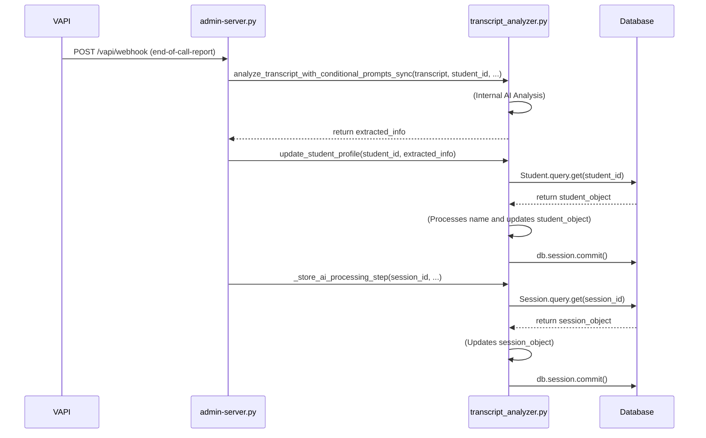

# Plan to Resolve Production Data-Saving Issues

This document outlines the plan to diagnose and fix the persistent issues with student name extraction and AI processing step storage in the production environment.

## 1. Problem Analysis

Despite previous fixes, the system is still failing to:
-   Update the student's name from the transcript (e.g., "Student 6010" is not being replaced with "Carl").
-   Store the AI processing steps in the session data (`ai_processing_steps` remains empty).

The successful extraction of interests and the mention of the correct name ("Carl") in the session summary strongly suggest that the AI analysis is working correctly. The failure likely lies in the data persistence logic within the `transcript_analyzer.py` or a database transaction issue.

## 2. Diagnostic Steps

To pinpoint the exact point of failure, I will add extensive logging to the following key areas in `ai-tutor/backend/transcript_analyzer.py`:

### In `update_student_profile`:

-   **Log Entry and Received Data:** Log the `extracted_info` at the very beginning of the function to confirm the data it receives.
-   **Log Name Extraction:** Log the `new_first_name` and `new_last_name` variables immediately after they are extracted.
-   **Log Default Name Check:** Log the `is_default_name` boolean value and the current student name to see if the check is passing or failing.
-   **Log Before and After Database Commit:** Add a log statement immediately before and after `db.session.commit()` to confirm a. that the code reaches the commit call, and b. that the commit call completes without throwing an exception.
-   **Log any exceptions:** Wrap the database commit in a `try...except` block and log any errors that occur.

### In `_store_ai_processing_step`:

-   **Log Function Entry:** Log when the function is called, including the `session_id`.
-   **Log Session Object:** Log the session object after it's queried from the database to ensure it's not `None`.
-   **Log Before and After Database Commit:** Similar to the profile update, add logging before and after `db.session.commit()` to trace the execution flow.

## 3. System Interaction Diagram

To better understand the flow of data, here is a sequence diagram of the process:

## 4. Implementation and Testing

Once the logging is in place, we will follow these steps:

1.  Commit and push the new logging code to production.
2.  Trigger a new VAPI call to generate a new session.
3.  Examine the new, detailed logs to identify the exact point of failure.
4.  Based on the logs, implement a precise fix.

This structured approach will provide us with the necessary visibility to solve this persistent issue.